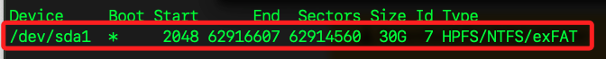

# 樹莓派系統分區

_尚未完成_

<br>

## 說明

1. 根據 [官方文件](https://www.raspberrypi.com/documentation/computers/config_txt.html#autoboot-txt) 對於 `autoboot.txt` 的說明，以下配置這個文件來設置樹莓派的引導分區。

<br>

2. `autoboot.txt` 除了可指定樹莓派的引導分區，還可與 `tryboot` 功能結合，實現 A/B 引導，這對於系統更新非常有用。

<br>

3. `boot_partition` 用來指定引導的分區號從 `1` 到 `4`，指定 `0` 時表示引導從第一個可引導的分區開始。

<br>

4. `tryboot` 機制允許在測試更新時安全地切換引導分區。使用 `tryboot` 標誌來臨時指定一個分區進行引導，如果更新成功，則修改 `autoboot.txt` 將該分區設置為默認引導分區。

<br>

## 文件配置

1. 查詢掛載路徑，可知引導分區是 `/dev/sda1`，掛載在 `/boot/firmware`，這個資料夾用來存放引導所需文件，包括 `config.txt`、`cmdline.txt` 等。

    ```bash
    df -h
    ```

    

<br>

2. 切換到前一個步驟所查詢的資料夾中，並查看是否有設置文件。

    ```bash
    cd /boot/firmware && ls -al
    ```

<br>

3. `autoboot.txt` 是一個可選文件，預設沒有建立，所以手動進行建立並編輯。

    ```bash
    sudo nano autoboot.txt
    ```

<br>

4. 編輯 `autoboot.txt` 文件，當 `tryboot_a_b` 設置為 `1` 時表示啟動 A/B 機制；設定 `boot_partition` 默認引導分區為 `1`，表示系統預設從分區 `1` 引導；`tryboot` 分區為 `2`，表示進行 `tryboot` 模式啟動時，系統會將從分區 `2` 引導。

    ```bash
    [all]
    tryboot_a_b=1
    boot_partition=1

    [tryboot]
    boot_partition=2
    ```

<br>

## 設置 `boot_partition` 和 `tryboot`

1. 查看當前分區和掛載狀況，其中引導分區會標示 `bootfs`，至於 `rootfs` 與 `bootfs` 的顯示是無序的；特別注意，以下輸出是經過手動編排，方便同學進行觀察。

    ```bash
    sudo blkid
    ```

    _輸出：以下經過手動排版_

    ```bash
    /dev/mmcblk0p1:
        LABEL_FATBOOT="bootfs" 
        LABEL="bootfs" 
        UUID="50C8-AEAE" 
        BLOCK_SIZE="512" 
        TYPE="vfat" 
        PARTUUID="e7d9a6bc-01"
    
    /dev/mmcblk0p2: 
        LABEL="rootfs" 
        UUID="fc7a1f9e-4967-4f41-a1f5-1b5927e6c5f9" 
        BLOCK_SIZE="4096" 
        TYPE="ext4" 
        PARTUUID="e7d9a6bc-02"
    ```

<br>

2. 查看 `cmdline.txt`，這是系統預設讀文件，依據前一個步驟查詢的結果進行檢查，確認 `root` 參數所指向的分區 UID 及分區格式是否正確。特別注意，以下是為了方便理解所進行的斷行註解，在實際的編寫上，`cmdline.txt 文件` 所有的參數 _必須在同一行、不能斷行或縮排_ ，每個參數之間用空格分隔，斷行或縮排會導致啟動失敗，因為啟動加載器只會讀取第一行內容。

    ```bash
    sudo nano cmdline.txt
    ```

    _內容如下：以下內容經過手動排版_

    ```bash
    console=serial0,115200
    console=tty1
    # 使用分區的 PARTUUID
    root=PARTUUID=e7d9a6bc-02
    # 文件系統類型
    rootfstype=ext4
    # 啟用文件系統檢查和修復
    fsck.repair=yes 
    # 在掛載根文件系統前等待，直到設備可用
    rootwait 
    # 隱藏啟動過程中的大部分信息，讓啟動過程顯得更安靜
    quiet 
    # 顯示啟動畫面
    splash 
    # 忽略串行控制台的 plymouth 輸出
    plymouth.ignore-serial-consoles 
    # 設置 Wi-Fi 頻譜管制區域為台灣
    cfg80211.ieee80211_regdom=TW
    ```

<br>

3. 設置 `config.txt`。

    ```bash
    sudo nano config.txt
    ```

<br>

4. 檢查並確認以下兩個設定參數已經開啟，確保樹莓派的圖形和系統運行在最佳性能和兼容性上；這是預設開啟的，這裡只是再次確認。

    ```bash
    # 啟用 KMS（Kernel Mode Setting）圖形驅動
    dtoverlay=vc4-kms-v3d
    # 啟用 64 位模式
    arm_64bit=1
    ```

<br>

## 設置分區與引導

1. 列出所有的儲存設備，其中 `mmcblk0` 就是 SD 卡的設備名稱，樹枝結構中的 `mmcblk0p1` 與 `mmcblk0p2` 便是分區名稱。

    ```bash
    lsblk
    ```

    _輸出：這是預設的設定值_

    ```bash
    NAME        MAJ:MIN RM  SIZE RO TYPE MOUNTPOINTS
    mmcblk0     179:0    0 58.3G  0 disk 
    ├─mmcblk0p1 179:1    0  512M  0 part /boot/firmware
    └─mmcblk0p2 179:2    0 57.7G  0 part /
    ```

<br>

2. 使用 `fdisk` 設置分區引導標誌，其中 `/dev` 是系統預設的目錄名稱，包含系統中所有設備的設備文件。輸入 `a`，選擇分區 `1`。輸入 `w` 保存並退出。

    ```bash
    sudo fdisk /dev/mmcblk0
    ```

    

<br>

3. 設置完成後可查看整個 microSD 卡的分區表，並確認分區 `1` 是否被標記為可引導，若使用外部硬碟也是相同，更換為正確磁碟名稱即可；特別說明，Linux 系統會自動創建多個 RAM 磁碟，這是系統預設行為，用於提供靈活的內存操作選項，可運行指令 `sudo fdisk -l` 查看，其中 `/dev/mmcblk0` 是實際的存儲設備，用於儲存操作系統和數據，這是個物理設備，也就是燒錄系統的 microSD 卡。

    ```bash
    sudo fdisk -l /dev/mmcblk0
    ```

    _輸出_

    ```bash
    Device         Boot   Start       End   Sectors  Size Id Type
    /dev/mmcblk0p1 *       8192   1056767   1048576  512M  c W95 FAT32 (LBA)
    /dev/mmcblk0p2      1056768 122159103 121102336 57.7G 83 Linux
    ```

<br>

4. 或使用 parted 工具列出分區信息，包括引導標記（boot flag）。

    ```bash
    sudo parted /dev/mmcblk0 print
    ```

    _輸出_

    ```bash
    Model: SD USDU1 (sd/mmc)
    Disk /dev/mmcblk0: 62.5GB
    Sector size (logical/physical): 512B/512B
    Partition Table: msdos
    Disk Flags: 
    Number  Start   End     Size    Type     File system  Flags
    1      4194kB  541MB   537MB   primary  fat32        boot, lba
    2      541MB   62.5GB  62.0GB  primary  ext4
    ```

<br>

5. 若有變動，可再次查詢所有儲存設備及其掛載情況。

    ```bash
    lsblk
    ```
    _輸出_
    ```bash
    NAME        MAJ:MIN RM  SIZE RO TYPE MOUNTPOINTS
    mmcblk0     179:0    0 58.3G  0 disk 
    ├─mmcblk0p1 179:1    0  512M  0 part /boot/firmware
    └─mmcblk0p2 179:2    0 57.7G  0 part /
    ```

<br>

6. 查看文件系統磁碟使用情況。

    ```bash
    df -h
    ```

    _輸出_

    ```bash
    Filesystem      Size  Used Avail Use% Mounted on
    udev            3.6G     0  3.6G   0% /dev
    tmpfs           782M  1.3M  780M   1% /run
    /dev/mmcblk0p2   57G  5.0G   49G  10% /
    tmpfs           3.9G  148K  3.9G   1% /dev/shm
    tmpfs           5.0M   16K  5.0M   1% /run/lock
    /dev/mmcblk0p1  510M   76M  435M  15% /boot/firmware
    tmpfs           781M   40K  781M   1% /run/user/1000
    ```

<br>

7. 重新啟動系統。

    ```bash
    sudo reboot now
    ```

<br>

## 創建新分區

_使用 `fdisk` 操作_

<br>

1. 對指定的設備運行 `fdisk` 指令，若該磁碟正被使用，執行指令後出現警告訊息，這是提醒相關操作可能會帶來風險。

    ```bash
    sudo fdisk /dev/mmcblk0
    ```
    

<br>

2. 輸入 `p` 可列出 `當前分區表`，包含目前儲存裝置的所有分區及詳細資訊，`FAT32 分區` 用於存放啟動文件；`Linux 分區` 用於存放操作系統和數據。

    ```bash
    Device         Boot   Start       End   Sectors  Size Id Type
    /dev/mmcblk0p1 *       8192   1056767   1048576  512M  c W95 FAT32 (LBA)
    /dev/mmcblk0p2      1056768 122159103 121102336 57.7G 83 Linux
    ```

<br>

3. 輸入 `n` 可 `創建新分區`，接著會提示選擇分區類型，`p` 為主分區、`e` 為擴展分區。

    ```bash
    Command (m for help): n
    Partition type
    p   primary (2 primary, 0 extended, 2 free)
    e   extended (container for logical partitions)
    Select (default p): 
    ```

<br>

4. 選擇 `p` 創建主分區，接著會詢問指定分區號。

    ```bash
    Select (default p): p
    Partition number (3,4, default 3): 
    ```

<br>

5. 輸入 `3` 作為分區號，接著會詢問起始扇區，按下 `Enter` 接受默認值即可。

    ```bash
    Partition number (3,4, default 3): 3
    First sector (2048-8191, default 2048):
    ```

<br>

6. 選擇結束扇區，輸入所需大小，這裡示範設置為 +20G， 表示創建 20GB 的分區。

    ```bash
    First sector (2048-8191, default 2048): 
    Last sector, +/-sectors or +/-size{K,M,G,T,P} (2048-8191, default 8191): +20
    ```

<br>

7. 若在上一個步驟中遺漏了單位 `G`，這個 `20` 將視作基礎單位 `512 byte` 的倍數，使得建立的分區是 `10.5K`，也就是 `20 x 512 byte = 10,240 byte`。

    ```bash
    Last sector, +/-sectors or +/-size{K,M,G,T,P} (2048-8191, default 8191): +20
    Created a new partition 3 of type 'Linux' and of size 10.5 KiB.
    ```

<br>

## 刪除分區

1. 同樣先使用指令 `p` 進行查詢。

    ```bash
    Device         Boot   Start       End   Sectors  Size Id Type
    /dev/mmcblk0p1         8192   1056767   1048576  512M  c W95 FAT32 (LBA)
    /dev/mmcblk0p2      1056768 122159103 121102336 57.7G 83 Linux
    /dev/mmcblk0p3         2048      2068        21 10.5K 83 Linux
    ```

<br>

2. 使用 `d` 指令進行刪除指定分區 `3`。

    ```bash
    Command (m for help): d
    Partition number (1-3, default 3): 3
    Partition 3 has been deleted.
    ```

<br>

## 使用 USB 隨身碟

1. 運行以下指令查看 USB 設備，名稱為 `sda`，有一個分區 `sda1`，容量是 7.4G，並且尚未掛載。

    ```bash
    lsblk
    ```

    

<br>

2. 若要卸載指定分區。

    ```bash
    sudo umount /dev/sda1
    ```

<br>

3. 若要在指定的磁碟上建立分區，同樣可使用 fdisk 進行操作，以下指令的指定磁碟為 `sda`，也就是新插入的 USD。

    ```bash
    sudo fdisk /dev/sda
    ```

<br>

4. 假如 USB 碟存在既有分區，可先使用 `d` 指令將指定分區號刪除，清空後輸入 `p` 查詢確認。

    

<br>

5. 先輸入 `n` 創建分區，然後輸入 `p` 建立主分區，分區編號輸入 `1`，然後空間設定部分可直接按下 `ENTER` 來表示 `最大可用空間`。

    

<br>

6. 輸入 `t`設置分區類型，若只有一個分區時，系統會自動選擇分區 `1`，若有多個分區，則輸入要選擇的分區號；再來要輸入 `L` 列出所有的 `文件系統標識列表`，選擇 `7`。

    ```bash
    Hex code or alias (type L to list all): 7
    Changed type of partition 'Linux' to 'HPFS/NTFS/exFAT'.
    ```

    

<br>

7. 輸入 `w` 來寫入分區表並退出 `fdisk`。

    ```bash
    Command (m for help): w
    The partition table has been altered.
    Calling ioctl() to re-read partition table.
    Syncing disks.
    ```

<br>

8. 假如出現以下訊息，代表設備或資源正在使用導致無法立即套用更改，此時內核會繼續使用舊的分區表，新表將在重啟之後被套用。

    

<br>

9. 重啟設備。

    ```bash
    sudo reboot now
    ```

<br>

## 格式化分區

1. 使用 mkfs.exfat 工具來格式化分區為 exFAT 文件系統。

    ```bash
    sudo mkfs.ext4 /dev/sda1
    ```

    

<br>

## 掛載分區

_USB 分區在樹莓派重啟後並不會自動掛載，需要進行以下步驟來掛載 USB 分區，所謂的 `掛載點` 就是在文件系統中將一個存儲設備連接到的一個目錄，如此便可通過目錄來訪問。_

<br>

1. 創建一個掛載點。

    ```bash
    sudo mkdir -p /mnt/usb
    ```

<br>

2. 使用 `mount` 指令掛載分區到創建的目錄，運行後會提示文件雖已經改過，但 `systemd` 仍會使用舊版本配置，如果要讓配置生效，必須重新加載 systemd。

    ```bash
    sudo mount /dev/sda1 /mnt/usb
    ```

    _輸出_

    ```bash
    mount: (hint) your fstab has been modified, but systemd still uses
            the old version; use 'systemctl daemon-reload' to reload.
    ```

<br>

3. 重新載入配置。

    ```bash
    sudo systemctl daemon-reload
    ```

<br>

4. 驗證掛載。

    ```bash
    df -h /mnt/usb
    ```

    

<br>

## 調整分區大小

_介紹圖形化工具 gparted_

<br>

1. 安裝 gparted。

    ```bash
    sudo apt update -y && sudo apt install gparted -y
    ```

<br>

2. gparted 還需要 `exfatprogs` 這個工具來支持 exFAT 文件系統的調整和管理。

    ```bash
    sudo apt install exfatprogs
    ```

<br>

3. 使用 VNC 連線樹莓派，開啟終端機運行以下指令啟動 `gparted`，這會開啟一個圖形介面。

    ```bash
    sudo gparted
    ```

    

<br>

4. 選取對應儲存裝置，並在指定分區中點擊右鍵進行調整；這裡暫不再贅述。

    

<br>

## 自動挂載分區

_每次啟動樹莓派時自動挂載指定的新分區_

<br>

1. 編輯 `/etc/fstab` 文件進行設定，在預設的內容中，是使用 `PARTUUID` 來標識設備，這可避免設備名稱變更導致的掛載失敗問題；在預設內容中有兩行說明。

    ```bash
    sudo nano /etc/fstab
    ```
    _預設內容_
    ```bash
    proc            /proc           proc    defaults          0       0
    PARTUUID=e7d9a6bc-01  /boot/firmware  vfat    defaults          0       2
    PARTUUID=e7d9a6bc-02  /               ext4    defaults,noatime  0       1
    ```


<br>

2. 添加一行代碼用以指定新分區和挂載點，並使用設備名稱 `/dev/sda1` 來標識設備，此與預設格式都是有效的配置，但要特別注意，但在熱插拔設備或多磁盤系統中，設備名稱可能會變化，因此使用 UUID 或 PARTUUID 會是更穩定的方式。

    ```plaintext
    /dev/sda1  /mnt/usb  ext4  defaults  0  0
    ```

<br>

3. 使用 blkid 命令來查找 UUID 或 PARTUUID。
```bash
sudo blkid /dev/sda1
```
_輸出_
```bash
/dev/sda1: 
    UUID="bd85c692-1e30-4add-b35c-3ec9e4adc122" 
    BLOCK_SIZE="4096" 
    TYPE="ext4" 
    PARTUUID="0002192a-01"
```

4. 重新編輯，補充說明其中 `defaults` 表示使用預設的掛載選項如讀寫權限、自動掛載等，第一個數字參數用於表示是否需要在 dump 命令備份時備份此文件系統，`0` 表示不備份；第二個數字參數表示 `文件系統檢查順序`，若設置為 `1` 表示根文件系統，這裡是其他文件系統通常設置為 `2`，在啟動過程中，fsck 會按照這個順序檢查文件系統，若設置為 `0` 則表示不檢查；完成後保存退出。

    ```bash
    sudo nano /etc/fstab
    ```
    _預設內容_
    ```bash
    PARTUUID=e7d9a6bc-01  /boot/firmware  vfat    defaults          0       2
    PARTUUID=e7d9a6bc-02  /               ext4    defaults,noatime  0       1
    PARTUUID="0002192a-01"  /mnt/usb  ext4  defaults  0  2
    ```
5. 重新啟動系統並檢查新分區是否自動挂載。

    ```bash
    sudo reboot now
    ```

<br>

6. 啟動後，確認新分區是否自動挂載。

    ```bash
    df -h
    ```

<br>

## 設置為開機分區

_要將 USB 驅動器設置為開機分區，需要在這個分區中安裝必要的引導文件，並配置 BIOS 或 UEFI 以允許從該分區啟動。_

<br>

1. 確保分區格式為 FAT32，因為大多數樹莓派的引導加載程序期望從 FAT32 分區讀取引導文件。

    ```bash
    sudo mkfs.vfat /dev/sda1
    ```

<br>

2. 安裝引導文件。

    ```bash
    sudo cp -r /boot/firmware/* /mnt/usb/
    ```

<br>

3. 查詢。

    ```bash
    sudo blkid
    ```

    _輸出_

    ```bash
    /dev/mmcblk0p1: LABEL_FATBOOT="bootfs" LABEL="bootfs" UUID="50C8-AEAE" BLOCK_SIZE="512" TYPE="vfat" PARTUUID="ae60924e-01"
    /dev/mmcblk0p2: LABEL="rootfs" UUID="fc7a1f9e-4967-4f41-a1f5-1b5927e6c5f9" BLOCK_SIZE="4096" TYPE="ext4" PARTUUID="ae60924e-02"
    /dev/sda1: UUID="983f8210-bae1-4fb8-8a79-c44553e75103" BLOCK_SIZE="4096" TYPE="ext4" PARTUUID="8ee228db-01"
    ```

<br>

4. 查看並配置引導文件。

    ```bash
    sudo nano /mnt/usb/cmdline.txt
    ```

<br>

5. 將參數 `root=PARTUUID=` 修改為 `/dev/sda1` 的 `PARTUUID` 值 `8ee228db-01`。

    ```bash
    console=serial0,115200 console=tty1 root=PARTUUID=8ee228db-01 rootfstype=ext4 fsck.repair=yes rootwait quiet splash plymouth.ignore-serial-consoles cfg80211.ieee80211_regdom=TW
    ```

<br>

## 檢查 fdisk 配置

1. 進入 fdisk。

    ```bash
    sudo fdisk /dev/sda
    ```

<br>

2. 輸入 `p`  查看分區信息，確認 /dev/sda1 的 Boot 標誌已設置（有 *）。

    

<br>

3. 重新啟動。

    ```bash
    sudo reboot now
    ```

<br>

___

_END：未完_