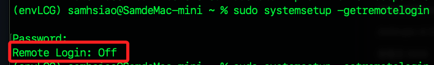
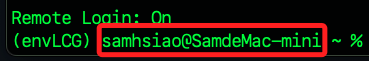
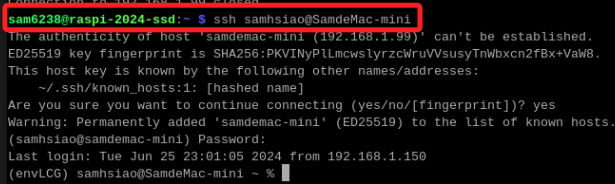

# 從樹莓派連線電腦

<br>

## 說明

1. 查詢 SSH 連線服務狀態。

    ```bash
    sudo systemsetup -getremotelogin
    ```

<br>

2. 假如狀態是 `OFF`。

    

<br>

3. 啟用 SSH 服務。

    ```bash
    sudo systemsetup -setremotelogin on
    ```

<br>

4. 確認 Mac 本機的使用者名稱及主機名稱。

    

<br>

5. 在樹莓派終端機使用 SSH 連線指令。

    ```bash
    ssh samhsiao@SamdeMac-mini
    ```

    

<br>

6. 使用 IP 也是相同的，不再贅述，其中有些比較特別之處，比如說，在本地終端機連線樹莓派時，執行 `code .` 指令並不會在樹莓派中開啟 VSCode，但從樹莓派終端機透過 SSH 連線本地電腦時，若在終端機中輸入 `code .` 指令是會在本地開啟 VSCode 的。

<br>

7. 另外，同樣也可以在樹莓派上運行 `ssh-keygen` 指令建立公鑰，然後貼到本地電腦的 `~/.ssh/authorized_keys` 文件中，可存入多個公鑰，一個一行、直接換行。

<br>

___

_END_