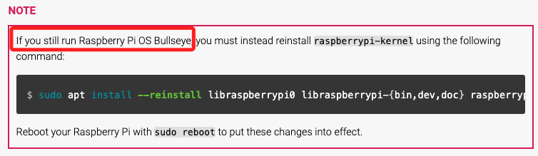

# 開始製作系統碟之前

_看到 [官方說明文件](https://www.raspberrypi.com/documentation/computers/os.html#introduction) 中這段話的用詞，斷然改用 Bookworm_

 

## 說明

1. 樹莓派作業系統當前的最新版本是 Bookworm，這是在 2023/10/10 推出，而前一個版本 Bullseye 則是在 2021/11/08 推出，距今也僅三年，但每次的升級都象徵了功能、性能和硬體支援上的重要改進。

 

2. 基於兼容性或其他長期支援需求，可能還有使用 `Bullseye` 的需求，以下將針對兩個版本的七點主要差異 `系統初始化和服務管理`、`網路管理`、`系統啟動`、`軟體包管理`、`使用者和權限管理`、`配置文件結構和位置變更`、`硬體支援和驅動` 進行說明。

 

## 系統初始化和服務管理

1. Bullseye：使用 `init.d` 和 `systemd` 來管理系統服務。大多數服務配置文件位於 `/etc/init.d/` 和 `/lib/systemd/system/`。

 

2. Bookworm：全面轉向 `systemd`，並逐漸淘汰 `init.d`。系統服務主要配置和管理文件集中在 `/etc/systemd/system/` 和 `/lib/systemd/system/`；特別注意，基於兼容性，所以原目錄中部分腳本依舊存在。

 

## 網路管理

1. Bullseye：使用 `dhcpcd` 作為主要的 DHCP 客戶端，網路配置文件位於 `/etc/dhcpcd.conf`。

 

2. Bookworm：轉向 `NetworkManager` 進行網路管理，配置文件集中在 `/etc/NetworkManager/` 目錄下。這帶來了更靈活的網路配置和管理選項。

 

## 系統啟動

1. Bullseye：使用 `config.txt` 和 `cmdline.txt` 進行啟動配置，這些文件位於 `/boot/` 目錄下。

 

2. Bookworm：啟動配置文件的位置沒有變化，仍然在 `/boot/` 下，但可能包含更多新的配置選項來支援新硬體和功能。

 

## 軟體包管理

1. Bullseye：使用 `apt` 進行軟體包的安裝和管理，軟體源列表位於 `/etc/apt/sources.list` 和 `/etc/apt/sources.list.d/`。

 

2. Bookworm：仍然使用 `apt` 進行軟體包管理，但預設的軟體源列表和包版本會有所更新。

 

## 使用者和權限管理

_用戶和群組部分的具體差異可查看兩版本的 /etc/passwd 和 /etc/group 文件_

 

1. Bullseye：使用傳統的 `/etc/passwd` 和 `/etc/group` 進行用戶和群組管理。

 

2. Bookworm：同樣使用這些文件進行用戶和群組管理，但可能增加了一些新的系統用戶或群組來支援新功能。

 

## 配置文件結構和位置變更

1. Bullseye：很多配置文件的位置較為分散，可能位於 `/etc` 的不同子目錄下。

 

2. Bookworm：系統配置文件結構更為集中和標準化，便於管理和維護。例如，網路相關配置集中到 `/etc/NetworkManager/`。

 

## 硬體支援和驅動

1. Bullseye：內核和驅動較為穩定，但對最新硬體的支援可能有限。

 

2. Bookworm：內核和驅動更新，支援更多新硬體，並提供更好的性能和穩定性。

 

___

_END_
