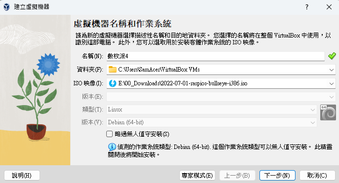
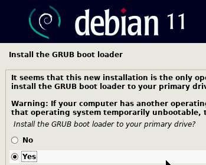
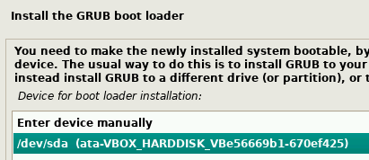
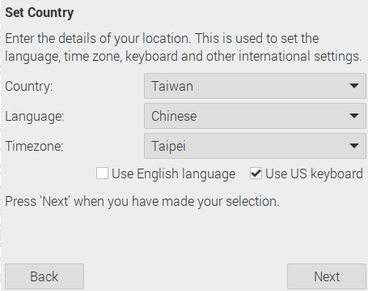
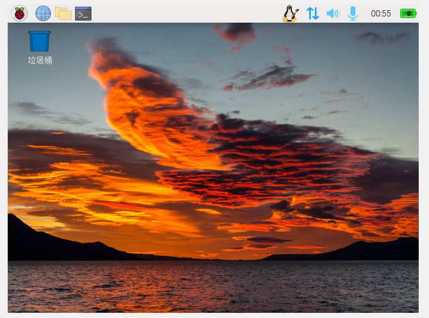

# 在 Windows 上使用 VirtualBox

 

## 安裝前準備

1. 前往 [VirtualBox 官網](https://www.virtualbox.org/wiki/Downloads) 進行下載。

   

 

2. 注意：安裝 `6.1` 版本可能會失敗，建議下載並安裝 `7.0` 版本。

 

## 安裝步驟

1. **新增**虛擬機台並自訂名稱。

   

   

 

2. 勾選 **略過** 無人值守。

   

 

3. 選擇 **下一步**。

 

4. 配置硬體: **8G 記憶體 + 4 核心**，硬碟配置為 **30G**。

   

 

5. 設定完成，進行 **標準啟動**。

 

6. 啟動後開始安裝樹莓派，並選擇 **中文** 作為語言。

 

7. 選取 **全部磁碟**。

   

 

8. 並將所有資料存放在同一磁區。

   

 

9. 最終確認，必須選擇 **YES** 才能完成安裝。

   

 

10. 是否安裝 `GRUB boot loader` 選擇 **YES**。

      

 

11. 使用預設路徑並等待安裝完成。

      

 

12. 再啟動一次就可完成，按照畫面指示即可。

 

## 補充

1. 建議選擇 `Use English language` 作為語言，但因為勾選可能會增加當機的風險，可以先不要勾。

   

 

2. 若選擇英文，建議將 `下載` 和 `文件` 文件夾名稱修改為英文 `Downloads` 和 `Documents` 以便於管理。

 

3. 記得保存帳號密碼。

 

4. 可以選擇是否立即更新系統。建議先完成安裝，因為更新會非常耗時。

 

5. 系統還會自行進行更新。

 

6. 一切完成後，進行重新啟動。

 

7. 完成重啟後，基本的安裝步驟即完成。

   

   _註：虛擬機先完成安裝，其餘在其他小節補充。_

 

___

_END：以上為 Virtual 安裝基本程序說明_
