# 使用 SSH 從本機連線虛擬機上的樹莓派

</br>

## 進入樹莓派虛擬機

- 開啟 SSH：虛擬機預設的 SSH 並未開啟
  
  

</br>

- 設定主機名稱：虛擬機安裝時並未設定主機名稱

  *自訂名稱，如 `raspi-2023-98`*

  

</br>

- 這些設定都是要重新開機的

  


</br>

## 進入 Virtual Box

- 開啟應用 VirtualBox

  

</br>

- 工具：網路管理員

  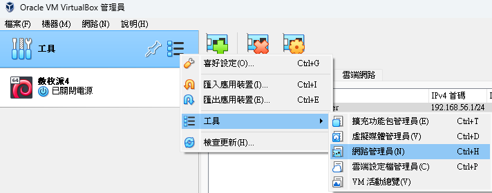

</br>

- 右邊會切換到網路功能設定頁面

  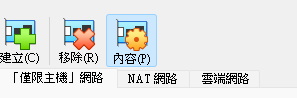

</br>

- 預設會有一張網卡

  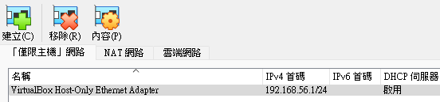

</br>

- 新建網路卡

  - 原本應該有一個 `192.168.56.1`
  - 要使用這個也是可以
  - 這裡我示範建立新的

    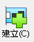

</br>

- 會添加一個，預設狀態停用，要手動開啟並設定 IP `192.168.242.1`

  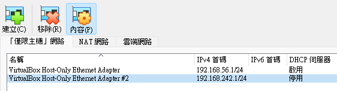

</br>

- 切換到 `DHCP 伺服器` ，勾選 `啟用伺服器` 後 `套用`

  

</br>

- 啟動虛擬機

  - 進入虛擬機終端機查詢 IP

  ```bash
  ifconfig
  ```

</br>

  - 只會看到這個 `10.0.2.15` ，但不是用來連線的

    

</br>

- 在本地電腦查詢：

  ```bash
  ipconfig
  ```

  *會看到虛擬機的網路卡以及 IP `192.168.242.1` *

  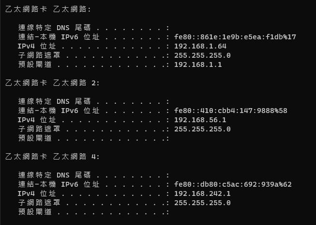

</br>

- 進入 VB 應用，在虛擬機上點擊 `設定`

  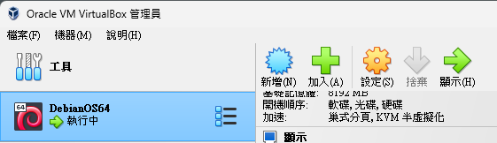

</br>

- 依序點選 `網路` -> `進階` -> `連接埠轉送`

  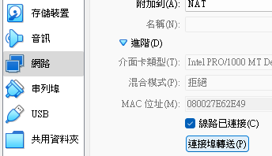

</br>

- 建立規則

  - 右側 `+` 添加規則
  - `主機 IP` 輸入 `本機上虛擬網卡的 IP`
  - `客體 IP` 輸入 `樹梅派上查詢的 IP`

  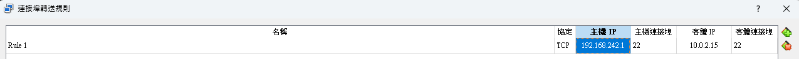

</br>

- 放大看清楚

  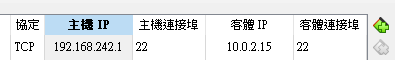

</br>

- 編輯 Windows 設定檔 `hosts` ，這需要管理員權限。
  *添加 IP 與主機名稱的映射*

    ```shell
    C:\Windows\System32\drivers\etc\hosts
    ```
 
  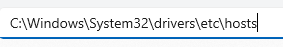

</br>

- 可使用任意編輯器
  
  

</br>

- 在設定檔的最後加入
  *這裡是示意的截圖，注意要使用當前的 IP*

  

</br>

- 完成後可從本地電腦用 SSH 連線虛擬機
    ```bash
    ssh sam6238@192.168.242.1
    ```

</br>

- 完成登入

  

</br>

- 退出
    ```bash
    exit
    ```
    
    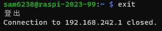

</br>

- 退出後可以嘗試使用 `主機名稱` 進行連線
    
    ```bash
    ssh <樹莓派帳號>@<樹莓派主機名稱>
    ```
    
    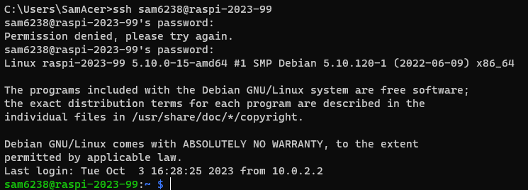

</br>

- 在 VSCode 中建立 SSH 設定檔案
  
  

</br>

- 雖然通道有打開，連線失敗
  *通道打開時會詢問所要連線機器的作業系統類型*
  
  
  
</br>

  *接著下個步驟會在虛擬機中安裝 VSCode 排除這個問題，再進行連線*

</br>

---

_END：以上是虛擬機的 SSH 連線設置_