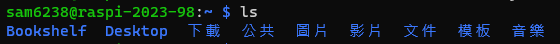
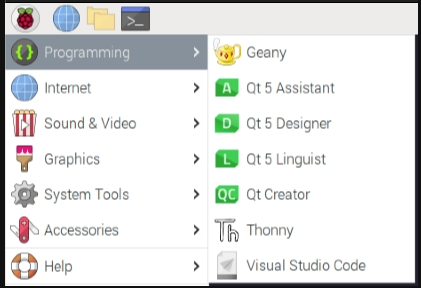
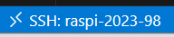

# 樹莓派安裝 VSCode

## 說明

1. 安裝的主要目的是要透過 VSCode 的 SSH 連線虛擬機中的樹梅派。

<br>

2. 因為安裝 VSCode 才有 code-server。

<br>

## 安裝前準備

1. 因為先前是使用中文，所以目錄也會是中文。

<br>

2. 假如還沒改過的話，這裡可以改一下。

    

<br>

3. 將其中的 `下載`、`文件` 更名。

    ```bash
    mv 下載 Downloads && mv 文件 Documents
    ```

    

<br>

## 開始安裝

_與樹莓派實機安裝 VSCode 程序相同_

<br>

1. 進入下載。

    ```bash
    cd Downloads
    ```

<br>

2. 下載。

    ```bash
    curl -sSL https://packages.microsoft.com/keys/microsoft.asc | sudo apt-key add -
    ```

<br>

3. 出現警告，可以改用以下指令，原本的指令還是可以運行。

    ```bash
    curl -sSL https://packages.microsoft.com/keys/microsoft.asc -o microsoft.asc
    ```

<br>

4. 將 VScode 添加到來源列表。

    ```bash
    echo "deb [arch=amd64,arm64,armhf] https://packages.microsoft.com/repos/vscode stable main" | sudo tee /etc/apt/sources.list.d/vscode.list
    ```

<br>

5. 更新＆安裝。

    ```bash
    sudo apt update && sudo apt install code -y
    ```

<br>

6. 完成安裝可看到應用 `Visual Studio Code`。

    

<br>

7. 再次連線，成功。

    

<br>

___

_END：以上說明樹莓派安裝 VSCode_