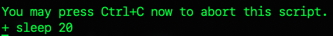
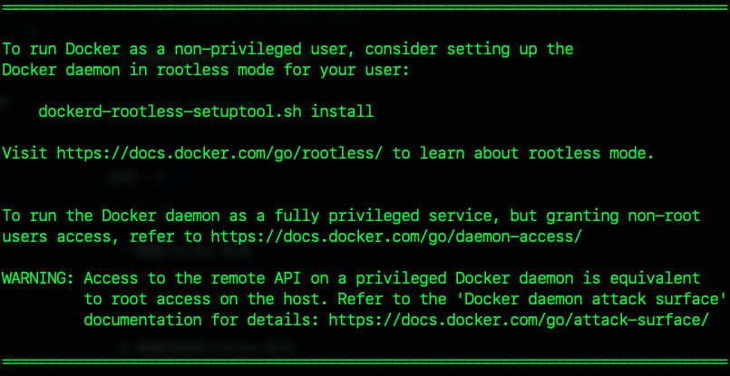
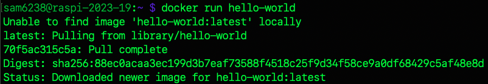

_上課實作_

# 在樹莓派上安裝 Docker 的步驟

</br>

1. **更新系統**:
   ```bash
   sudo apt update && sudo apt upgrade -y
    ```

2. **進入目錄**:

   ```bash
   cd Downloads
   ```
3. **下載 Docker 安裝腳本**:

   ```bash
   curl -fsSL https://get.docker.com -o get-docker.sh
   ```

   🔈 參數說明
   1. curl：命令行工具，用於從 URL 獲取或發送數據。
   2. -f (或 --fail): 表示在 HTTP 錯誤時如 404 頁面未找到的錯誤，使 curl 失敗。
   3. -s (或 --silent): 表示靜默模式，不顯示進度信息或錯誤消息。
   4. -S (或 --show-error): 與 -s 一起使用時，表示在發生錯誤時顯示錯誤，也就是會隱藏正常的操作，僅顯示錯誤。
   5. -L (或 --location): 如果指定的 URL 被重定向，則跟隨重定向的位置。
   6. -o get-docker.sh：指定輸出文件的名稱，就是從 URL 下載的數據將被保存為 get-docker.sh 文件。

</br>

4. **運行安裝腳本**:

   ```bash
   sudo sh get-docker.sh
   ```
   
   _會通知等待 20 秒_   
   
   

5. 執行腳本時會出現警告

- 警告若使用特權訪問 Docker daemon 上的遠程 API，等同在主機上的 root 訪問。
- 也就是說若能夠訪問 Docker API，如同以最高權限在主機上做任何事情。
- 這裡只是基本教學所以了解一下即可。

   


6. **添加用戶到 Docker 群組**（可避免每次使用 Docker 都需要使用 sudo）:

   ```bash
   sudo usermod -aG docker $USER
   ```
7. **重新啟動樹莓派**或登出再登入:

   ```bash
   sudo reboot now
   ```

<br>
   
   _稍等一下_ 💤  

<br>

8. **驗證 Docker 安裝**:

   ```bash
   docker run hello-world
   ```

   _第一次執行會通知並下拉_
   
   


9. **檢查安裝的 Docker 版本**:

   ```bash
   docker --version
   ```

</br>

## Docker 基本指令

| 指令              | 功能                   | 說明                                            |
| ----------------- | ---------------------- | ----------------------------------------------- |
| `docker pull`   | 下載 Docker 映像       | 從Docker Hub或其他Docker registry下載指定的映像 |
| `docker run`    | 運行 Docker 容器       | 根據指定的映像啟動一個新的容器實例              |
| `docker ps`     | 列出運行中的容器       | 顯示運行中的所有Docker容器的列表                |
| `docker stop`   | 停止運行的容器         | 使用容器ID或名稱來停止容器                      |
| `docker start`  | 啟動已停止的容器       | 使用容器ID或名稱來啟動停止的容器                |
| `docker rm`     | 刪除一個容器           | 使用容器ID或名稱來刪除一個停止的容器            |
| `docker images` | 列出本地的 Docker 映像 | 顯示在本地機器上儲存的所有Docker映像的列表      |
| `docker rmi`    | 刪除 Docker 映像       | 使用映像ID或名稱來刪除指定的Docker映像          |

</br>

## 注意事項

樹莓派使用的是 **ARM 架構** 的處理器，而大部分的 Docker 映像是為 **x86 架構** 的處理器設計的，所以在選擇 Docker 映像時，必須確保它支援 ARM 架構。
</br>

---

_END：以上在樹莓派安裝 Docker_
