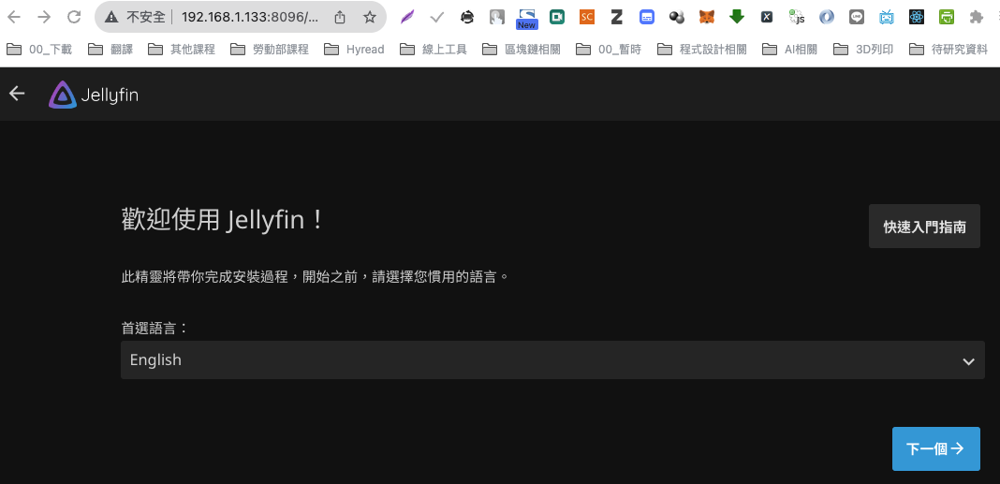

# 安裝 Jellyfin

1. 拉取鏡像

   ```bash
   sudo docker pull jellyfin/jellyfin
   ```
   
   

<br>

2. 查詢用戶身份資訊

   ```bash
   id <使用者帳號>
   ```
   如
   ```bash
   id sam6238
   ```
   
   

<br>

3. 關於用戶的說明。

   ```bash
   (1) UID：用戶ID，是用戶在系統上的唯一編號。
   
   (2) GID：主群組ID，是用戶的主群組的唯一編號。
   
   (3) groups：這個用戶是其成員的所有群組的列表。
   ```

<br>

3. 建立鏡像使用的目錄

   ```bash
   sudo mkdir /home/sam6238/jellyfin_config
   ```

   ```bash
   sudo mkdir /home/sam6238/media
   ```

4. 授權

   ```bash
   sudo chmod 755 /home/sam6238/jellyfin_config
   ```
   ```bash
   sudo chmod 755 /home/sam6238/media
   ```


5. 建立容器

   ```bash
    sudo docker run -d \
    --name=jellyfin \
    -e PUID=1000 \
    -e PGID=1000 \
    -e TZ=Asia/Taipei \
    -p 8096:8096 \
    -v /home/sam6238/jellyfin_config:/config \
    -v /home/sam6238/media:/media \
    --restart unless-stopped \
    jellyfin/jellyfin
   ```


6. 訪問

   ```bash
   <樹莓派 IP>:8096
   ```
   如
   ```bash
   192.168.1.217:8096
   ```

   

<br>

---

_END：以上簡單示範安裝倉庫_