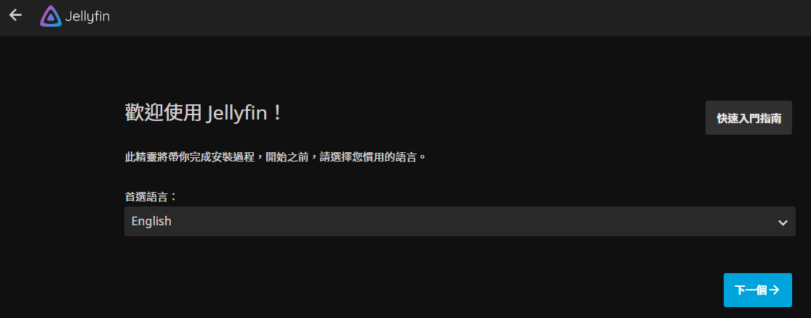
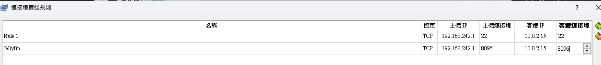
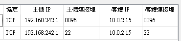
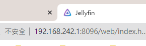

*課後可嘗試實作*

# 在虛擬機上運行 Jellyfin


1. 安裝好之後，可測試從容器內部訪問

   ```bash
   docker exec -it jellyfin curl http://localhost:8096
   ```

2. 或是
   ```bash
   curl http://localhost:8096
   ```

3. 先確定可以訪問
   
   

4. 在 VirtualBox 設定虛擬機轉接

   

5. 放大看清楚，轉接 8096

   


6. 在區網訪問

   ```bash
   192.168.242.1:8096
   ```

   


<br>

---

_END：以上示範基本運作_