# 使用 SSH 從本機連線虛擬機上的樹莓派

<br>

## 進入樹莓派虛擬機

1. 開啟 SSH：虛擬機中預設的 SSH 並未開啟。

   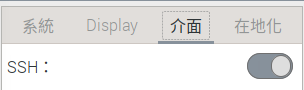

<br>

2. 設定主機名稱：虛擬機安裝時並未設定主機名稱，如 `raspi-2023-98`

   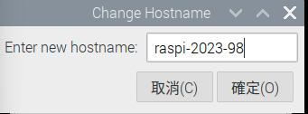

<br>

3. 設定完成重新開機。

   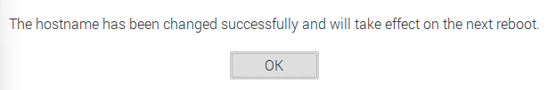

<br>

## 在 Virtual Box 面板上進行工具設定

1. 開啟應用 VirtualBox 點選 `工具`。

   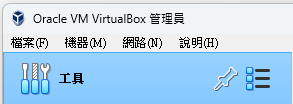

<br>

2. 在 `工具` 上點擊滑鼠右鍵， 依據開啟 `工具` -> `網路管理員`。

   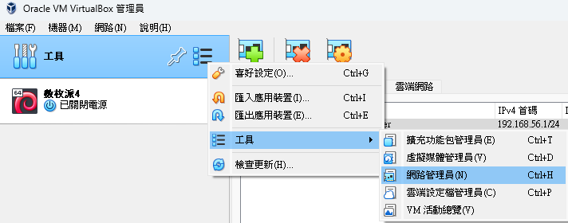

<br>

3. 右邊會切換到 `網路功能` 設定頁面。

   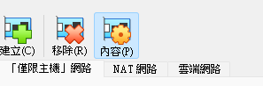

<br>

4. 預設會有一張網卡。

   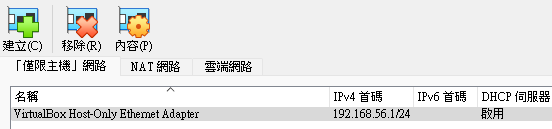

<br>

5. 點擊上方或右側的 `+` 號新建網路卡，原本應該有一個 `192.168.56.1`，要使用這個也是可以，這裡示範建立新的。

   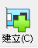

<br>

6. 會添加一個虛擬網卡，預設狀態停用，要手動開啟並設定 IP `192.168.242.1`，切記手動 `啟用`。

   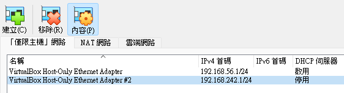

<br>

7. 切換到 `DHCP 伺服器` ，勾選 `啟用伺服器` 後 `套用`。

   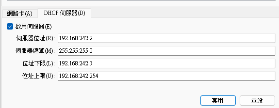

<br>

8. 啟動虛擬機，進入虛擬機終端機查詢 IP。

   ```bash
   ifconfig
   ```

<br>

9. 只會看到這個 `10.0.2.15` ，但不是用來連線的。

   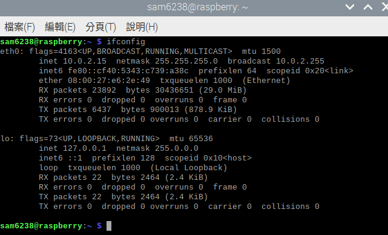

<br>

10. 在本地電腦查詢，會看到虛擬機的網路卡以及 IP `192.168.242.1`。

      ```bash
      ipconfig
      ```

      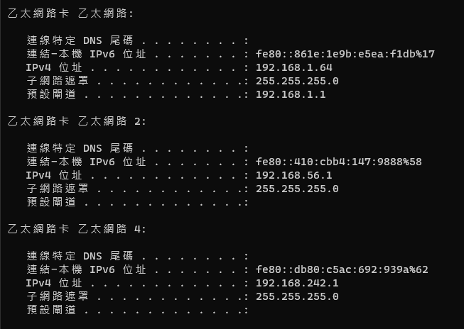

<br>

11. 進入 VirtualBox 應用，在虛擬機上點擊 `設定`。

      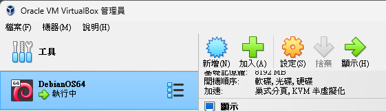

<br>

12. 依序點選 `網路` -> `進階` -> `連接埠轉送`。

      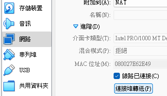

<br>

13. 建立規則，右側 `+` 添加規則，`主機 IP` 輸入 `本機上虛擬網卡的 IP`，`客體 IP` 輸入 `樹梅派上查詢的 IP`；若要檢查是否成功設定，可先重新啟動後透過 SSH 指令檢查。

      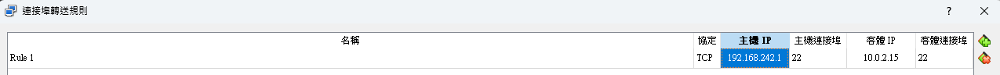

      _放大看清楚_

      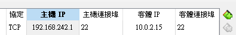

<br>

## 編輯 Windows 設定檔 `hosts`

_這需要管理員權限、添加 IP 與 Hostname 映射_

<br>

1. 添加 IP 與主機名稱的映射。

   ```bash
   C:\Windows\System32\drivers\etc\hosts
   ```

   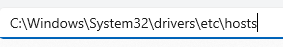

<br>

2. 可使用任意編輯器。

   

<br>

3. 在設定檔的最後加入，這裡是示意的截圖，注意要使用當前的 IP*

   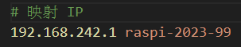

<br>

4. 完成後可從本地電腦用 SSH 連線虛擬機。

   ```bash
   ssh sam6238@192.168.242.1
   ```

<br>

5. 完成登入。

   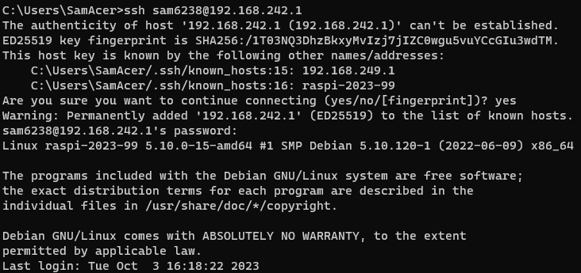

<br>

6. 退出。

   ```bash
   exit
   ```

   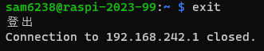

<br>

## 使用主機名稱連線

1. 嘗試使用 `主機名稱` 進行連線。

   ```bash
   ssh <樹莓派帳號>@<樹莓派主機名稱>
   ```

   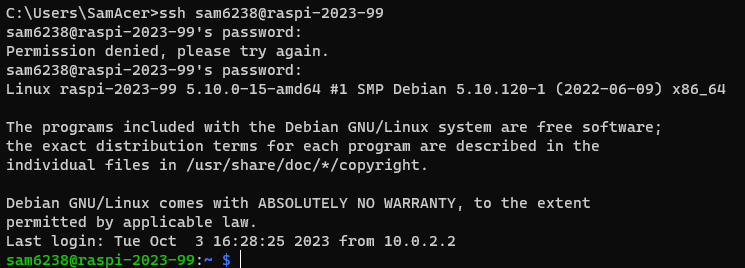

<br>

2. 在 VSCode 中編輯 SSH 設定檔案。

   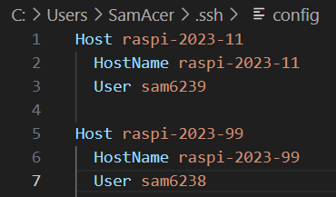

<br>

## 連線失敗 ❗️

1. 通道打開，並詢問所要連線機器的作業系統類型。

   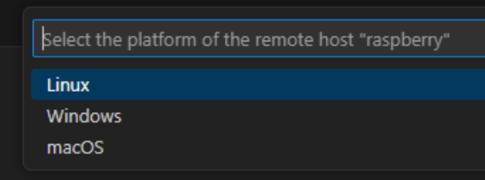

<br>

2. 雖然通道有打開，但顯示連線失敗❗️。

   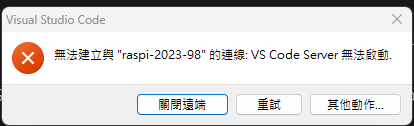

<br>

_接著下個步驟會在虛擬機中安裝 VSCode 排除這個問題，再進行連線；安裝方法詳樹莓派安裝 VSCode_

<br>

___

_END：以上是虛擬機的 SSH 連線設置_
