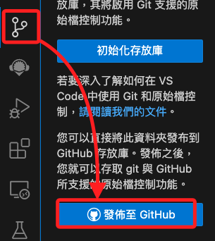
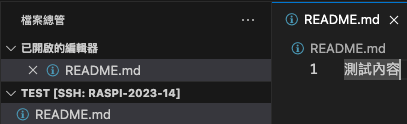
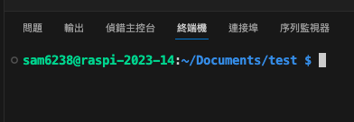
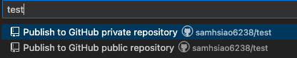
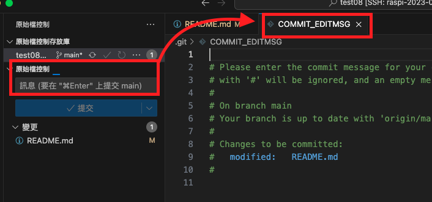
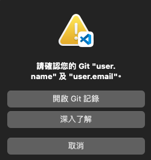
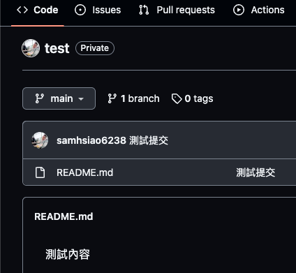
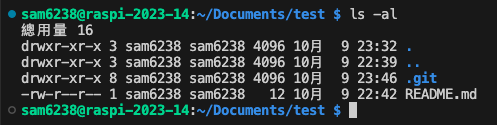
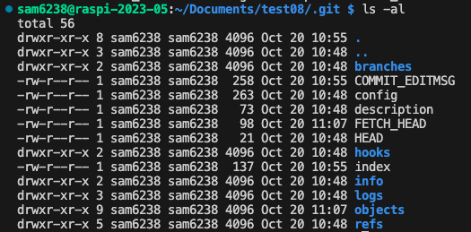
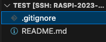

# 發佈至 GitHub

_原始檔控制是一種管理文件版本變更的系統，而 Git 是最流行的原始檔控制工具之一。_

<br>

## 說明

_為樹莓派的專案建立 Git 儲存庫並發佈到 GitHub_

<br>

1. 點擊 `發佈至 GitHub` 時，預設會將 `當前所在目錄` 作為儲存倉庫 `Repository`，並以資料夾名稱作為儲存庫名稱來建立 Git 儲存庫。

   

<br>

2. 在樹莓派中，建議使用資料夾 `Documents` 來存放個人的專案文件，包含未來可能使用的虛擬環境檔案，所以若在 `Documents` 根目錄中建立倉庫，對於之後文件或原始檔的管理可能會帶來困擾，故建議在文件資料夾中建立專案資料夾進行初始化倉庫的位置。

<br>

## 建立專案資料夾

1. 連線樹莓派後，點擊 `開啟資料夾`，依序選擇進入 `Documents` 資料夾。

   

<br>

2. 使用終端機或點擊功能圖標建立新的資料夾。

   ```bash
   mkdir <資料夾名稱> && cd <資料夾名稱>
   ```

<br>

3. 透過指令在該資料夾內開啟新的工作視窗，這樣可以確保在正確的路徑下開啟工作區並建立倉庫。

   ```bash
   code .
   ```

<br>

4. 先建立一個 `README.md` 檔案，內容隨意輸入。

   

<br>

_以上完成本地資料的準備_

<br>

## 輸入儲存倉庫的作者資訊

_特別留意這個步驟，若有遺漏，對於接下來的作業會造成一定的小麻煩_

<br>

1. 進入 VSCode 之後先啟動一個終端機。

   

<br>

2. 以 Git 指令設定作者名稱和郵箱，特別注意，這並不是驗證程序，只是 `指定作者資訊`，無需與 GitHub 帳號連結；另外，如果作者名稱是由多個單詞組成的，例如 `John Doe`，則必須加註引號包覆。

   ```bash
   git config --global user.name <輸入作者名稱>
   git config --global user.email <輸入作者電子郵件>
   ```

<br>

## 建立版本管理 / 原始檔控制

1. 點擊 VScode 的 `原始檔控制` 。

   

<br>

2. 點擊 `發布至 GitHub` 。
   
   

<br>

3. 選擇公開或私有。

   

<br>

4. 在上面這個步驟，可以使用預設名稱，也可以自訂名稱。

   

<br>

5. 選擇 `README.md` 檔案後，點擊 `確定` 。

   

<br>

6. 若是第一次提交到此就完成，右下角會顯示 `在 GitHub 上開啟` 。

   

<br>

7. 後續若有對倉庫中文件做修改，要對該次提交進行命名，然後點擊 `提交` 。

   

<br>

## 特別說明

1. `特別說明 1` ，假如沒有給 `提交` 輸入說明，這裡會跳出 `COMMIT_EDITMSG`，關閉後重新輸入說明文字再重新提交即可。

   

<br>

2. `特別說明 2` ，假如前面沒設定 `名稱與郵件`，這裡會跳出提示，接下來可能會出現衝突，建議刪除遠端儲存庫重新建立。

   

<br>

3. 完成作者資訊建立後再次提交，點擊 `發佈到分支` ，與提交不同，發佈到分支可不輸入訊息。

   

<br>

4. 同前述，自定義一個倉庫名稱，或使用預設。

   

<br>

## 進行查看


1. 完成後，可在 GitHub 上開啟並查看新建立的儲存倉庫以及 README.md。

   

<br>

2. 在終端機中可透過 `ls -al` 指令看到 .git 資料夾；特別注意，這是一個隱藏資料夾。

   

<br>

3. 資料夾內記錄各種版本控制的資訊與設定，其中包含了版本控制系統所需的內部數據和配置文件，包括對象儲存、配置、提交記錄和引用等信息，這個文件和目錄是由 Git 自動管理，不應手動編輯，只有配置文件（如 config）可以根據需要進行修改。

   

<br>

4. 接著在儲存倉庫的根目錄內手動建立 `.gitignore` 文件，這個文件用於設定儲存倉庫內要 `取消追蹤` 的項目；特別注意，這並非是 `必要文件`，但基於良好的編程習慣，即便沒有進行版本控制的專案也建議添加這個文件。

   

<br>

___

_END：以上成功在 GitHub 上建立新的 Repo_
