# 安裝 GitHub CLI

_樹莓派已經內建了 `git`，但如果要使用 GitHub 的特定功能，則需要自行安裝 `GitHub CLI` 。_

<br>

## 說明

_git 與 GitHub CLI 有何不同 ❓_

<br>

1. `git` 和 `GitHub CLI` 是兩個不同的工具，雖然兩者都是對 GitHub 操作的工具，但功能和用途有差異。

<br>

2. `git` 是一個 `分布式版本控制系統`，適用於 `版本管理` 。 

<br>

3. `GitHub CLI` 專為 GitHub 平台設計，除了完成 git 的基本操作外，還可以直接在終端機中進行 GitHub 的特定操作。

<br>

## 安裝步驟

1. 訪問 [GitHub CLI 官網](https://cli.github.com/)，點擊 `Manual`。

    

<br>

2. 並進入 `Installation` 下的 `README`。

    

<br>

3. 在 `Linux & BSD` 部分，選擇 [Linux & BSD installation](https://github.com/cli/cli/blob/trunk/docs/install_linux.md)。

    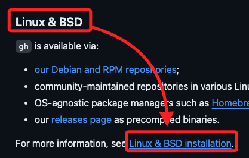

<br>

4. 複製提供的安裝指令。

    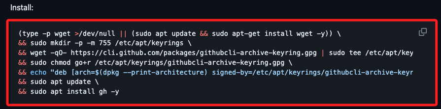

<br>

5. 在樹莓派終端機中運行指令。

    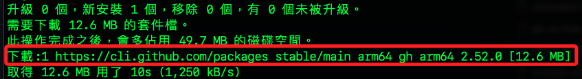

<br>

6. 安裝完成後，檢查版本。

    ```bash
    gh --version
    ```

    _結果_

    ```bash
    gh version 2.52.0 (2024-06-24)
    https://github.com/cli/cli/releases/tag/v2.52.0
    ```

<br>

_以上完成安裝_

<br>

## 錯誤排除

1. 安裝過程若出現 `Hash Sum mismatch` 錯誤，這是一個常見的更新問題 `APT（Advanced Package Tool）`，先將錯誤的儲存庫網址記錄下來。

    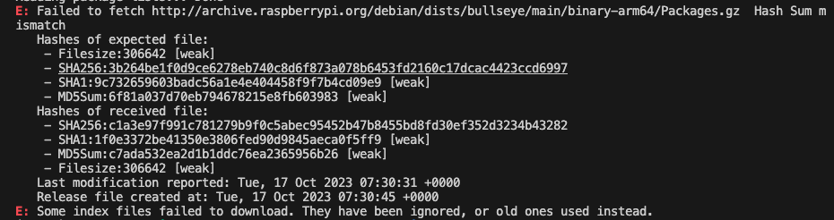

<br>

2. 查看 `sources.list.d` 目錄下所有文件。

    ```bash
    ls /etc/apt/sources.list.d/
    ```

<br>

3. 會出現幾個檔案。

    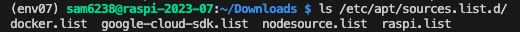

<br>

4. 逐一查看內容。

    ```bash
    cat /etc/apt/sources.list.d/<文件名>
    ```

    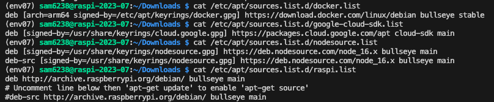

<br>

5. 對有疑問的儲存庫進行編輯。

    ```bash
    sudo nano /etc/apt/sources.list.d/<疑似錯誤的儲存庫>
    ```

<br>

6. 將引發錯誤的儲存庫標註排除。

   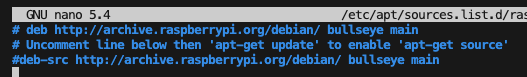

<br>

7. 再次進行更新後安裝。

    ```bash
    sudo apt update && sudo apt upgrade -y && sudo apt autoremove -y
    ```

<br>

## 使用 VSCode 對以上問題進行修正

_使用 VSCode 可能會遇到權限問題，以下一併處理_

<br>

1. 切換到指定資料夾。

    ```bash
    cd /etc/apt/sources.list.d
    ```

<br>

2. 查詢有哪些檔案。

    ```bash
    ls
    ```

    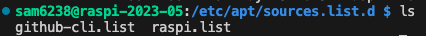

<br>

3. 可先查看再對要修改的檔案進行授權，查看部分參考前一小段說明。

    ```bash
    sudo chmod 777 /etc/apt/sources.list.d/raspi.list
    ```

<br>

4. 開啟資料夾逐一進行檢查與修改。

    ```bash
    code .
    ```

<br>

5. 某個來源有問題就把它註解。

    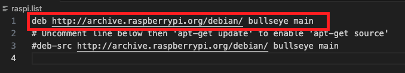

<br>

6. 完成後可恢復原本授權，授權之前使用 `ls` 指令查詢，比如說 `-rw-r--r--` 就代表 `644`。

    ```bash
    sudo chmod 644 /etc/apt/sources.list.d
    ```

<br>

## 登入

_安裝好之後可透過指令進行登入，切記要進入樹莓派運行以下操作_

<br>

1. 使用 gh 進行登入。

    ```bash
    gh auth login
    ```

<br>

2. 選擇 `GitHub.com`。

    

<br>

3. 選擇 `HTTPS`。

    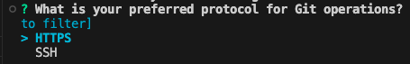

<br>

4. 授權 `y`。

    

<br>

5. 透過瀏覽器 `Login with a web browser`。

    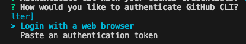

<br>

6. 複製這串代碼，點擊 `ENTER` 開啟瀏覽器。

    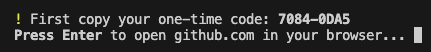

<br>

7. 將此代碼輸入到網頁瀏覽器中。

    

<br>

8. 跟隨網頁上的指示完成授權。

    

<br>

9.  完成手機驗證後完成登入 GitHub CLI。

    

<br>

## 特別說明

1. 終端機中顯示 `涉及 Wayland 框架和頁面加載指標` 的錯誤，但這並不影響登入，可另外開啟一個終端機，並運行以下指令查詢登入狀態。

    ```bash
    gh auth status
    ```

    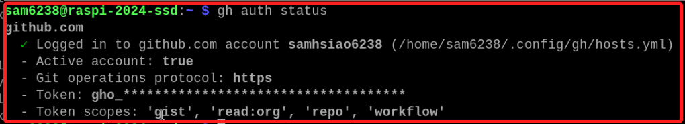

<br>

2. 嘗試更新。

    ```bash
    sudo apt update && sudo apt upgrade gh -y
    ```

<br>

3. 再次運行登入指令，同樣可順利完成並且不會出現錯誤訊息。

    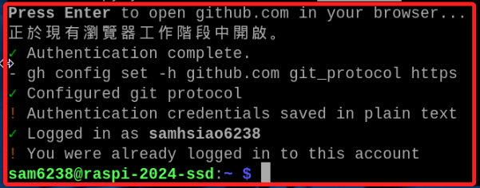

<br>

___

_END：以上完成安裝以及登入_