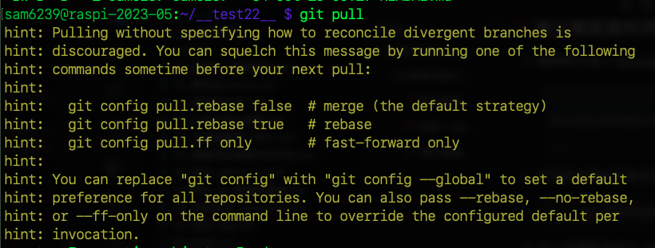

# 警告說明

_同步過程中可能出現各種警告，有些無需理會，多數皆可簡易排除。_

 

## 狀況 1

1. 提示要明確選擇策略，這是在 2.27 版之後加入的警告。

   

 

## 指令參數說明

1. git config pull.rebase false

   - 這是預設的拉取策略：合併策略。

   - 當拉取遠端更改時，如果本地和遠端都有新的提交，Git 會建立一個新的合併提交來整合這些更改。

 

2. git config pull.rebase true

   - 當拉取遠端更改時，如果本地有新的提交，Git 會先回退這些提交，然後將遠端的提交應用到本地，最後再將先前的本地提交應用回來，這可以確保提交歷史是線性的。

 

3. git config pull.ff only

   - `僅快進策略`，如果遠端的提交是當前提交的直接後繼，所以 Git 只會進行快進操作。

   - 這表示 Git 會簡單地移動 HEAD 指針，但如果有分叉，則該操作將失敗。

 

4. git config --global

   - 全局設置，對所有的儲存庫都有效。

 

5. `--rebase`、`--no-rebase` 或 `--ff-only`。

   - 瞬時覆蓋已配置的預設值

 

___

_END_