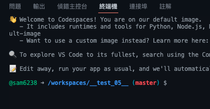
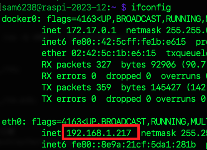

*課外參考操作即可，沒太大用處*

# 從 Codespace 連線樹莓派
- 連線家中樹莓派主機時需備有固定 IP
- 遠端 Codespace 透過 SSH 連線到本地的樹莓派
- 無法將 Codespace 作為一個 UI 的終端對樹莓派做開發

<br>

## 1. 在 Codespace 中開啟一個終端機

  

<br>

## 2. 建立金鑰，跟在本機一樣都預設即可
- 可輸入自訂的密鑰尾綴，以下是用電子郵件為例

  ```bash
  ssh-keygen -t rsa -b 4096 -C <可輸入電子郵件帳號>
  ```
  如

  

- 查看私鑰，這個 `用不到`
  ```bash
  cat ~/.ssh/id_rsa
  ```

- 查看＆複製公鑰
  ```bash
  cat ~/.ssh/id_rsa.pub
  ```

<br>

## 3. 在樹莓派編輯＆貼上公鑰
- 編輯 & 貼上
  
  ```bash
  sudo nano ~/.ssh/authorized_keys
  ```

  

- 查詢樹莓派 IP
  
  ```bash
  ifconfig
  ```

  

<br>

## 4. 設定家中網路轉接埠

- 登入家中的主機設定轉接

  

- 會有一個轉接設定
  
  

- 填入樹莓派的本地 IP

  

<br>

## 5. 遠端連入樹莓派

- 透過遠端連入本地樹莓派
  ```bash
  ssh -v -p 2222 <使用者帳號>@<家裡的 IP>
  ```

  

- 一樣會先問是不是要繼續

  


- 輸入密碼
- 第一次與 `免密碼` 相同，因設定了公鑰，不用輸入密碼就完成了
- 不過第二次再登入的時候會詢問密碼，有可能虛擬機的公鑰改變
  
  


<br>

---

  *特別注意*

  **這僅僅是在終端機中連線**

---

_END_
