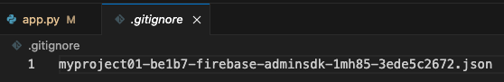

# Streamlit + Firebase Realtime Database

1. 結合即時資料庫的 Streamlit 網站。

<br>

2. 假如在本地測試運行則讀取本地的權證，所以要將權證儲存在根目錄。

<br>

3. 這是一個很簡易的示範，多次執行可能會有 Bug，若有興趣深究的同學可參考進階範例。

<br>

## 說明

_以下將程式碼分做五個部分，實作時整合在一起即可_

<br>

1. 導入函式庫。

    ```python
    import streamlit as st
    import firebase_admin
    from firebase_admin import credentials, db
    import json
    ```

<br>

2. 讀取權證。

    ```python
    # 讀取憑證
    try:
        # 嘗試載入權證，假如是在本地運行則會讀取到
        with open('myproject01-be1b7-firebase-adminsdk-1mh85-3ede5c2672.json', 'r') as f:
            FIREBASE_CONFIG_STR = json.load(f)
    except FileNotFoundError:
        # 找不到就從服務器上讀取
        FIREBASE_CONFIG_STR = st.secrets["FIREBASE_CONFIG_STR"]

    # 初始化 Firebase Admin SDK
    if not firebase_admin._apps:
        #
        cred = credentials.Certificate(FIREBASE_CONFIG_STR)
        firebase_admin.initialize_app(cred, {
            'databaseURL': 'https://myproject01-be1b7-default-rtdb.asia-southeast1.firebasedatabase.app/'
        })
    ```

<br>

3. 初始化 `Firebase Admin SDK`。

    ```python
    # 初始化 Firebase Admin SDK
    if not firebase_admin._apps:
        #
        cred = credentials.Certificate(FIREBASE_CONFIG_STR)
        firebase_admin.initialize_app(cred, {
            'databaseURL': 'https://myproject01-be1b7-default-rtdb.asia-southeast1.firebasedatabase.app/'
        })
    ```

<br>

4. 建立寫入以及讀取的函數。

    ```python
    # 寫入
    def write_to_firebase():
        ref = db.reference('data')
        ref.set({
            '新人報到': 'Hello, Firebase!'
        })

    # 讀取
    def read_from_firebase():
        ref = db.reference('data')
        data = ref.get()
        return data
    ```

<br>

5. 建立網站內容。

    ```python
    # Streamlit 網站內容
    # 標題
    st.title("Streamlit & Firebase 整合範例")
    # 按鈕
    if st.button("寫入 Firebase"):
        write_to_firebase()
        st.success("完成寫入到 Firebase 節點！")
    # 按鈕
    if st.button("讀取 Firebase"):
        data = read_from_firebase()
        if data:
            st.write(data)
        else:
            st.warning("Firebase 節點上無資料!")
    ```

<br>

6. 務必記得將權證 `.json` 檔案加入 .gitignore。

   

<br>

7. 本地運行。

    ```bash
    streamlit run app.py
    ```

<br>

___

_END：以上為簡易範例_