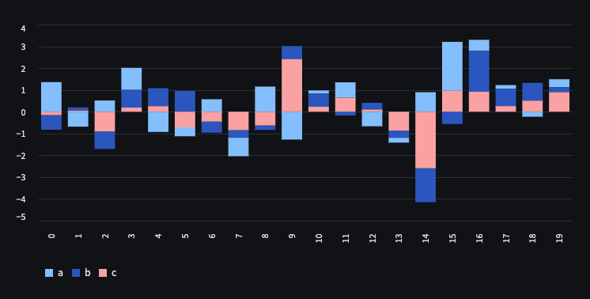

# 官網範例

<br>

## 成果


<br>

## 腳本
```python
# 官網範例
import streamlit as st
import pandas as pd
import numpy as np

chart_data = pd.DataFrame(np.random.randn(20, 3), columns=["a", "b", "c"])
st.bar_chart(chart_data)
```

<br>

_END_