# 發佈至 GitHub

</br>

## 在樹莓派建立 Git 並且發佈到 GitHub 上

_注意_

- 預設會將 `當前所在目錄` 作為儲存倉庫 `Repository` ，並以當前所在資料夾的名稱作為儲存庫名稱來建立 Git。
- 以目前所在位置 `Documents` 來說，在這建立倉庫對於日後專案管理可能會帶來困擾。
- 所以建議將資料放入其他指定的資料夾，以下進行操作。

</br>

### 📌 A. 建立專案資料夾

1. 連線後先進入 `Documents` 目錄

   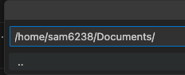
   
2. 使用終端機或直接使用圖標建立資料夾

   ```bash
   mkdir <資料夾名稱> && cd <資料夾名稱>
   ```

3. 透過指令在該資料夾內開啟新的工作視窗，這樣可以確保在正確的路徑下建立倉庫。

   ```bash
   code .
   ```

4. 先建立一個 `README.md` 檔案，內容隨意輸入。
   
   

   _以上完成本地資料準備_

</br>


### 📌 B. 先登入 GitHub 帳號密碼

1. 進入 VSCode 之後先啟動一個終端機
   
   

2. 以 Git 指令設定用戶名稱和郵箱，這不是驗證程序，只是指定作者資訊。

   ```bash
   git config --global user.name <輸入 github 名稱>
   git config --global user.email <輸入電子郵件>
   ```

   **注意**
   
   _如果用戶名是由多個單詞組成的，例如 `John Doe`，則必須使用引號包裹。_


</br>

### 📌 C. 建立版本管理 / 原始檔控制


1. 點擊 VScode 的 `原始檔控制` 。
   
   
   
2. 點擊 `發布至 GitHub` 。
   
   


3. 選擇公開或私有。

   

4. 在上面這個步驟，可以使用預設名稱，也可以自訂名稱。

   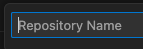

5. 選擇 `README.md` 檔案後，點擊 `確定` 。
   
      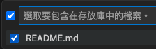
  
6. 若是第一次提交到此就完成，右下角會顯示 `在 GitHub 上開啟` 。

   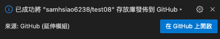

7. 若再做修改，要給該提交一個版本命名，然後 `提交` 。

      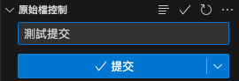

</br>

### 📌 D. 特別說明

1. `特別說明 1` 假如沒有給 `提交` 輸入說明，這裡會跳出 `COMMIT_EDITMSG`，關閉後重新輸入說明文字再重新提交即可。

   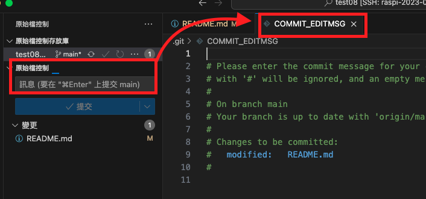

2. `特別說明 2` 假如前面沒設定 `帳號與郵件`，這裡會跳出提示，接下來可能會出現衝突，建議刪除遠端儲存庫重新建立。
   
   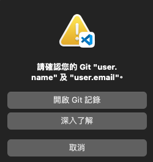

3. 完成作者資訊建立後再次提交，點擊 `發佈到分支` ，與提交不同，發佈到分支可不輸入訊息。
    
      

4. 同前述，自定義一個倉庫名稱，或使用預設。
    
    


</br>

### 📌 E. 進行查看


1. 完成後，可在 GitHub 上開啟並查看新建立的儲存倉庫以及 README.md。

      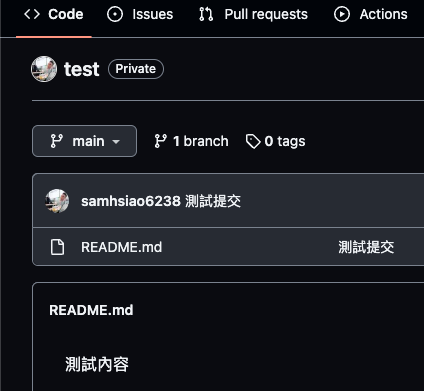


2. 在終端機中可看到 .git 資料夾，

      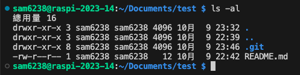

3. 資料夾內記錄各種版本控制的資訊與設定。

   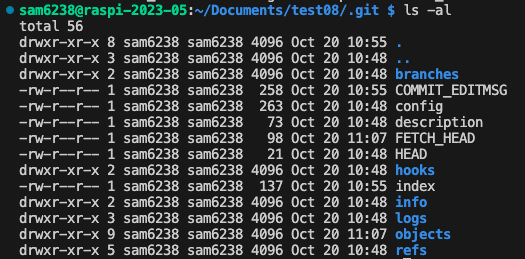

4. 可以在儲存倉庫的根目錄內手動建立 .gitignore 檔案，用於設定儲存倉庫內要 `取消追蹤` 的項目。
    
    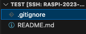

</br>

---

_END：以上成功在 GitHub 上建立新的 Repo_
