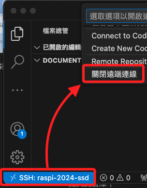
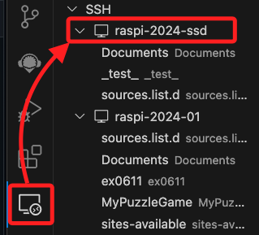

# 複製存放庫

<br>

_特別注意，務必在正確的資料夾下開啟 VSCode_

<br>

## 克隆前準備

1. 連線後如果 `已經選取資料夾` 或 `尚未登入 GitHub` 會顯示 `初始化` 或 `發佈`。

    

<br>

2. 需要設定作者名稱和電子郵件地址以進行克隆操作。

    ```bash
    git config --global user.name <輸入作者名稱>
    git config --global user.email <輸入作者電子郵件>
    ```

<br>

3. 設定完成，點擊左下角展開選單，選取 `關閉遠端連線` 然後重新登入，本來就設定好就直接關閉重新連線。

    

<br>

4. 關閉後，點擊 `遠端總管` 重新連線樹莓派的根目錄。

    

<br>

5. 接著畫面中會顯示兩個選項 `開啟資料夾` 及 `複製存放庫 Clone Repository`。

    

<br>

## 開始複製


1. 選擇 `複製存放庫`。

    

<br>

2. 從 GitHub 複製。

    

<br>

3. 選擇要複製的存放庫。

    

<br>

4. 選擇要將存放庫克隆到的本地目錄，建議放在 `Documents` 目錄下。

    

<br>

5. 一旦完成，畫面中會顯示相關的訊息，選擇 `在新視窗中開啟`，這樣就會將克隆的儲存庫作為工作區來開啟 VSCode。

    

<br>

## 本地建立檔案

1. 接著，可以嘗試手動建立一個 `.ipynb` 檔案。

    

<br>

2. VSCode 會提示安裝必要的組件。

    

<br>

3. 安裝完畢再次選擇 `.ipynb` 檔案的核心，依舊還不足以運行。

    

4. 手動到市集安裝

    

<br>

5. 接下來輸入 `jupyter` 並選取插件安裝。

    

<br>

6. 完成後點擊 `核心` 可選取 `Python 環境` 。

    

<br>

_此節說明先到此結束，目前已可以運行 .ipynb，接下來可以測試上傳，將在後面小節說明。_

<br>

1. 示範在 VSCode 中進行安裝 AWS CodeWisperer。

    

<br>

___

_END：成功複製存放庫到本地目錄_


