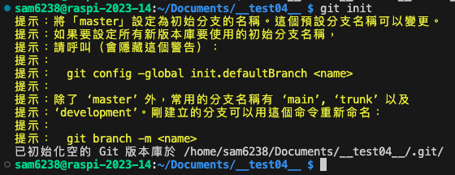
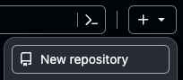
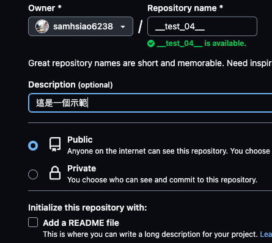
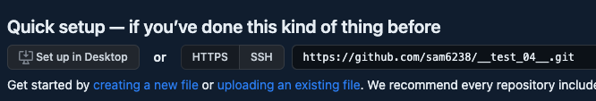
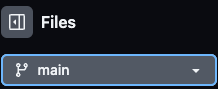
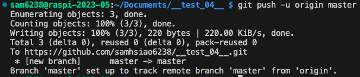
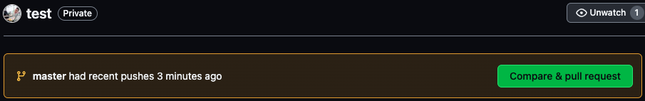
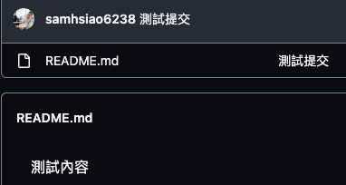

# 以指令建立倉庫的同步
_在 `本地` 與 `遠端` 皆以 `手動` 方式建立倉庫，然後進行 `串接`_

</br>


## A. 建立前的檢查與說明

1. 確保在 `Documents` 目錄下開啟終端機，並檢查在 `Documents` 目錄內沒有其他的版本控制設定資料 `.git` 。


2. 在分支的名稱上會有三個，避免在觀念上產生混淆，分別是 `本地分支名稱`、`遠端分支名稱`、`遠端分支的別名` 。


<br>

## B. 本地倉庫初始化

1. 在終端機中，新建並進入自訂的資料夾內，此處舉例名為 `__test_04__` ）。

   ```bash
   mkdir __test_04__ && cd __test_04__
   ```

2. 初始化新的 Git 倉庫

   ```bash
   git init
   ```

   

_特別注意_

- 若要透過終端機指令建立遠端倉庫，需要安裝與使用 `GitHub CLI` ，這會在下一個小節說明。
- 現在是要以手動方式在 GitHub 上建立一個新的倉庫，然後與本地倉庫串接來完成下拉、合併等同步作業。

</br>

## C. 建立遠端倉庫

1. 手動在 GitHub 上建立一個新的倉庫，

   


2. 這裡以同名倉庫舉例 `__test_04__` 。

   - 可選擇是否填寫描述。
   - 遠端不用建立 `README.md` 文件，因為之後會從本地推送到遠端。

   


3. 建立倉庫後會看到 `Quick setup`，可先複製這個 URL 供稍後使用，也可以之後再來複製。

   ```plaintext
   https://github.com/samhsiao6238/__test_04__.git
   ```

   

</br>

## D. 建立本地與遠端的連線

1. 回到 VSCode 終端機，設定遠端倉庫的連線:
   - 指令中的 `origin` 是遠端儲存庫的 `別名`，而不是 `分支名稱` 。

   ```bash
   git remote add origin https://github.com/<帳戶名稱>/<倉庫名稱>.git
   ```
   如
   ```bash
   git remote add origin https://github.com/samhsiao6238/__test_04__.git
   ```


2. 可在 GitHub 上查看分支名稱，預設通常是 `master` 或是 `main` 。
 
   


3. 在本地建立 `README.md` 文件並輸入任意內容:

   ```bash
   touch README.md
   ```


4. 加入 Git 暫存區、提交更改、推送至遠端:

   - 特別注意分支名稱是 `master`，也可以命名為 `main` 。
   - `origin` 是遠端儲存庫的別名。


   ```bash
   git add .
   git commit -m "初始化建立"
   git push -u origin master
   ```


5. 說明輸出訊息

   - `origin` 已被設定為追蹤遠端的 `master`。
   - 之後在 `origin` 上進行更多的變更時，可以簡單地使用 `git push`
  
   


6. 查看遠端 GitHub 倉庫，可看到提示有更新推送，並可點選 `Compare` 進行查看。

   


7.  可以直接觀察您 `README.md` 文件。

    


8.  之後每次要推送變更到遠端，只需執行以下指令：

    ```bash
    git add .
    git commit -m "描述您的更改"
    git push
    ```

</br>

## E. 如果 GitHub 上已經有現成倉庫

_Git 基本的克隆指令_

1. 拉取遠端倉庫內的變動，先在遠端更改，然後在本地觀察

   ```bash
   git pull
   ```

2. 拉取變動但不合併，本地文件保持不變，需執行下一個指令才會變動

   ```bash
   git fetch
   ```


3. 合併

   ```bash
   git merge
   ```

4. 查看所有分支的日誌

   ```bash
   git log --oneline --all --graph --decorate
   ```


5. 比較本地分支和遠端分支的差異

   ```bash
   git diff master..origin/master
   ```

6. 查看尚未合併到本地分支的提交

   ```bash
   git log master..origin/master
   ```

</br>


---


_END：成功在 GitHub 上建立和配置 Git 倉庫_
