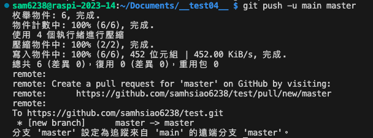

# 以指令建立倉庫同步

</br>

## 📌 如果 GitHub 上已經有現成倉庫

- Git 基本的克隆指令

| 指令          | 功能                 | 說明 |
| ------------- | -------------------- | ---- |
| `git pull`  | 拉取遠端倉庫內的變動 |      |
| `git fetch` | 拉取變動但不合併     |      |
| `git merge` | 合併                 |      |

</br>

## 📌 建立前的檢查

1. 確保在 `Documents` 目錄下開啟終端機。
2. 確保 `Documents` 根目錄內沒有其他 .git 。


</br>

## 📌 本地倉庫初始化

1. 在終端機中，新建並進入自訂的資料夾內（此處舉例名為 `__test_04__` ）:

   ```bash
   mkdir __test_04__ && cd __test_04__
   ```
2. 初始化新的 Git 倉庫:

   ```bash
   git init
   ```

   

**特別注意**

- 若要透過終端機指令建立遠端倉庫，需要使用 `GitHub CLI` ，該步驟將在後面解釋。
- 此處現是以手動方式在 GitHub 上建立一個新的倉庫然後下拉。

</br>

## 📌 建立遠端倉庫

1. 手動在 GitHub 上建立一個新的倉庫，

   
2. 這裡以同名倉庫舉例 `__test_04__` 。

   - 可選擇是否填寫描述。
   - 遠端不用建立 `README.md` 文件，因為之後會從本地推送到遠端。

   
3. 建立倉庫後，您會看到 `Quick setup`。複製該 URL 以供稍後使用, 例如:

   ```plaintext
   https://github.com/sam6238/__test_04__.git
   ```

   

</br>

## 📌 建立本地與遠端的連線

1. 回到 VSCode 終端機，設定遠端倉庫的連線:
   - 指令中的 `origin` 是遠端儲存庫的 `別名`，而不是 `分支名稱` 。

   ```bash
   git remote add origin https://github.com/sam6238/__test_04__.git
   ```
2. 可在 GitHub 上查看分支名稱，預設通常是 `master` 或是 `main` 。
 
   

3. 在本地建立 `README.md` 文件並輸入任意內容:

   ```bash
   touch README.md
   ```
4. 加入 Git 暫存區、提交更改、推送至遠端:

   - 特別注意分之名稱是 `main`
   - `master` 是本地分支名稱

   ```bash
   git add .
   git commit -m "初始化建立"
   git push -u main master
   ```

5. 輸出

   - 本地 `master`` 分支現在已被設定為追蹤遠端的 `main``
   - 之後在本地 master 分支上進行更多的變更時，可以簡單地使用 `git push`
  
   
6. 查看遠端 GitHub 倉庫，可看到提示有更新推送，並可點選 `Compare` 進行查看。

   
7.  可以直接觀察您 `README.md` 文件。

    
8.  之後每次要推送變更到遠端，只需執行以下指令：

    ```bash
    git add .
    git commit -m "描述您的更改"
    git push
    ```

</br>

---

**END：成功在 GitHub 上建立和配置 Git 倉庫。**
