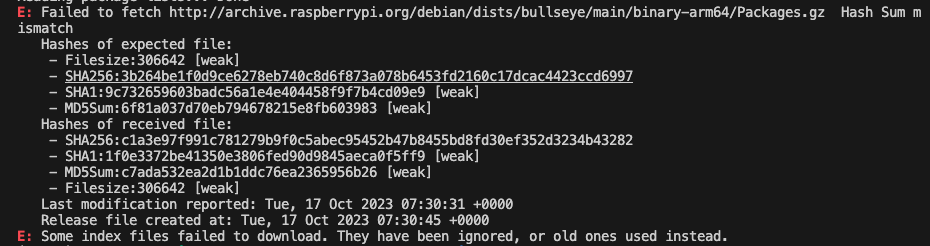
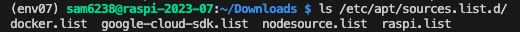
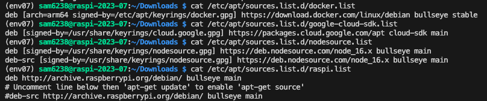
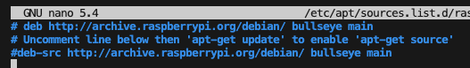
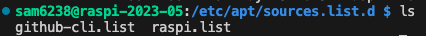
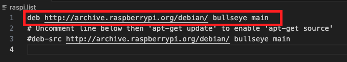
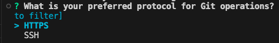
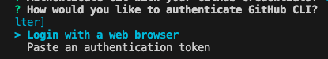

# 安裝 GitHub CLI

- 樹莓派已經內建了 `git`，但如果要使用 GitHub 的特定功能，則需要自行安裝 `GitHub CLI` 。

<br>

_懶得看這些說明可以直接跳到 C. 安裝與確認指令_

<br>

## A. git 與 GitHub CLI 有何不同 ❓

- 說明：
    1. `git` 和 `GitHub CLI` 是兩個不同的工具，雖然兩者都是對 GitHub 操作的工具，但功能和用途有差異。
    2. `git` 是一個 `分布式版本控制系統` ，適用於 `版本管理` 。 
    3. `GitHub CLI` 專為 GitHub 平台設計，除了完成 git 的基本操作外，還可以直接在終端機中進行 GitHub 的特定操作。

- 自動化腳本：可以建立自動化腳本，以簡化長指令的操作。
  
  _後面會說明_

<br>

## B. 安裝步驟

1. 訪問 [GitHub CLI 官網](https://cli.github.com/).
2. 點擊 `Manual` 並進入 `Installation` 下的 `README`.
3. 在 `Linux & BSD` 部分，選擇 `Linux & BSD installation`.
4. 複製提供的安裝指令 `如下` 。

<br>

## C. 安裝與確認指令
- 在樹莓派終端機中，執行以下指令：

    ```bash
    type -p curl >/dev/null || (sudo apt update && sudo apt install curl -y)
    curl -fsSL https://cli.github.com/packages/githubcli-archive-keyring.gpg | sudo dd of=/usr/share/keyrings/githubcli-archive-keyring.gpg \
    && sudo chmod go+r /usr/share/keyrings/githubcli-archive-keyring.gpg \
    && echo "deb [arch=$(dpkg --print-architecture) signed-by=/usr/share/keyrings/githubcli-archive-keyring.gpg] https://cli.github.com/packages stable main" | sudo tee /etc/apt/sources.list.d/github-cli.list > /dev/null \
    && sudo apt update \
    && sudo apt install gh -y
    ```

- 安裝完成後，檢查版本：

    ```bash
    gh --version
    ```

<br>

## D. 錯誤排除
1. 安裝過程若出現 `Hash Sum mismatch` 錯誤，這是一個常見的更新問題 `APT（Advanced Package Tool）` 。
- 先將錯誤的儲存庫網址記錄下來

  


2. 查看 sources.list.d 目錄下所有文件

    ```bash
    ls /etc/apt/sources.list.d/
    ```

3. 會出現幾個檔案

   

4. 逐一查看內容

    ```bash
    cat /etc/apt/sources.list.d/<文件名>
    ```

    

5. 對有疑問的儲存庫進行編輯

    ```bash
    sudo nano /etc/apt/sources.list.d/<疑似錯誤的儲存庫>
    ```

6. 將引發錯誤的儲存庫標註排除
   
   

7. 再次進行更新後安裝

    ```bash
    sudo apt update
    ```

<br>

## D. 使用 VSCode 對以上問題進行修正

1. 切換到指定資料夾

    ```bash
    cd /etc/apt/sources.list.d
    ```

2. 查詢有哪些檔案
    
    ```bash
    ls
    ```
   
   

3. 可先查看再對要修改的檔案進行授權，查看部分參考前一小段說明。

    ```bash
    sudo chmod 777 /etc/apt/sources.list.d/raspi.list
    ```

4. 開啟資料夾逐一進行檢查與修改

    ```bash
    code .
    ```


4. 某個來源有問題就把它註解

   

5. 完成後可恢復原本授權，授權之前使用 `ls` 指令查詢，比如說 `-rw-r--r--` 就代表 `644`。

    ```bash
    sudo chmod 644 /etc/apt/sources.list.d
    ```

<br>

## E. 登入
- 安裝好之後可透過指令進行登入

1. 使用 gh 進行登入。

    ```bash
    gh auth login
    ```

2. 選擇 `GitHub.com`.

    

3. 選擇 `HTTPS`

    

4. 授權 `y`

   

5. 透過瀏覽器

   

6. 複製這串代碼，點擊 `ENTER` 開啟瀏覽器。

   

7. 將此代碼輸入到網頁瀏覽器中

   

8. 跟隨網頁上的指示完成授權。

   

9.  完成手機驗證後完成登入 GitHub CLI。

    

<br>

---

_END：以上完成安裝以及登入_