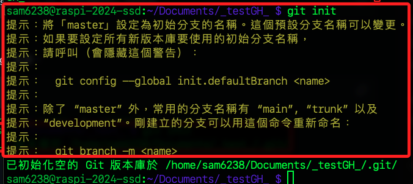

# 使用 gh 建立新倉庫

_利用 `gh`（GitHub CLI）工具建立遠端倉庫，並且與本地倉庫進行關聯_

<br>

## 步驟說明

1. 首先，建立一個新的目錄並進入該目錄。

    ```bash
    mkdir -p ~/Documents/_testGH_ && cd ~/Documents/_testGH_
    ```

<br>

2. 在此資料夾內初始化一個新的 git 倉庫。

    ```bash
    git init
    ```

    

<br>

3. 使用 `gh` 工具建立一個遠端倉庫，這個名稱是遠端倉庫名稱，可以選擇公開或私有。

    ```bash
    gh repo create _testGH_ --public
    ```

    _輸出_

    ```bash
    ✓ Created repository samhsiao6238/_test_ on GitHub
    https://github.com/samhsiao6238/_testGH_
    ```

<br>

4. 將遠端倉庫的網址添加到本地倉庫的 remote。

    ```bash
    git remote add origin https://github.com/samhsiao6238/_testGH_.git
    ```

<br>

5. 建立一個新的 README.md 檔案，並將一些資料添加到該檔案。

    ```bash
    echo "# My New Repository" >> README.md
    ```

<br>

6. 添加和提交變更。

    ```bash
    git add .
    git commit -m "Init commit"
    ```

<br>

7. 將變更推送到遠端的 `main` 分支。

    ```bash
    git push -u origin main
    ```

<br>

___

_END_