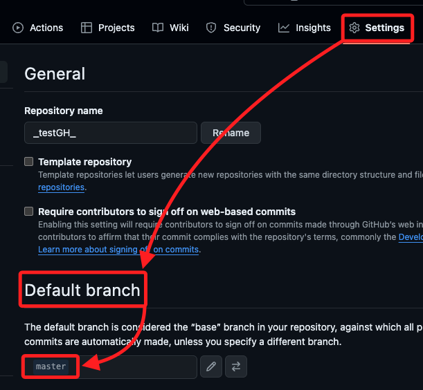
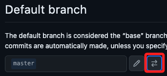
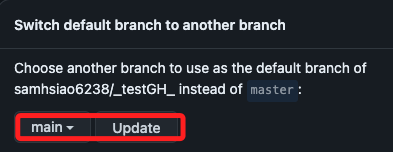

# 使用 gh 建立新倉庫

_利用 `gh`（GitHub CLI）工具建立遠端倉庫，並且與本地倉庫進行關聯_

<br>


## 步驟說明

1. 首先，建立一個新的目錄並進入該目錄。

    ```bash
    mkdir -p ~/Documents/_testGH_ && cd ~/Documents/_testGH_
    ```

<br>

2. 在此資料夾內初始化一個新的 git 倉庫；關於這個黃色警告，將在最後面 _補充說明_。

    ```bash
    git init
    ```

    

<br>

3. 使用 `gh` 工具建立一個遠端倉庫，這個名稱是遠端倉庫名稱，可以選擇公開或私有。

    ```bash
    gh repo create _testGH_ --public
    ```

    _輸出_

    ```bash
    ✓ Created repository samhsiao6238/_test_ on GitHub
    https://github.com/samhsiao6238/_testGH_
    ```

<br>

4. 將遠端倉庫的網址添加到本地倉庫的 remote。

    ```bash
    git remote add origin https://github.com/samhsiao6238/_testGH_.git
    ```

<br>

5. 建立一個新的 README.md 檔案，並將一些資料添加到該檔案。

    ```bash
    echo "# My New Repository" >> README.md
    ```

<br>

6. 添加和提交變更。

    ```bash
    git add . && git commit -m "init commit"
    ```

    _輸出_

    ```bash
    [master (根提交) 714191d] init commit
    1 file changed, 1 insertion(+)
    create mode 100644 README.md
    ```

<br>

7. 將變更推送到遠端的 `master` 分支；特別注意，這個 master 是預設的，在這無法變更。

    ```bash
    git push -u origin master
    ```

    _輸出_

    ```bash
    枚舉物件: 3, 完成.
    物件計數中: 100% (3/3), 完成.
    寫入物件中: 100% (3/3), 232 位元組 | 232.00 KiB/s, 完成.
    總共 3 (差異 0)，復用 0 (差異 0)，重用包 0
    To https://github.com/samhsiao6238/_testGH_.git
    * [new branch]      master -> master
    已將 “master” 分支設定為追蹤 “origin/master”。
    ```

<br>

## 補充說明


<br>

1. 當在 Git 中執行 `git init` 時，它會初始化一個新的 Git 儲存庫，並建立一個名為`master` 的預設分支，而這個預設名稱從 2020 年在許多開源項目和平台包括 GitHub 開始推動改用 `main`，這是因為名稱中隱含了貶義詞 `奴性` 的關係。

<br>

2. 新的 Git 版本預設已改用 `main` 作為初始分支名稱，但在某些版本中仍使用 `master`，但可手動進行全局配置，將預設值改為 `main`。

    ```bash
    git config --global init.defaultBranch main
    ```

<br>

3. 如果要對已經初始化的儲存庫 `master` 重新命名為 `main`，首先重命名本地分支。

    ```bash
    git branch -m master main
    ```

<br>

4. 推送重命名後的分支到遠端。 

    ```bash
    git push -u origin main
    ```

    _輸出_

    ```bash
    remote: 
    remote: Create a pull request for 'main' on GitHub by visiting:
    remote:      https://github.com/samhsiao6238/_testGH_/pull/new/main
    remote: 
    To https://github.com/samhsiao6238/_testGH_.git
    * [new branch]      main -> main
    已將 “main” 分支設定為追蹤 “origin/main”。
    ```

<br>

5. 在 GitHub 上更改預設分支。

    

<br>

6. 點擊 `Switch`。

    

<br>

7. 切換為 `main` 之後點擊 `update`。

    

<br>

8. 點擊理解且確認。

    

<br>

9. 刪除遠端的 master 分支。

    ```bash
    git push origin --delete master
    ```

    _輸出_

    ```bash
    To https://github.com/samhsiao6238/_testGH_.git
    - [deleted]         master
    ```

<br>

## 檢查

_可使用以下方法確認分支已經成功變更_

<br>

1. 檢查本地當前分支。

    ```bash
    git branch
    ```

<br>

2. 確認遠端 `main` 分支存在。

    ```bash
    git branch -r
    ```

<br>

3. 可推送更改以確認遠端倉庫的狀態。

    ```bash
    git push origin main
    ```

<br>

___

_END_