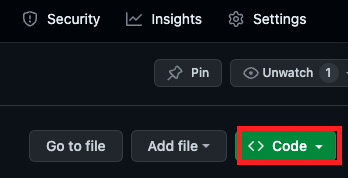
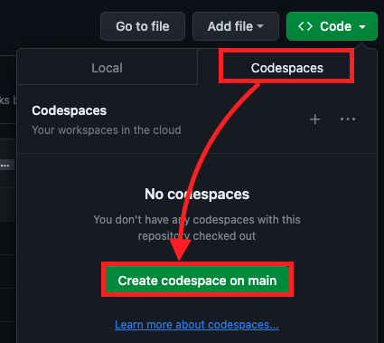
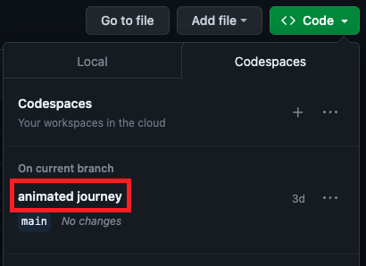
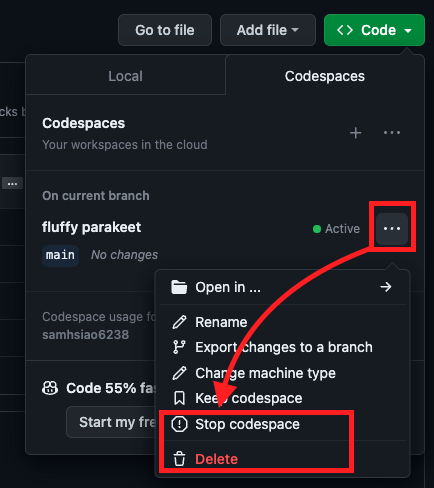

# 在 GitHub 上建立 Codespace 開發環境

 

## 步驟
1. 進入 Repo，點擊 `Code`

    

2. 點選 `Codespaces` 然後點選 `Create codespace on main`

    

3. 以上就會開啟一個雲端的開發環境，畫面跟 VSCode 一樣。

4. 已經建立的話，點擊虛擬機開啟

    

5. 會看到在倉庫中正在開啟 Codespace

    

6. 點擊 `...` 可以 `Stop` 或是 `Delete` 

    

 

---

_END_