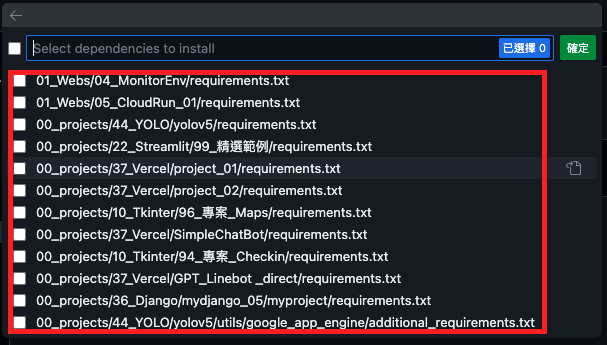

# 在 Codespace 中建立 Python 預設的虛擬環境

 

## .ipynb

1. 開啟任一 `.ipynb` 檔案，沒有的話請任意建立

   
2. 點擊工作區右上方的 `選取核心`

   
3. 選取 `Python Environments`

   
4. 這時還沒建立虛擬環境，所以選擇 `Create Python Environment`

   
5. 選擇 Python 內建的 Venv

   
6. 選取合適或目標版本，這是示範使用 `/usr/bin/python3`

   
7. Codespace 會自動偵測資料夾內所有的套件管理檔案 `requirements.txt`，詢問是否安裝，可以跳過。

   
8. 畫面右下角會顯示訊息，系統進行必要安裝。

   
9. 完成時，前面步驟所建立的核心會顯示在右上方選取欄位中

   
10. 點擊可以查看選取，或再建立其他版本的核心

    

 

## .py 檔案

1. 再建立一個測試用的 .py 檔案

   

2. 開啟檔案後，下方會顯示選取的核心，假如沒有，點擊 Pyhon 。
 
   

3. 上方訊息框輸入 `Python` 之後選取 `Python`

   

4. 這時應該就會顯示虛擬環境了。

   

 

---

_END_