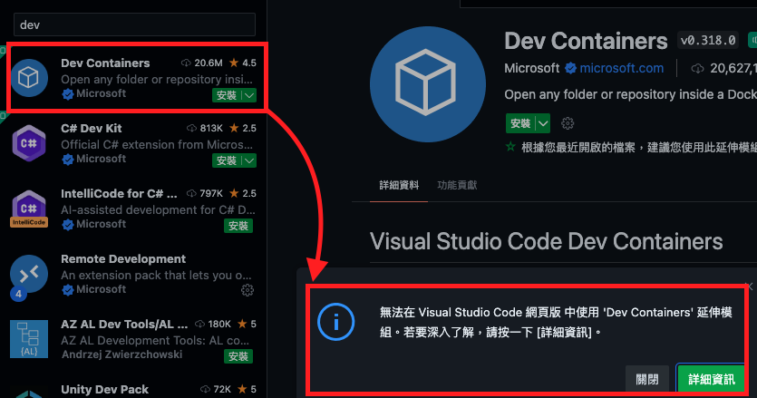
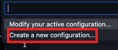
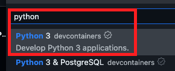
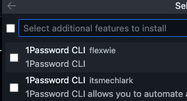

# 使用 .devcontainer

</br>

## 說明


1. 在 Codespaces 中並不需要安裝 `Dev Containers` 插件，因為 Codespaces 本質上就是基於容器技術的，在 Codespaces 中開啟一個專案，會自動建立一個遠端的開發環境，這個環境就是一個容器。

    


2. 雖然不用手動建立容器，但 `devcontainer.json` 在 Codespaces 中還是有用途的，當打開一個儲存庫，Codespaces 會先檢查該儲存庫中是否存在 `.devcontainer/devcontainer.json` 文件，如果存在就會使用該文件中的配置來建立和啟動容器。

3. 基於以上這樣的機制，在 GitHub Codespaces 中使用 `devcontainer.json` 便可使雲端與本地的開發環境一致，同樣的，協作者只要遵循 `devcontainer.json` 配置，就會得到相同的開發環境。

</br>

## 步驟

1. 開啟 `命令選擇區`

   

2. 輸入 `devcontainer` 並選擇添加容器

   

3. 建立一個新的設定

   

4. 輸入關鍵字 `python` 進行查詢並選擇

   

5. 選擇預設的 `3.11-bullseye`，從名稱可以看出這個版本是基於 Debian 的 `bullseye` 建立的。
   

6. 預設的功能可以先跳過，按下 `確定`

    

7. 按下 `rebuild` 開始建立容器

   

8. 完成時會添加一個資料夾 `.devcontainer` 以及一個設定檔案 `devcontainer.json`
   
   


</br>

## 檢查與觀察

1. 在這個容器中執行指令查詢 Python 安裝版本
   ```bash
   python --version
   ```
   結果是 `3.11`

   

2. 自訂 `.json` 內容，指定使用 python:3.9-slim-buster 映像，並在容器建立後升級 pip。
```json
{
    "name": "Python 3.9 Development",
    "image": "python:3.9-slim-buster",
    "postCreateCommand": "pip install --upgrade pip",
    "settings": {
        "terminal.integrated.shell.linux": "/bin/bash"
    },
    "extensions": ["ms-python.python"]
}
```

3. 切記要先提交

   
   

   