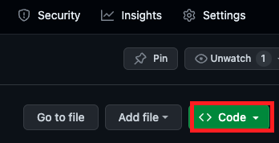

# 在 GitHub 上建立 Codespaces 開發環境
- 官網名稱是包含複數 `s` 的 `Codespaces`，講義中若有誤植單數者請見諒。

 

## 步驟

1. 進入 Repo，點擊 `Code`

   

 

2. 點選 `Codespaces` 然後點選 `Create codespace on main`

   

 

3. 以上就會開啟一個雲端的開發環境，畫面跟 VSCode 一樣。

 

4. 已經建立的話，點擊虛擬機開啟

   

 

5. 會看到在倉庫中正在開啟 Codespaces

   

 

6. 假如開啟的 Codespace 數量超過會顯示警告

   

 

7. 點擊 `...` 可以 `Stop` 或是 `Delete`

   

 

---

_END_
