# 使用 .devcontainer

</br>

## 說明


1. 在 Codespaces 中並不需要安裝 `Dev Containers` 插件，因為 Codespaces 本質上就是基於容器技術的，在 Codespaces 中開啟一個專案，會自動建立一個遠端的開發環境，這個環境就是一個容器。

    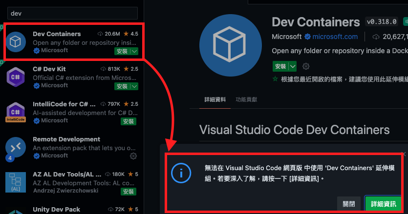


2. 雖然不用手動建立容器，但 `devcontainer.json` 在 Codespaces 中還是有用途的，當打開一個儲存庫，Codespaces 會先檢查該儲存庫中是否存在 `.devcontainer/devcontainer.json` 文件，如果存在就會使用該文件中的配置來建立和啟動容器。

3. 基於以上這樣的機制，在 GitHub Codespaces 中使用 `devcontainer.json` 便可使雲端與本地的開發環境一致，同樣的，協作者只要遵循 `devcontainer.json` 配置，就會得到相同的開發環境。

</br>

## 步驟

1. 開啟 `命令選擇區`

   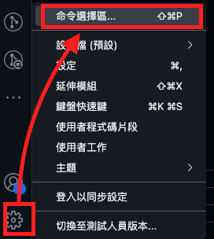

</br>

2. 輸入 `devcontainer` 並選擇添加容器

   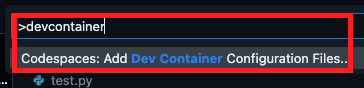

</br>

3. 建立一個新的設定

   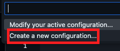

</br>

4. 輸入關鍵字 `python` 進行查詢並選擇

   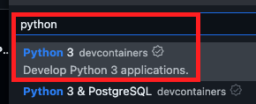

</br>

5. 選擇預設的 `3.11-bullseye`，從名稱可以看出這個版本是基於 Debian 的 `bullseye` 建立的。
   
   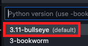

</br>

6. 預設的功能可以先跳過，按下 `確定`。

    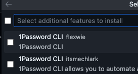

</br>

7. 按下 `rebuild` 開始建立容器

   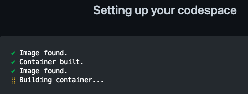

</br>

8. 完成時會添加一個資料夾 `.devcontainer` 以及一個設定檔案 `devcontainer.json`
   
   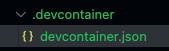

</br>

## 檢查與觀察

1. 在這個容器中執行指令查詢 Python 安裝版本

   ```bash
   python --version
   ```
   結果是 `3.11`

   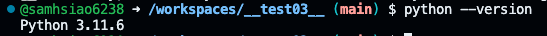

</br>

2. 自訂 `.json` 內容，指定使用 python:3.9-slim-buster 映像，並在容器建立後升級 pip。

   ```json
   {
      "name": "Python 3.9 Development",
      "image": "python:3.9-slim-buster",
      "postCreateCommand": "pip install --upgrade pip",
      "settings": {
         "terminal.integrated.shell.linux": "/bin/bash"
      },
      "extensions": ["ms-python.python"]
   }
   ```

</br>

3. 切記要先提交

   

</br>

4. 點擊左下角連線訊息框

   

</br>

5. 停止當前 Codespaces

   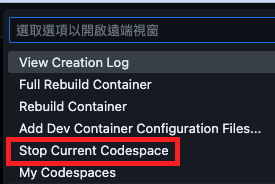

</br>
   
6. 刪除 Codespace，直接重建也是可以，這裡刪除主要是用來觀察整個容器的設置。

   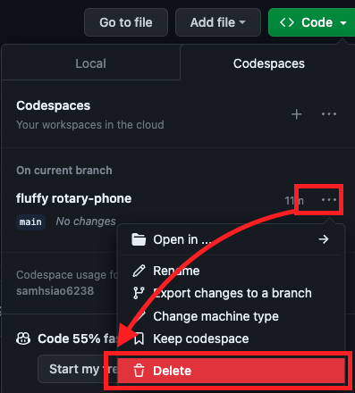

</br>

7. 重新建立 Codespaces，或是重建容器也可以
   
   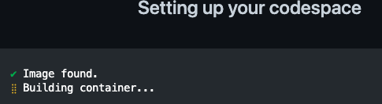

</br>

_⚠️ 啟動後會因為容器特性出現一些警告或提示，暫時不予理會_

</br>

8. 查詢 Python 版本，確實為設定檔案所指定的版本。

   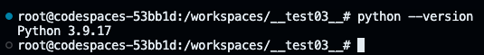

</br>

### 補充說明

1. 使用指定的 Docker 映像，特別是官方的基礎映像時，通常預設會以 `root` 使用者運行，除非映像本身有明確的指示，或建立映像時在 Dockerfile 或 devcontainer.json 中指定了使用者。

   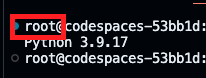

</br>

2. `python:3.9-slim-buster` 是一個輕量化的映像，這類映像可能不包含一些標準工具，比如 `git` ，若需要使用則手動進行安裝。

</br>

## 進階設定 Dockerfile

1. 先在 `.devcontainer` 目錄中創建一個 `Dockerfile`，這可達成在想要的映像上安裝其他工具。

   ```ini
   # 使用指定映像
   FROM python:3.9-slim-buster

   # 安裝必要庫
   RUN apt-get update && apt-get install -y git zsh && rm -rf /var/lib/apt/lists/*

   # (可選，僅供參考) 建立並切換使用者
   # RUN useradd -m myuser
   RUN useradd -m -s /bin/zsh myuser
   USER myuser
   ```

</br>

2. 建立檔案之後會提示安裝延伸模組 `Docker`

   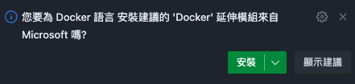

3. 接著修改 `devcontainer.json` 中的 `image`，將原本所指向的映像改變為 `Dockerfile` 。

   ```json
   {
      // "name": "Python 3.9 Development",
      "name": "Python 3.9 Development V2",
      // "image": "python:3.9-slim-buster",
      "build": {
         "dockerfile": "Dockerfile"
      },
      "postCreateCommand": "pip install --upgrade pip",
      "settings": {
         // 預設也是使用 bash
         // "terminal.integrated.shell.linux": "/bin/bash"
      },
      "extensions": ["ms-python.python"],
   }
   ```

</br>

4. 這次直接選擇 `Rebuild Container`

   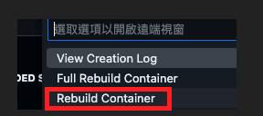

</br>

5. 套出警告，點擊重建即可

   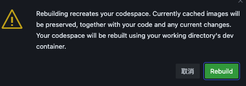

</br>

6. 重建後會再次提示安裝插件

   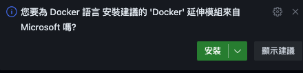

</br>

7. 透過指令 `groups` 查詢使用者
   
   

</br>

8. 同樣也可以查詢 `git` 的版本

   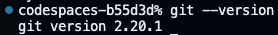

</br>

9. 當前所在路徑 `pwd`

    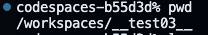

</br>

### 補充說明

1. 在用戶資訊部分所顯示的 `codespaces-b55d3d` 是目前所在的 Codespaces 環境識別符號。

   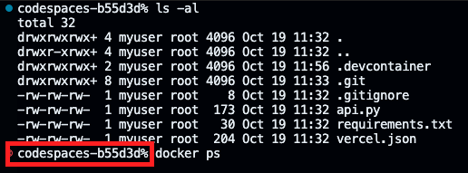

</br>
   
2. 進入這個容器時所安裝的 Docker 插件是用來解釋、運行這個容器，而不是在這個容器之內，所以在這裡查詢指令 `docker ps` 的結果是找不到指令的，必須在容器內再安裝 Docker 才可以識別，但這是無意義的。

    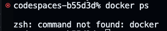

</br>

---

_END_