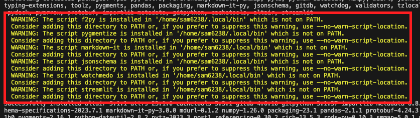
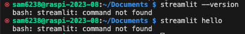
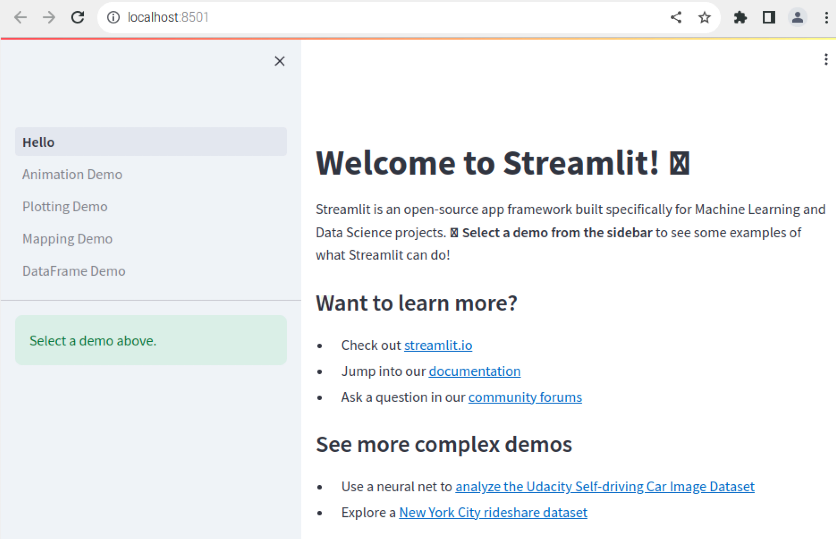
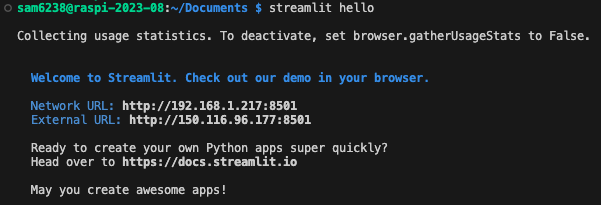
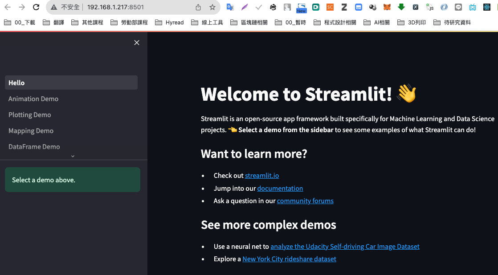
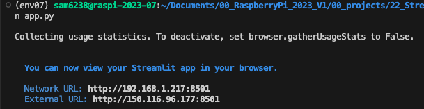

*上課實作*

# Streamlit
- 專為創建數據應用程式而設計的 Python 框架

</br>

## 簡介

- [官方文檔](https://docs.streamlit.io/library/get-started)。
- GitHub 與各種雲端的串接很多，Streamlit 只是其一。
- Streamlit 發佈於 2019，很年輕的函式庫。

</br>

## 開始
- 以下實作在 Codespace 或本地 VScode 上開發皆可。

1. 安裝

   - 需要一段時間，因為會附帶很多資料科學相關套件如 numpy

   ```bash
   pip install streamlit
   ```

2. 出現以下警告

   - 描述說套件已經成功安裝，但是有些命令行腳本被安裝在
  
    

   - 這些腳本包含 

        |序|  腳本名稱 |   說明    |
        |---|----------|------------------------------------|
        |1 | keygenf2py|	用於將Fortran代碼綁定到Python，從而允許從Python調用Fortran函數。|
        |2|	pygmentize|	來自Pygments包，用於將源代碼高亮顯示為彩色文本或HTML。|
        |3|	markdown-it|	用於將Markdown文本轉換為HTML。|
        |4|	jsonschema|	用於驗證JSON對象是否滿足特定的JSON模式。|
        |5|	watchmedo|	來自watchdog包，用於監控文件系統事件。|
        |6|	streamlit|	用於快速創建數據應用的Web應用。|

3. 確認是否安裝完成

    ```bash
    streamlit --version
    ```
    或
    ```bash
    streamlit hello
    ```

4. 安裝好的時候會顯示找不到執行檔案

    

</br>

## 編輯環境參數

1. 編輯環境參數的設定檔案
    ```bash
    sudo nano ~/.bashrc
    ```

2. 加在最後即可

   ```bash
   export PATH="$PATH:<警告訊息中提示要加入環境參數的路徑>"
   ```
   如   

   ```bash
   export PATH="$PATH:/home/sam6238/.local/bin"
   ```

3. 存檔後重新加載 `.bashrc` 讓設定生效

    ```bash
    source ~/.bashrc
    ```

</br>

## 測試

1. 再次測試
   
   ```bash
   streamlit hello
   ```

2. 若是在樹莓派上運行會出現
   - 樹莓派自動開啟網頁

   

3. 假如不是在樹莓派上運行
   
   

4. [開啟網址](http://192.168.1.217:8501)

    

</br>

_🔺 以上完成套件的安裝  🔻 以下開始建立自己的網站_

</br>

## 建立網站檔案

1. 建立一個專案資料夾
   - 建議不要將專案資料夾放在 Git 倉庫的子資料夾內。
   - 因為嵌套的 Git 需要更多的使用經驗以及技巧。

   ```bash
   mkdir <專案資料夾> && cd <專案資料夾>
   ```

2. 添加專案檔案，名稱可以自訂，一般使用 `app.py`

    ```python
    import streamlit as st
    st.title('我的第一個 Streamlit 應用')
    st.write('您好，歡迎使用 Streamlit！')
    # 使用者輸入
    user_input = st.text_input('請輸入一些文字')
    st.write('您輸入的文字是：', user_input)
    # 數字滑框
    number = st.slider('選擇一個數字', min_value=1, max_value=100)
    st.write('您選擇的數字是：', number)
    ```

3. 關於腳本快速鍵請參考 ` 建立 Snippets ` 介紹

4. 在終端機要透過執行檔案調用腳本
   
   ```bash
   streamlit run app.py
   ```
    
    

5. 開啟網址
 
   

</br>

## 在 Codespace 中運行 Streamlit
- Codespace 提供了一個隔離的開發環境，不一定允許所有的外部連接。
- 可透過幾種方式來解決這個問題，以下提供其中之一。

</br>

1. 進入配置檔案

   ```bash
   cd ~/.streamlit
   ```

2. 假如不存在，開啟終端機建立配置檔案

   ```bash
   mkdir ~/.streamlit
   ```

3. 編輯設定檔案

   ```bash
   code config.toml
   ```

4. 加入以下內容以確保 Streamlit 允許所有 IP 地址連接

   ```toml
   [server]
   enableCORS = false
   enableXsrfProtection = false
   ```

5. 重新運行 Streamlit 專案

   ```python
   streamlit run <專案.app>
   ```

</br>

---

_END_