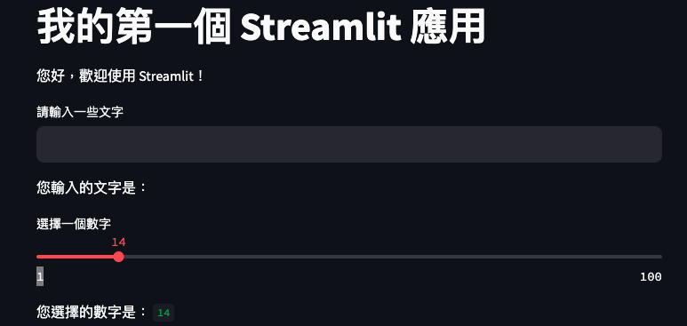
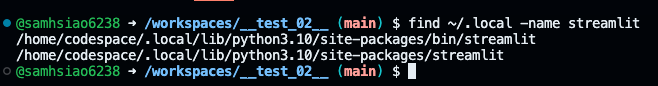
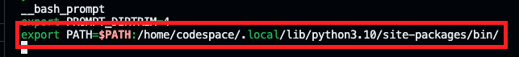
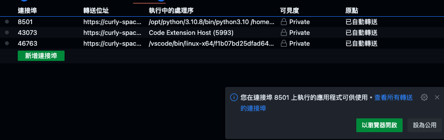
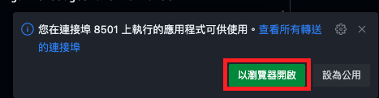
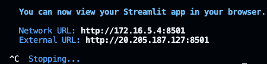

# Streamlit

_專為建立數據應用程式而設計的 Python 框架_

<br>

## 簡介

1. [官方文件](https://docs.streamlit.io/library/get-started)。

<br>

2. GitHub 與各種雲端的串接很多，Streamlit 只是其一。

<br>

3. Streamlit 發佈於 2019，很年輕的函式庫。

<br>

## 開始

_以下實作在 Codespace 或本地 VScode 上開發皆可。_

<br>

1. 安裝：需要一段時間，因為會附帶很多資料科學相關套件如 numpy。

   ```bash
   pip install streamlit
   ```

<br>

2. 出現以下警告：描述說套件已經成功安裝，但是有些命令行腳本被安裝在。

   

   ```bash
   # 用於將 Fortran 代碼綁定到 Python，從而允許從Python調用 Fortran 函數
   keygenf2py
   # 來自 Pygments包，用於將源代碼高亮顯示為彩色文本或 HTML
   pygmentize
   # 用於將 Markdown 文本轉換為 HTML
   markdown-it
   # 用於驗證 JSON 對象是否滿足特定的 JSON 模式
   jsonschema
   # 來自 watchdog 包，用於監控文件系統事件
   watchmedo
   # 用於快速建立數據應用的Web應用
   streamlit
   ```

<br>

3. 確認是否安裝完成。

   ```bash
   streamlit --version
   ```

   或

   ```bash
   streamlit hello
   ```

<br>

4. 安裝好的時候會顯示找不到執行檔案。

   

<br>

## 編輯環境參數

1. 編輯環境參數的設定檔案。

   ```bash
   sudo nano ~/.bashrc
   ```

<br>

2. 加在最後即可。

   ```bash
   export PATH="$PATH:<警告訊息中提示要加入環境參數的路徑>"
   ```
   如   

   ```bash
   export PATH="$PATH:/home/sam6238/.local/bin"
   ```

<br>

3. 存檔後重新加載 `.bashrc` 讓設定生效。

   ```bash
   source ~/.bashrc
   ```

<br>

## 測試

1. 再次測試。
   
   ```bash
   streamlit hello
   ```

<br>

2. 若是在樹莓派上運行會出現：樹莓派自動開啟網頁。

   

<br>

3. 假如不是在樹莓派上運行。
   
   

<br>

4. [開啟網址](http://192.168.1.217:8501)。

   

<br>

_🔺 以上完成套件的安裝  🔻 以下開始建立自己的網站_

<br>

## 建立網站檔案

1. 建立一個專案資料夾：建議不要將專案資料夾放在 Git 倉庫的子資料夾內，因為嵌套的 Git 需要更多的使用經驗以及技巧。

   ```bash
   mkdir <專案資料夾> && cd <專案資料夾>
   ```

<br>

2. 添加專案檔案，名稱可以自訂，一般使用 `app.py`。

   ```python
   import streamlit as st
   st.title('我的第一個 Streamlit 應用')
   st.write('您好，歡迎使用 Streamlit！')
   # 使用者輸入
   user_input = st.text_input('請輸入一些文字')
   st.write('您輸入的文字是：', user_input)
   # 數字滑框
   number = st.slider('選擇一個數字', min_value=1, max_value=100)
   st.write('您選擇的數字是：', number)
   ```

<br>

3. 關於腳本快速鍵請參考 ` 建立 Snippets ` 介紹。

<br>

4. 在終端機要透過執行檔案調用腳本。

   ```bash
   streamlit run app.py
   ```

   

<br>

5. 開啟網址。

   

<br>

## 在 Codespace 中運行 Streamlit

_設置環境變數_

<br>

### 設置環境變數

1. 查詢在 Codespace 中的安裝路徑。

   ```bash
   find ~/.local -name streamlit
   ```
   結果

   

<br>

2. 加入環境參數。

   ```bash
   echo 'export PATH=$PATH:/home/codespace/.local/lib/python3.10/site-packages/bin/' >> ~/.bashrc
   ```

<br>

3. 可透過指令觀察。

   ```bash
   cat ~/.bashrc
   ```

   如下

   

<br>

4. 載入設定。

   ```bash
   source ~/.bashrc
   ```

<br>

5. 在 Codespace 中會自訂轉接埠。

   

<br>

6. 點擊在瀏覽器中開啟。

   

<br>

7. 若要停止運行，在終端機按下 `CTRL` + `C`。

   

<br>

### 特殊狀況

_若需要手動開啟允許 IP 連接_

<br>

1. 進入配置檔案。

   ```bash
   cd ~/.streamlit
   ```

<br>

2. 假如不存在，開啟終端機建立配置檔案。

   ```bash
   mkdir ~/.streamlit
   ```

<br>

3. 編輯設定檔案。

   ```bash
   code config.toml
   ```

<br>

4. 加入以下內容。

   ```ini
   [server]
   enableCORS = false
   enableXsrfProtection = false
   ```

<br>

5. 重新運行 Streamlit 專案。

   ```bash
   streamlit run <專案.app>
   ```

<br>

___

_END_