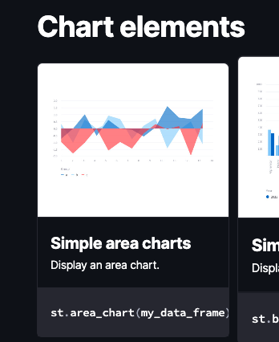
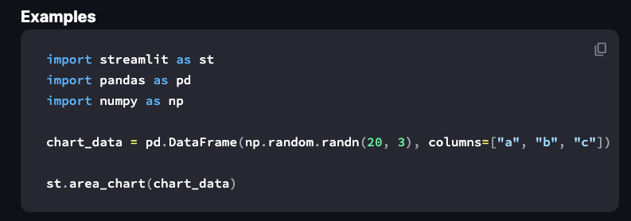
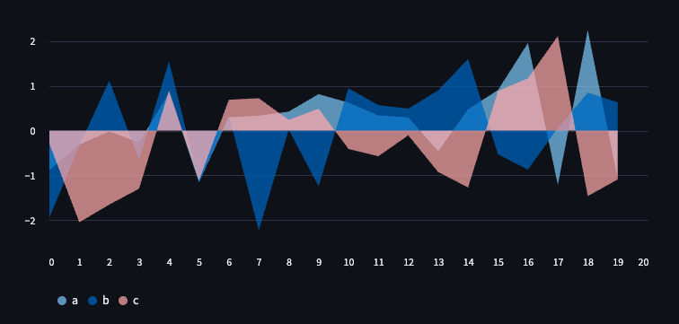

# 官網範例

[官網網址](https://docs.streamlit.io/)

</br>

## 導覽

1. 可選取 `API reference` 查看
    
    

</br>

2. 可以查看其中 `Chart elements`
    
    

</br>

3. 點擊後複製其中腳本

    

</br>

4. 複製程式碼

    ```python
    import streamlit as st
    import pandas as pd
    import numpy as np
    chart_data = pd.DataFrame(np.random.randn(20, 3), columns=["a", "b", "c"])
    st.area_chart(chart_data)
    ```
</br>

5. 假如還沒安裝，可先安裝必要的套件（不過應該預設安裝了）。

    ```bash
    pip install pandas numpy
    ```

</br>

6. 結果

    

</br>

___

_END：以上簡單介紹官網範例的引用_