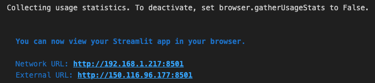

# 開發階段的簡易運行

- 在開發階段可直接在 Jupyter Notebook 中運行 Streamlit 專案

- 省去測試階段在終端機運行的麻煩

- 利用 Jupyter Notebook 魔法命令達成目的

</br>

## 魔法命令

1. 三種主要的前綴。

   - `%` ：魔法指令，僅對單行的指令起作用。

   - `%%` ：單元魔法指令，影響整個單元格的內容。

   - `!` ：允許直接在 Jupyter Notebook 中運行 shell 命令。

</br>

2. 儲存為檔案。
   
   ```bash
   %%writefile temp_app.py
   ```
</br>

3. 然後再另一個儲存格執行單行魔法指令。

   ```bash
   !streamlit run temp_app.py
   ```

<br>

## 範例

1. 第一個儲存格。
   
   ```python
   %%writefile temp_app.py
   import streamlit as st
   import matplotlib.pyplot as plt
   import numpy as np
   st.title('Streamlit 與 Matplotlib')
   fig, ax = plt.subplots()
   x = np.linspace(0, 20, 100)
   ax.plot(x, np.sin(x))
   st.pyplot(fig)
   st.write('這是一個使用 Matplotlib 在 Streamlit 上繪製的線圖。')
   ```

<br>

2. 第二個儲存格。
   
   ```python
   !streamlit run temp_app.py
   ```

<br>

3. 運行結果。
   
   

<br>

4. 點擊 `以瀏覽器開啟`。

   

<br>

___

_END：以上示範在 Jupyter Notebook 中直接運行 Streamlit 腳本_