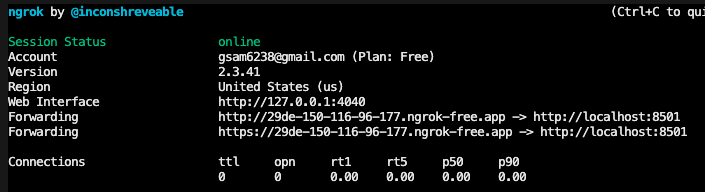
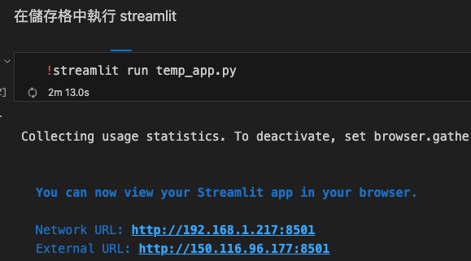
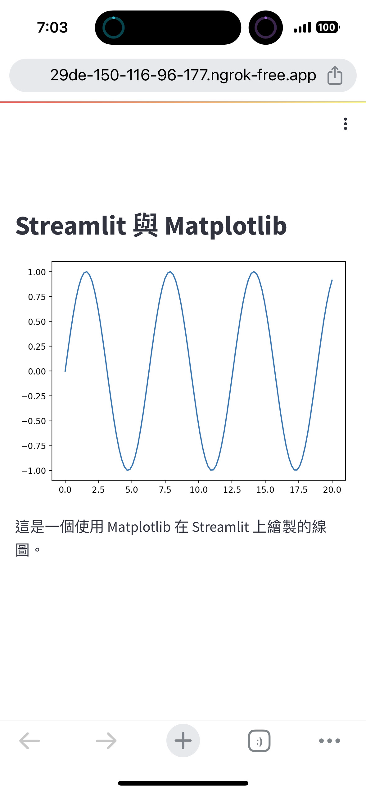

# 架設 Streamlit 網站

1. 在樹莓派上。

2. Streamlit 搭配 Ngrok。

3. 將使用端口 8501。

4. 這部分在下一次課程完成 `Ngrok` 設置後再回來操作。

<br>

## 指定端口

_Streamlit 預設通訊埠（端口）是 `8501`_

<br>

1. 在樹莓派啟動 Ngrok，指定端口為 8501。

   ```bash
    ./ngrok http 8501
   ```

   

<br>

2. 運行 Streamlit 主程式（這裡我使用儲存格運行）：以下所指派的 IP 是區網的 IP，因為有指定端口，透過外網連入後可以訪問網址。

   

<br>

3. 透過手機瀏覽 Ngrok 指派的網址，每次重新執所指派的網址都會不一樣。

   ```bash
   https://29de-150-116-96-177.ngrok-free.app
   ```

<br>


4. 使用手機或電腦瀏覽。

   

<br>

___

_END：以上完成外網訪問樹莓派 Streamlit 網站_
