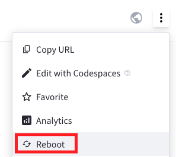

# Streamlit 網站託管

_在官網服務器部署網站_

</br>

# 註冊

1. 進入[官網](https://streamlit.io/)，點擊 `Sign in`。

</br>

2. 建議連結 GitHub，點擊 `Connect GitHub account`。

   

</br>

3. 點擊授權 `Authorize streamlit`。

   

</br>

4. 填寫基本資料。

   

</br>

5. 接受。

   

</br>

6. 假如初次登入還沒任何專案。

   

</br>

7. 假如已經建立的 Streamlit 應用清單。

   

</br>

8. 可以添加新的 app，這裡先不用，之後再回來添加。

   

</br>

## 編輯網站基本結構

1. 建立網站資料夾。

   ```bash
   mkdir __streamlit_web_01__
   ```

   

</br>

2. 建立 README.md。

   ```bash
   touch README.md
   ```

   

</br>

## 將資料夾發佈到 GitHub

_若在 Codespace 上開發可以省略這個步驟_

</br>

1. 原始碼控制。

   

</br>

2. 發佈至 GitHub。

   

</br>

3. 選取。

   

</br>

4. 勾選。

   

</br>

## 編輯網站內容

1. 建立必要檔案：app.py、requirements.txt。

   ```bash
   touch app.py requirements.txt
   ```

<br>

2. 編輯腳本。

   ```python
   import streamlit as st
   import matplotlib.pyplot as plt
   import numpy as np
   st.title('Streamlit 與 Matplotlib')
   fig, ax = plt.subplots()
   x = np.linspace(0, 20, 100)
   ax.plot(x, np.sin(x))
   st.pyplot(fig)
   st.write('這是一個使用 Matplotlib 在 Streamlit 上繪製的線圖。')
   ```

<br>

3. 編輯依賴文件。

   ```bash
   streamlit
   matplotlib
   numpy
   ```

</br>

## 設定 Streamlit 服務器

_回到官網_

<br>

1. 添加。

   

<br>

2. 使用現有 repo。

   

<br>

3. 再次授權。

   

<br>

4. 逐項確認各設定。

   

<br>

5. 也可以手動貼上超連結。

   

<br>

6. 點擊後展開選擇。

   

<br>

7. 選擇所要部署為網站內容的倉庫。

   

<br>

8. 選取倉庫分支❗️。
   
   

<br>

9.  設定網站主檔案路徑，務必記得 `手動進行修改` 。

   

<br>

10. 可自訂網址前綴，顯示 `Domain is available` 表示沒重複可以使用。

   

</br>

## 進階設定與部署

1. 可選取 Advanced settings 進行其他設定，之後再補充。

   

</br>

2. 完成後進行部署。

   

</br>

3. 瀏覽器會顯示烘烤的示意圖。

   

</br>

4. 完成後即可以指派的網址進行訪問。

   

</br>

## 特別注意

1. 若要刪除 Repo 之前，務必先刪除 Streamlit 服務器上的專案。

<br>

2. 若先刪除 Repo，服務器上的專案可能就無法被刪除，若沒強迫症的話沒差 😅 。

<br>

3. 內容變動可以不用重新部署，但設定值有變動需重新部署。

    

</br>

___

_END：以上完成在官網上佈置站台_
