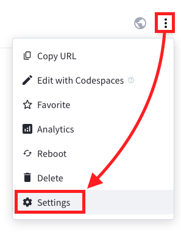
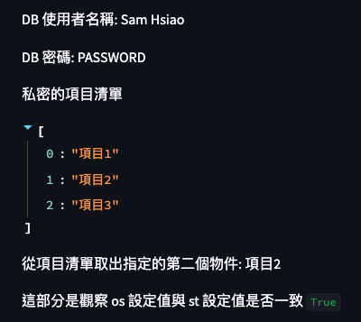

# 關於 Secrets

- [官網說明](https://docs.streamlit.io/streamlit-community-cloud/deploy-your-app/secrets-management)

</br>

## 進行設置

1. 點擊 `Settings`
   
    

2. 選取 `Secrets`
 
    

3. 使用 [TOML](https://toml.io/en/v1.0.0) 格式
    ```toml
    db_username = 'Sam Hsiao'
    db_password = 'PASSWORD'
    [secrets]
    items = ["項目1", "項目2", "項目3"]
    ```

4. 記得儲存

   

5. 編輯網頁來觀察 `Secrets` 的設定
    ```python
    import streamlit as st
    import os
    #
    st.write("DB 使用者名稱:", st.secrets["db_username"])
    st.write("DB 密碼:", st.secrets["db_password"])
    #
    st.write("私密的項目清單", st.secrets["secrets"]["items"])
    st.write("從項目清單取出指定的第二個物件:", st.secrets["secrets"]["items"][1])
    #
    st.write("這部分是觀察 os 設定值與 st 設定值是否一致", os.environ["db_username"] == st.secrets["db_username"])
    ```

6. 瀏覽自訂的站台網址，正確顯示了寫在 `Secrets` 內的各項設定值。

    

</br>

---
_待續：上課講述_