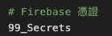
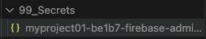
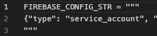
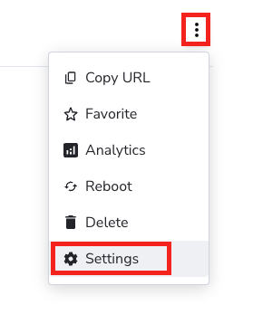
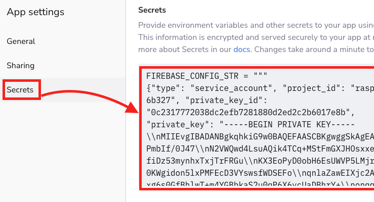
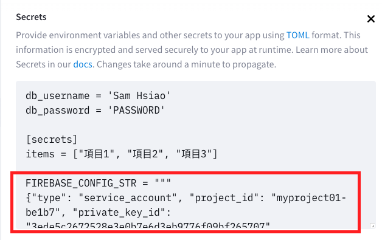
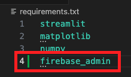
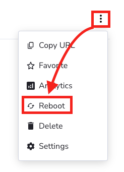
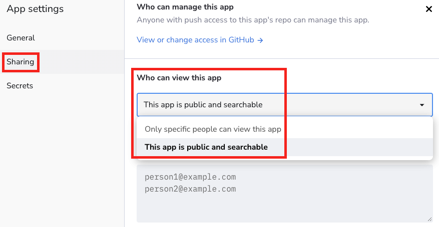

_實作_

# Firebase
- 專案在本機（電腦或樹莓派）運行時讀取 Firebase 的憑證檔案（JSON）沒有困難，但憑證無法上傳到 Streamlit 服務器上。
- 此處不說明憑證生成、下載的程序，請參考相關章節，並假設已經下載完成。
- 切記若將憑證放入 GitHub 管理的專案內，要將完整檔案名稱寫入 `.gitignore`，或放入特定資料夾後取消追蹤。
  
  

</br>

## 設定 Firebase
1. 安裝套件

    ```bash
    pip install firebase_admin
    ```

</br>

## 步驟說明 

1. 準備好從 Firebase 下載的專案憑證。

   
   
2. 因為格式為 JSON 檔案，需轉換為文字檔案再貼到 Streamlit 服務器，所以製作一個工具腳本讀取個人從 Firebase 專案取得的密鑰。

    ```python
    # 導入 json
    import json

    # 權杖檔案路徑
    _PATH_ = '.json 憑證的相對路徑'
    # 讀取
    with open(_PATH_) as f:
        firebase_config = json.load(f)
    # 輸出    
    firebase_config_str = json.dumps(firebase_config)
    # 儲存到 .txt 文件，並加上指定的格式
    formatted_str = f'FIREBASE_CONFIG_STR="""{firebase_config_str}"""'
    with open('output.txt', 'w') as out_file:
        out_file.write(formatted_str)
    #
    print("已將輸出保存到 output.txt 文件中。")
    ```

4. 上一個步驟中，要自定義一個環境參數名稱如 `FIREBASE_CONFIG_STR` ，將前一個步驟輸出的字典頭尾處以三個引號 `"""` 包覆。

   

5. 進入 Streamlit 服務器官網，點擊所要設定的專案

   

6. 選取 `Secrets` 並貼上後儲存 `Save`

    

7. 貼在任意處即可，與其他資料無排序問題。

   

8. 因為使用了 `firebase_admin` ，所以要修改 `requirements.txt` 。

   

9. 修改了設定要將服務器重新開機 `Reboot` 。

    

10. 記得開啟訪問權限。

    

</br>

---

_END_