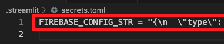
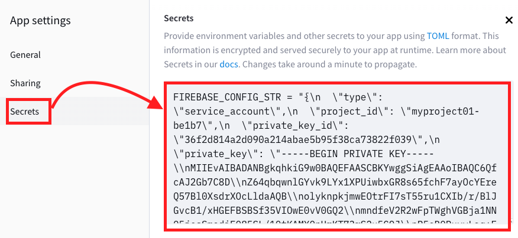
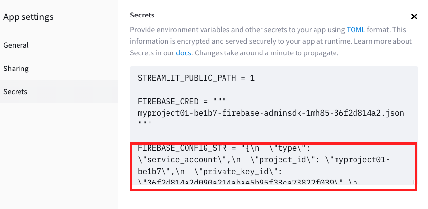

_這部分在說明 Firebase 資料庫時再回來實作_

# Firebase
- 專案在本機（電腦或樹莓派）運行時讀取 Firebase 的憑證檔案（JSON）沒有困難，但憑證無法上傳到 Streamlit 服務器上。
- 此處不說明憑證生成、下載的程序，請參考相關章節，並假設已經下載完成。
- 切記若將憑證放入 GitHub 管理的專案內，要將完整檔案名稱寫入 `.gitignore`，或放入特定資料夾後取消追蹤。
  
  

<br>

## 設定 Firebase
1. 安裝套件

    ```bash
    pip install firebase_admin
    ```

<br>

## 步驟說明 

1. 先從 Firebase 下載專案的憑證。

   
   
2. 因為憑證格式為 JSON 檔案，需轉換為 [TOML](https://toml.io/en/v1.0.0) 格式再貼到 Streamlit 服務器的 `Secrets` ，所以製作一個工具腳本 `key-to-toml.ipynb` 讀取個人從 Firebase 專案取得的密鑰進行轉換。

    ```python
    # 載入 toml
    import toml
    # 設定轉換後輸出檔案的路徑
    output_file = ".streamlit/secrets.toml"
    # 讀取權證檔案
    with open("myproject01-be1b7-firebase-adminsdk-1mh85-36f2d814a2.json") as f:
        # 先讀取這個 JSON 檔案
        json_text = f.read()
    # 給這個檔案一個 key：「FIREBASE_CONFIG_STR」
    config = {"FIREBASE_CONFIG_STR": json_text}
    # 透過 toml 進行轉換
    toml_config = toml.dumps(config)
    # 寫入指定的目標檔案
    with open(output_file, "w") as target:
        target.write(toml_config)
    ```

3. 上一個步驟中，自定義一個 `key` 作為環境參數的名稱 `FIREBASE_CONFIG_STR` ，將前一個步驟輸出的字典頭尾處以雙引號 `" "` 包覆，這是一個單行格式的字串。

   

4. 進入 Streamlit 服務器官網，點擊所要設定的專案

   

5. 選取 `Secrets` 並貼上後儲存 `Save`

    

6. 貼在任意處即可，與其他資料無排序問題。


   

7. 因為使用了 `firebase_admin` ，所以要修改 `requirements.txt` 。

   

8. 修改了設定要將服務器重新開機 `Reboot` 。

    

9.  記得開啟訪問權限。

    

<br>

---

_END：以上說明關於轉換 JSON 權證到 Streamlit 服務器的 Secrets_