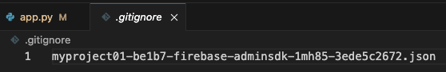

# Streamlit + Firebase Realtime Database
- 結合即時資料庫的 Streamlit 網站
- 假如在本地測試運行則讀取本地的權證，所以要將權證儲存在根目錄

</br>

## 說明
- 以下將程式碼分做五個部分，實作時整合在一起即可。
  
1. 導入函式庫
```python
import streamlit as st
import firebase_admin
from firebase_admin import credentials, db
import json
```

2. 讀取權證
```python
# 讀取憑證
try:
    # 嘗試載入權證，假如是在本地運行則會讀取到
    with open('myproject01-be1b7-firebase-adminsdk-1mh85-3ede5c2672.json', 'r') as f:
        FIREBASE_CONFIG_STR = json.load(f)
except FileNotFoundError:
    # 找不到就從服務器上讀取
    FIREBASE_CONFIG_STR = st.secrets["FIREBASE_CONFIG_STR"]

# 初始化 Firebase Admin SDK
if not firebase_admin._apps:
    #
    cred = credentials.Certificate(FIREBASE_CONFIG_STR)
    firebase_admin.initialize_app(cred, {
        'databaseURL': 'https://myproject01-be1b7-default-rtdb.asia-southeast1.firebasedatabase.app/'
    })
```
3. 初始化 `Firebase Admin SDK`
```python
# 初始化 Firebase Admin SDK
if not firebase_admin._apps:
    #
    cred = credentials.Certificate(FIREBASE_CONFIG_STR)
    firebase_admin.initialize_app(cred, {
        'databaseURL': 'https://myproject01-be1b7-default-rtdb.asia-southeast1.firebasedatabase.app/'
    })
```
4. 建立寫入以及讀取的函數
```python
# 寫入
def write_to_firebase():
    ref = db.reference('data')
    ref.set({
        'example_key': 'Hello, Firebase!'
    })

# 讀取
def read_from_firebase():
    ref = db.reference('data')
    data = ref.get()
    return data
```
5. 建立網站內容
```python
# Streamlit 網站內容
# 標題
st.title("Streamlit & Firebase 整合範例")
# 按鈕
if st.button("寫入 Firebase"):
    write_to_firebase()
    st.success("完成寫入到 Firebase 節點！")
# 按鈕
if st.button("讀取 Firebase"):
    data = read_from_firebase()
    if data:
        st.write(data)
    else:
        st.warning("Firebase 節點上無資料!")
```

6. 務必記得將權證 `.json` 檔案加入 .gitignore

   

7. 本地運行

    ```bash
    streamlit run app.py
    ```