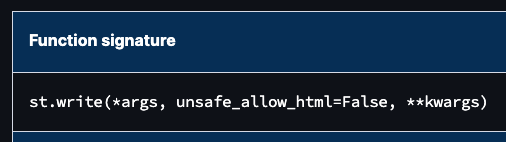
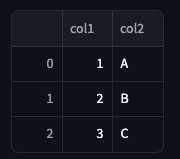
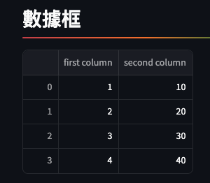
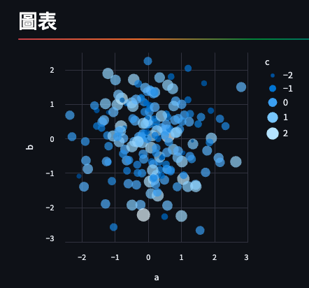
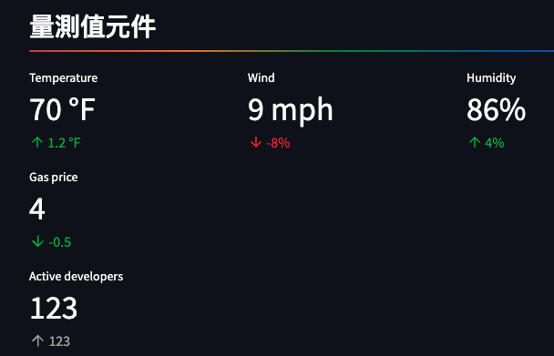
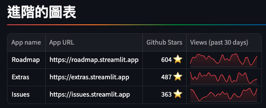

# 讀懂 Streamlit [官方文件](https://docs.streamlit.io/)
- 這裡並沒有要鉅細彌遺地講述 Streamlit 的所有部件，僅藉由官方文件中的常用部件來引導同學讀懂官方文檔。

</br>

## 套件版本問題
- 某些文檔範例運行時會出現套件版本衝突問題，需手動進行安裝，如 `jinja2` 就是其一。
- 遇到錯誤訊息時，依照實際情況安裝或升級套件。

  ```python
  pip install --upgrade jinja2
  ```

</br>

## 以 st.write 為例

- st.write(*args, unsafe_allow_html=False, **kwargs)

- `st.write()` 是一個簡便、直觀的用法，對於初學者來說很實用，但建議在上手後利用其他專用的特定類型用法來取代，比如用 `st.markdown()` 表示 markdown 語法、使用 `st.dataframe()` 來展示數據框等。
- 其中一個星號 `*` 代表的是位置參數，這些參數會被加入一個數組 `tuple` 中。
- 兩個星號 `**` 代表的是關鍵字參數，這些參數會被加入一個字典 `dict` 中。
- 這裡補充一個觀念，參數 `parameter` 跟引數 `argument` 在本質上有所不同的，課程中再說明。

</br>

### 參數說明

1. *args

- 代表一個參數列表，也就是可以傳入很多個參數，Streamlit 會自動判讀並應用在介面上。

2. unsafe_allow_html=False

- 預設值為 False。
- 設定是允許將 HTML 寫入，之所以預設為 False 是因為開啟後容易被攻擊。

3. **kwargs

- 關鍵字參數字典，允許傳入其他參數。

</br>

### 使用

- 輸出文字：`st.write("Hello, Streamlit!")`
- 輸出數據框： `使用 write 其實蠻醜的`

  ```python
  import pandas as pd
  df = pd.DataFrame({
    'col1': [1, 2, 3],
    'col2': ['A', 'B', 'C']
  })
  st.write(df)
  ```

  


- 使用 Markdown：

  ```python
  st.write("""
  # This is a header
  ## This is a sub-header
  Here's some **bold** text and *italic* text.
  """)
  ```
  


- 輸入 HTML（需要開啟 `unsafe_allow_html`）：

  ```python
  st.write("<h2>HTML Header</h2>", unsafe_allow_html=True)
  ```

  

</br>

## 其他範例

- 必要與經常搭配使用的函式庫
```python
import streamlit as st
import pandas as pd
import pandas as pd
import numpy as np
import altair as alt
import random
```

</br>

- 標題跟子標題
```python
## 標題跟子標題
st.subheader('這是標題', divider='rainbow')
st.subheader('這是子標題')
```


</br>

- 文字與字串效果
```python
## 文字與字串效果
st.subheader('文字與字串效果', divider='rainbow')
st.write('Hello, *World!* :sunglasses:')
st.write(':blue[cool] :sunglasses:')
st.write(1234)
st.write('1 + 1 = ', 2)
```


</br>

- 數據框
```python
## 數據框
st.subheader('數據框', divider='rainbow')
st.write(pd.DataFrame({
    'first column': [1, 2, 3, 4],
    'second column': [10, 20, 30, 40],
}))
#
st.write('Below is a DataFrame:', pd.DataFrame({
    'first column': [1, 2, 3, 4],
    'second column': [10, 20, 30, 40],
}), 'Above is a dataframe.')
#
df = pd.DataFrame(np.random.randn(50, 20), columns=("col %d" % i for i in range(20)))
st.dataframe(df)  # Same as st.write(df)
```



</br>

- 圖表
```python
## 圖表
st.subheader('圖表', divider='rainbow')
df = pd.DataFrame(
    np.random.randn(200, 3),
    columns=['a', 'b', 'c'])

c = alt.Chart(df).mark_circle().encode(
    x='a', y='b', size='c', color='c', tooltip=['a', 'b', 'c'])

st.write(c)
```



</br>

- 量測值元件
```python
## 量測值元件
st.subheader('量測值元件', divider='rainbow')
col1, col2, col3 = st.columns(3)
col1.metric("Temperature", "70 °F", "1.2 °F")
col2.metric("Wind", "9 mph", "-8%")
col3.metric("Humidity", "86%", "4%")
#
st.metric(label="Gas price", value=4, delta=-0.5,
    delta_color="inverse")

st.metric(label="Active developers", value=123, delta=123,
    delta_color="off")
```



</br>

- 進階的圖表
```python
## 進階的圖表
st.subheader('進階的圖表', divider='rainbow')
# 先製作一個資料表
df = pd.DataFrame(
    {
        "name": ["Roadmap", "Extras", "Issues"],
        "url": ["https://roadmap.streamlit.app", "https://extras.streamlit.app", "https://issues.streamlit.app"],
        "stars": [random.randint(0, 1000) for _ in range(3)],
        "views_history": [[random.randint(0, 5000) for _ in range(30)] for _ in range(3)],
    }
)
# 透過 st.dataframe 來展示這個資料表
st.dataframe(
    df,
    column_config={
        "name": "App name",
        "stars": st.column_config.NumberColumn(
            "Github Stars",
            help="Number of stars on GitHub",
            format="%d ⭐",
        ),
        "url": st.column_config.LinkColumn("App URL"),
        "views_history": st.column_config.LineChartColumn(
            "Views (past 30 days)", y_min=0, y_max=5000
        ),
    },
    hide_index=True,
)
```



</br>

---

_END：再補充_