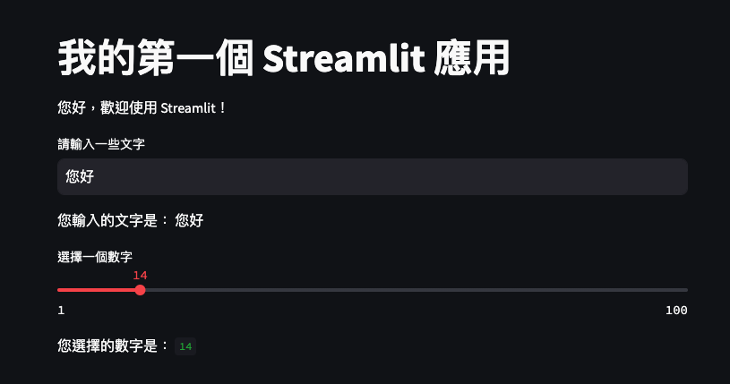

# 第一個簡單的範例
- 文字輸入框
- Slider

</br>

## 成果



</br>

## 腳本
```python
# 簡單範例
import streamlit as st
st.title('我的第一個 Streamlit 應用')
st.write('您好，歡迎使用 Streamlit！')
# 使用者輸入
user_input = st.text_input('請輸入一些文字')
st.write('您輸入的文字是：', user_input)
# 數字滑框
number = st.slider('選擇一個數字', min_value=1, max_value=100)
st.write('您選擇的數字是：', number)
```

</br>

_END_