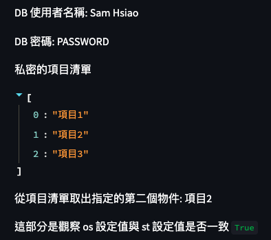

# 讀取 Secrets

<br>

## 成果



<br>

## 腳本

```python
import streamlit as st
import os

st.write("DB 使用者名稱:", st.secrets["db_username"])
st.write("DB 密碼:", st.secrets["db_password"])
# 
st.write("私密的項目清單", st.secrets["secrets"]["items"])
#
st.write("從項目清單取出指定的第二個物件:", st.secrets["secrets"]["items"][1])
#
st.write("這部分是觀察 os 設定值與 st 設定值是否一致", os.environ["db_username"] == st.secrets["db_username"])
```

<br>

## Secrets

```toml
db_username = 'Sam Hsiao'
db_password = 'PASSWORD'

[secrets]
items = ["項目 1", "項目 2", "項目 3"]
```

<br>

_END_