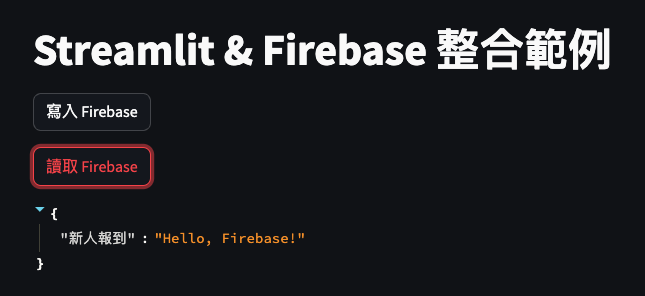

# 連結 Firebase Realtime Database

</br>

## 成果


</br>

## 腳本

```python
import streamlit as st
import firebase_admin
from firebase_admin import credentials, db
import json

# 讀取憑證
try:
    # 嘗試載入權證，假如是在本地運行則會讀取到
    with open('myproject01-be1b7-firebase-adminsdk-1mh85-36f2d814a2.json', 'r') as f:
        FIREBASE_CONFIG_STR = json.load(f)
except FileNotFoundError:
    # 找不到就從服務器上讀取
    FIREBASE_CONFIG_STR = st.secrets["FIREBASE_CONFIG_STR"]

# 初始化 Firebase Admin SDK
if not firebase_admin._apps:
    #
    cred = credentials.Certificate(FIREBASE_CONFIG_STR)
    firebase_admin.initialize_app(cred, {
        'databaseURL': 'https://myproject01-be1b7-default-rtdb.asia-southeast1.firebasedatabase.app/'
    })


# 寫入
def write_to_firebase():
    ref = db.reference('data')
    ref.set({
        '新人報到': 'Hello, Firebase!'
    })

# 讀取
def read_from_firebase():
    ref = db.reference('data')
    data = ref.get()
    return data

# Streamlit 網站內容
# 標題
st.title("Streamlit & Firebase 整合範例")
# 按鈕
if st.button("寫入 Firebase"):
    write_to_firebase()
    st.success("完成寫入到 Firebase 節點！")
# 按鈕
if st.button("讀取 Firebase"):
    data = read_from_firebase()
    if data:
        st.write(data)
    else:
        st.warning("Firebase 節點上無資料!")
```

</br>

## Secrets

```toml

```

</br>

_END_
