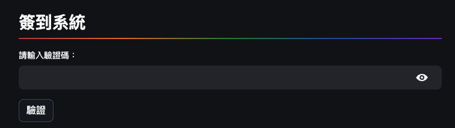
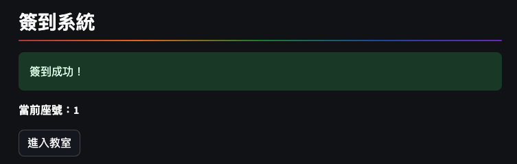
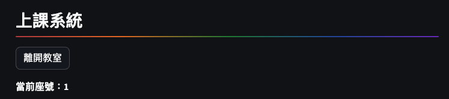

# 簽到系統

</br>

## 成果

- 驗證成功進入簽到系統



- 選擇座號簽到，成功進入上課系統



- 離開教室



</br>

## 腳本

```python
import os
import json
from google.oauth2 import service_account
import streamlit as st
from firebase_admin import credentials, db, initialize_app
import firebase_admin
import inspect

# 常數：環境使用
class Constants:
    # 學員狀態
    VALIDATED = "validated"
    PASSWORD_INPUT = "password_input"
    CHECKED_IN = "checked_in"
    IN_CLASSROOM = "in_classroom"
    SEAT_NUMBER = 'seat_number'
    IS_HAND_RAISED = 'hand_raised'
    # 畫面狀態
    SEAT_NUMBER_DISPLAYED = 'seat_number_displayed'
    # Streamlit 環境參數
    ST_FIREBASE_CRED = 'FIREBASE_CRED'
    ST_FIREBASE_CONFIG_STR = 'FIREBASE_CONFIG_STR'
    STREAMLIT_PUBLIC_PATH = 'STREAMLIT_PUBLIC_PATH'
    # 節點
    NODE_CHECKIN = 'checkin'
    NODE_CHECHED_IN = 'checked_in'
    NODE_HAND_RAISED = 'hand_raised'
    # Placeholder
    # PH_BTN_SIGN_OUT = 'sign_out_button_placeholder'
    # PH_BTN_RAISE_HAND = 'raise_hand_button_placholder'
    PH_TITLE_MAIN = 'title_placeholder'
    PH_BTN_ENTER_CLASSROOM = 'enter_classroom_placeholder'
    PH_BTN_VALIDATE_CHECKIN = 'button_placeholder'
    PH_PASSWORD = 'password_placeholder'
    # 輸入
    INPUT_PASSWORD = 'password_input'
    

count = 0
# 常數
IS_DEBUG = False
NUMBER_OF_STUDENT = 26  # 自訂學生人數
PASSWORD = '0000'       # 自訂密碼，之後可以另做函數處理密碼流程

def debug_info(_message=''):
    if IS_DEBUG:
        global count
        count += 1
        # 獲取當前的堆棧
        current_frame = inspect.currentframe()
        # 獲取調用debug_info的函數的堆棧
        outer_frame = inspect.getouterframes(current_frame, 2)
        # outer_frame的第一個元素是當前debug_info的堆棧，第二個元素是調用debug_info的函數的堆棧
        func_name = outer_frame[1][3]
        st.write(f"{count} :[{func_name}] {_message}")  # 將 print 改為 st.write


# 初始化 Firebase 
def initialize_firebase():
    debug_info()
    # 判斷是否已經初始化過 Firebase
    try:
        firebase_admin.get_app()
    except ValueError as e:
        # 根據是否在 Streamlit 服務器上運行，用不同方式獲取 Firebase 憑證
        # (1) 判斷是否在服務器上
        if Constants.STREAMLIT_PUBLIC_PATH in os.environ:
            # 如果在 Streamlit 服務器上運行，從環境變量讀取憑證
            # firebase_cred = os.environ.get(Constants.ST_FIREBASE_CRED)
            firebase_cred = st.secrets[Constants.ST_FIREBASE_CRED]
            # 如果有這個環境變數
            if firebase_cred is not None:
                try:
                    cred_info = json.loads(firebase_cred)
                    cred = credentials.Certificate(cred_info)
                except json.JSONDecodeError:
                    # 假如這樣獲取失敗，還有另一個環境變數儲存了文字憑證
                    try:
                        # 讀取 json
                        cred = credentials.Certificate(json.loads(st.secrets[Constants.ST_FIREBASE_CONFIG_STR]))
                    except Exception as e:
                        st.error(f'兩種方式皆無法解析服務器上的憑證：{e}')
                        return False
            else:
                st.error('未設置 FIREBASE_CRED 環境變量')
                return False
        else:
            try:
                # 如果在本地運行，從檔案讀取憑證
                PATH = "myproject01-be1b7-firebase-adminsdk-1mh85-36f2d814a2.json"
                with open(PATH) as json_file:
                    cred_info = json.load(json_file)
                cred = credentials.Certificate(cred_info)
            except(FileNotFoundError, json.JSONDecodeError) as e:
                st.error(f'讀取本地 Firebase 憑證出錯，錯誤訊息：{e}')
                return False
        # 以上程序若沒退出理應要取得憑證，可以進行Firebase的初始化
        initialize_app(cred, {'databaseURL': 'https://myproject01-be1b7-default-rtdb.asia-southeast1.firebasedatabase.app/'})
    # 這個函數設置了一個回傳值，用來判斷是不是完成
    return True

# 簽到
def check_in_system():
    debug_info()
    # 假如不存在「簽到」
    if not st.session_state[Constants.CHECKED_IN]:
        # 座號設置為下拉選單「selectbox」
        st.session_state['seat_number_placeholder'] = st.empty()  # 添加到 session_state
        st.session_state[Constants.PH_BTN_VALIDATE_CHECKIN] = st.empty()  # 添加到 session_state
        seat_number = st.session_state['seat_number_placeholder'].selectbox('請選擇你的座號:', [str(i) for i in range(1, NUMBER_OF_STUDENT+1)])
        # 寫入座號
        st.session_state[Constants.SEAT_NUMBER] = seat_number
        # 節點
        check_in_ref = db.reference(Constants.NODE_CHECKIN).child(seat_number).child(Constants.NODE_CHECHED_IN)
        # 取得狀態（目前沒用到）
        initial_state = check_in_ref.get()

        # if button_placeholder.button('簽到'):
        if st.session_state[Constants.PH_BTN_VALIDATE_CHECKIN].button('簽到'):
            check_in_ref.set(1)
            # 顯示訊息
            st.success('簽到成功！')
            st.session_state[Constants.CHECKED_IN] = 1
            # 清空
            # seat_number_placeholder.empty()
            # button_placeholder.empty()
            st.session_state['seat_number_placeholder'].empty()
            st.session_state[Constants.PH_BTN_VALIDATE_CHECKIN].empty()
            # 調用簽到後的函數
            after_check_in(seat_number)
    else:
        after_check_in(st.session_state.seat_number)

# 檢查是否已在教室中
def is_already_in_classroom(seat_number):
    # 節點
    check_in_ref = db.reference(Constants.NODE_CHECKIN).child(seat_number)
    # 取值
    in_classroom = check_in_ref.get()
    #
    if in_classroom == True:
        # st.success('已在教室中')
        return True
    else:
        # st.success('歡迎進入教室')
        return False

# 登入之後要做的事
def after_check_in(seat_number):
    debug_info()
    #
    # 假如 session_state 不存在或值=False
    if Constants.SEAT_NUMBER_DISPLAYED not in st.session_state or not st.session_state[Constants.SEAT_NUMBER_DISPLAYED]:
        st.markdown(f"**當前座號：{seat_number}**")
        st.session_state.seat_number_displayed = True
    # 目前沒用到
    # check_in_ref = db.reference(Constants.NODE_CHECKIN).child(seat_number).child(Constants.NODE_CHECHED_IN)
    # hand_raise_ref = db.reference(Constants.NODE_CHECKIN).child(seat_number).child(Constants.NODE_HAND_RAISED)    
    
    # 假如「在教室」且「沒有舉手佔位」
    if st.session_state[Constants.IN_CLASSROOM]:
        pass
    else:
        # 使用 st.empty() 建立一個空的占位元件（placeholder），預留給「進入教室」使用
        st.session_state[Constants.PH_BTN_ENTER_CLASSROOM] = st.empty()
        # 假如點擊按鈕，這時將這個占位元件賦予型態與文字（進入教室按鈕）
        if st.session_state[Constants.PH_BTN_ENTER_CLASSROOM].button('進入教室'):
            # (1)變更「in_classroom」為 True
            st.session_state[Constants.IN_CLASSROOM] = True
            # (2)清空「簽到系統」的占位元件
            st.session_state[Constants.PH_TITLE_MAIN].empty()
            # (3)清空「進入教室」按鈕
            st.session_state[Constants.PH_BTN_ENTER_CLASSROOM].empty()
            # (4)設置為 False 才能顯示
            st.session_state[Constants.SEAT_NUMBER_DISPLAYED] = False
            # 刷新頁面
            st.experimental_rerun()

# 處理教室狀態 (進入或離開教室)
def handle_classroom_status(seat_number):
    debug_info()
    # 初始化節點
    check_in_ref = db.reference(Constants.NODE_CHECKIN).child(seat_number).child(Constants.CHECKED_IN)
    hand_raise_ref = db.reference(Constants.NODE_CHECKIN).child(seat_number).child(Constants.NODE_HAND_RAISED)    

    # 假如「在教室」且「沒有舉手佔位」
    if st.session_state[Constants.IN_CLASSROOM]:
        # 添加：簽退按鈕的占位元件
        st.session_state[Constants.PH_BTN_ENTER_CLASSROOM] = st.empty()  # 添加到 session_state
        # 假如本來就未簽到：顯示「你已經簽退」，但這正常來說不應該發生，因為簽退後不會有簽退選項
        if st.session_state[Constants.PH_BTN_ENTER_CLASSROOM].button('離開教室'):
            # 將兩個節點設置為 0
            check_in_ref.set(0)
            hand_raise_ref.set(0)
            # (1)簽退要復位的 session_state
            st.session_state[Constants.VALIDATED] = 0
            st.session_state[Constants.PASSWORD_INPUT] = ''
            st.session_state[Constants.IS_HAND_RAISED] = 0
            st.session_state[Constants.CHECKED_IN] = 0
            st.session_state[Constants.IN_CLASSROOM] = 0
            # (2)直接刪除 session_state
            st.session_state[Constants.PH_BTN_ENTER_CLASSROOM].empty()
            del st.session_state[Constants.PH_BTN_ENTER_CLASSROOM]
            # (3)要清空的 placeholder
            st.session_state['seat_number_placeholder'].empty()
            st.session_state[Constants.PH_BTN_VALIDATE_CHECKIN].empty()
            #
            # del_check_out_button()
            # main()
            st.experimental_rerun()
# 初始化 session_state
def initialize_session_state():
    # 主標題
    st.session_state[Constants.PH_TITLE_MAIN] = st.empty()
    # 是否在教室
    st.session_state[Constants.IN_CLASSROOM] = st.session_state.get(Constants.IN_CLASSROOM, False)
    # 
    st.session_state[Constants.VALIDATED] = st.session_state.get(Constants.VALIDATED, 0)
    st.session_state[Constants.INPUT_PASSWORD] = st.session_state.get(Constants.PASSWORD_INPUT, "")
    st.session_state[Constants.IS_HAND_RAISED] = st.session_state.get(Constants.IS_HAND_RAISED, 0)
    st.session_state[Constants.CHECKED_IN] = st.session_state.get(Constants.CHECKED_IN, 0)

    st.session_state[Constants.PH_PASSWORD] = st.empty()
    st.session_state[Constants.PH_BTN_VALIDATE_CHECKIN] = st.empty()

# 主程式：只會被調用一次
def main():
    debug_info()
    # 初始化 Firebase ＆設置完成
    if initialize_firebase():
        # 初始化 session_state
        initialize_session_state()
        # 建立一個「Main Title（主要標題）」
        st.session_state[Constants.PH_TITLE_MAIN] = st.empty()
        # 假如「不在教室」
        if not st.session_state[Constants.IN_CLASSROOM]:
            # 顯示為「簽到系統」
            st.session_state[Constants.PH_TITLE_MAIN].title('==簽到系統==')
        else:   # 假如在教室
            st.session_state[Constants.PH_TITLE_MAIN].title('==上課系統==')
            #
            handle_classroom_status(st.session_state.seat_number)

        st.session_state[Constants.PH_BTN_VALIDATE_CHECKIN] = st.empty()

    st.session_state[Constants.PH_PASSWORD] = st.empty()  # 添加到 session_state
    st.session_state[Constants.PH_BTN_VALIDATE_CHECKIN] = st.empty()  # 添加到 session_state

    if not st.session_state.validated:
        # 使用text_input來獲取驗證碼，並存入session_state
        st.session_state[Constants.INPUT_PASSWORD] = st.session_state[Constants.PH_PASSWORD].text_input("請輸入驗證碼：", value=st.session_state.get(Constants.INPUT_PASSWORD, ""), type='password')

        if st.session_state[Constants.PH_BTN_VALIDATE_CHECKIN].button("驗證"):
            if len(st.session_state[Constants.INPUT_PASSWORD]) != 4:
                st.warning("驗證碼需為四碼")
            else:
                if st.session_state[Constants.INPUT_PASSWORD] != PASSWORD:
                    st.error("驗證碼錯誤，請再試一次")
                    st.session_state[Constants.INPUT_PASSWORD] = ""
                else:
                    st.session_state.validated = 1
                    st.session_state[Constants.PH_PASSWORD].empty()
                    st.session_state[Constants.PH_BTN_VALIDATE_CHECKIN].empty()
                    check_in_system()
    else:
        check_in_system()

if __name__ == "__main__":
    debug_info()
    main()
```

</br>

## Secrets

```toml

```

</br>

_END_


