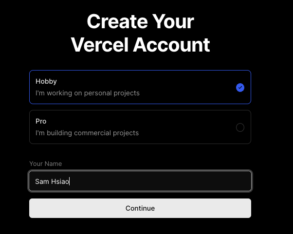
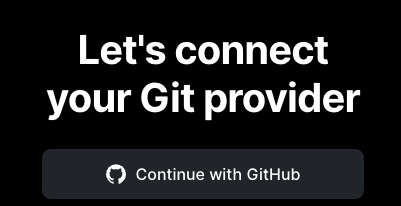
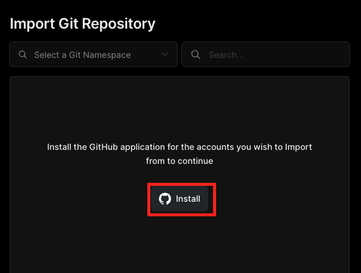
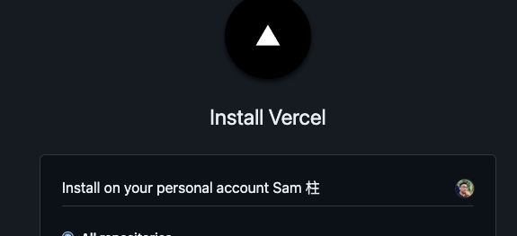
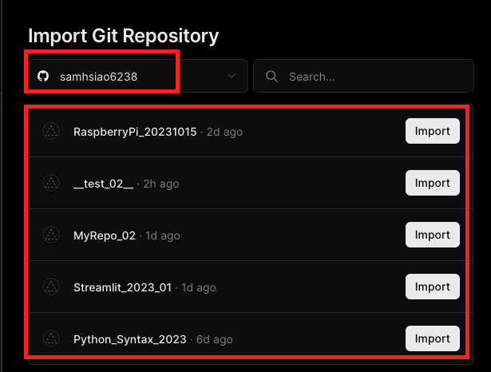
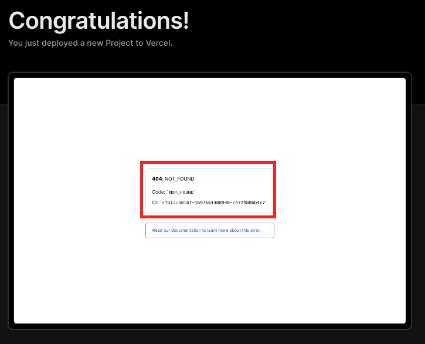

*上課講述*
# Vercel
- Heroku 的替代方案
- 可以部署 LineBot
- [官網](https://vercel.com/)

 

# 註冊步驟

1. 建立帳號
   - 輸入類型以及名字

    

2. （整合）連結 GitHub

    

3. 假如沒有自動跳轉，可以點擊下面連結
   
   

4. 授權

    

5. 驗證

    

6. 驗證碼

    

7. 點擊 `Install`

    

8. 說明授權範圍
   
   

9. 確認安裝
    
    

10. 需要再次授權
    
    

11. 若是第一次啟用，會顯示沒有發現出存庫
    
    

12. 若已有倉庫可選擇儲存庫，也可以切換帳號

    

13. 任意載入一個儲存庫
    
    

14. 進行必要與客製的設置之後點擊部署 `Deploy`
    
    

15. 完成時，畫面中央會顯示錯誤訊息，不用理會，因為目前尚未建立專案。
    
    

 

---

_待續_