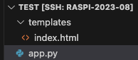
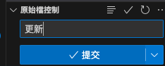
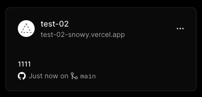
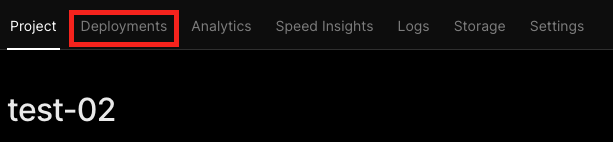
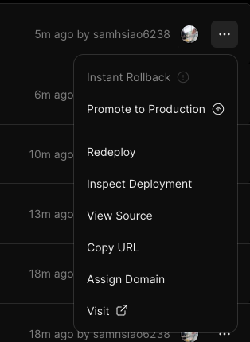
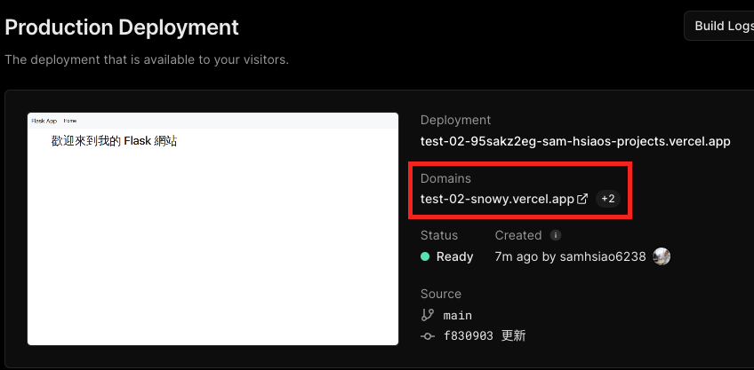
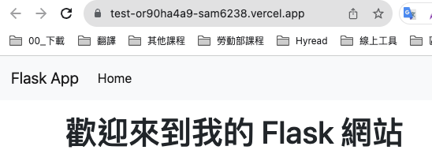
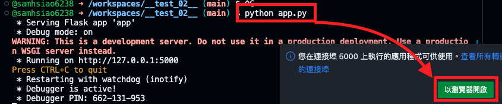

_待續_

# Flask

<br>


## 基本步驟

<br>

1. 假如還沒建立專案資料夾，先建立一個。

    ```bash
    mkdir <我的專案資料夾>
    ```

2. 建立一個主檔案 `app.py` ，這是慣用名字，非限定。

    ```bash
    touch app.py
    ```

3. 編輯簡易的內容

    ```python
    from flask import Flask, render_template
    app = Flask(__name__)

    @app.route('/')
    def home():
        return render_template('index.html')

    if __name__ == '__main__':
        app.run(debug=True)
    ```

4. 在專案資料夾內建立一個 `模板` 資料夾，並在這個資料夾內建立一個超文本 `index.html`
    
    ```bash
    mkdir -p templates && touch index.html
    ```

5. 編輯超文本

    ```html
    <!DOCTYPE html>
    <html lang="en">
    <head>
        <meta charset="UTF-8">
        <title>Simple Flask App</title>
        <link rel="stylesheet" href="https://stackpath.bootstrapcdn.com/bootstrap/4.3.1/css/bootstrap.min.css">
    </head>
    <body>
        <nav class="navbar navbar-expand-lg navbar-light bg-light">
            <a class="navbar-brand" href="#">Flask App</a>
            <div class="collapse navbar-collapse" id="navbarNav">
                <ul class="navbar-nav">
                    <li class="nav-item active">
                        <a class="nav-link" href="#">Home <span class="sr-only">(current)</span></a>
                    </li>
                </ul>
            </div>
        </nav>
        <div class="container mt-3">
            <h1>歡迎來到我的 Flask 網站</h1>
        </div>
    </body>
    </html>
    ``` 

6. 注意一下，截至目前為止的專案結構（請忽略名稱的差異，主要是看結構即可）

    

7. 在專案的根目錄內建立套件檔案 `requirements.txt`

    ```bash
    touch requirements.txt
    ```

8. 在套件管理檔案 `requirements.txt` 中加入基本所需的模組

    ```txt
    Flask
    ```

9. 建立一個 Vercel 管理的 JSON 檔案 `vercel.json`

    ```bash
    touch vercel.json
    ```

10. 基本管理檔案 `vercel.json` 的內容

    ```json
    {
        "version": 2,
        "builds": [
            {"src": "/app.py", "use": "@vercel/python"}
        ],
        "routes": [
            {"src": "/.*", "dest": "/app.py"}
        ]
    }
    ```

11. 同步到 Git 
    
    

12. 進入 Vercel 官網，會看到專案，點擊進入
    
    

13. 切換到 `Deployments` 頁籤

    

14. 一般檔案內容的修正會自動部署，假如修改設定的話需要手動重新部署 `Redeploy`
    
    

15. 在 `Project` 頁籤可以預覽，也可以看到 `Domains` 網站網址
    
    
    
16. 或點擊右上方的 `Visit` 訪問
    
    

17. 若要在 Codespace 執行腳本進行預覽的話，在終端機執行以下指令
    
    ```bash
    python app.py
    ```

18. 接著點擊開啟瀏覽器即可
    
    

<br>

---

_END_