# 從樹莓派部署
- Vercel CLI
- 示範如何在樹莓派以 `Vercel CLI` 部署一個簡單的 Flask 站台到 Vercel

</br>

## 說明
1. 部署 Flask 應用到 Vercel 需要一些特定的設定，因為 Vercel 主要是為 `前端` 和 `無伺服器（serverless）` 函數設計的。
2. 可以使用 Vercel 的 `無伺服器功能` 來執行 Flask 應用。

</br>

## 準備

1. 更新

    ```bash
    sudo apt update && sudo apt upgrade -y
    ```

2. 安裝 `nodejs` 、 `npm`

    ```bash
    curl -fsSL https://deb.nodesource.com/setup_16.x | sudo -E bash -
    ```

3. 非常謹慎，給60秒好好考慮

   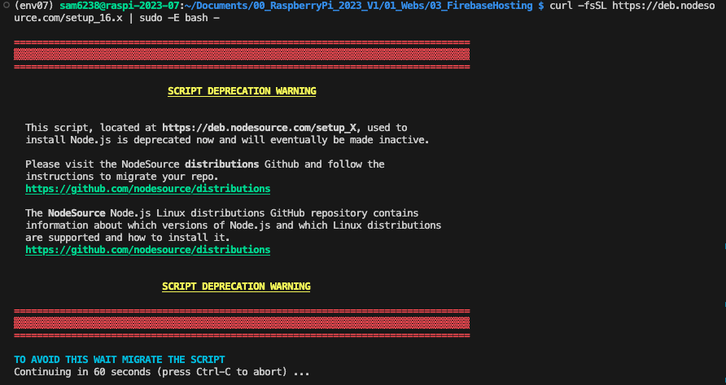

4. 安裝

    ```bash
    sudo apt install -y nodejs
    ```

## 操作

- 使用 `serverless-wsgi` 來將 Flask 應用轉換為無伺服器函數。


1. 建立一個專案目錄

    ```bash
    mkdir __test03__ && cd __test03__
    ```

2. 安裝 `serverless-wsgi` 和 `werkzeug`

    ```bash
    pip install serverless-wsgi werkzeug
    ```


2. 建立一個名為 `api.py` 的新文件，這將是主要入口點

    ```python
    from flask import Flask

    app = Flask(__name__)

    @app.route('/')
    def hello():
        return "Hello Vercel with Flask 0816"

    if __name__ == "__main__":
        app.run()
    ```

3. 建立 `requirements.txt`

    ```text
    Flask
    serverless-wsgi
    werkzeug
    ```

4. 建立 `vercel.json`
   - 這個文件告訴 Vercel 如何部署和運行應用

    ```json
    {
        "version": 2,
        "builds": [
        {
            "src": "api.py",
            "use": "@vercel/python"
        }
        ],
        "routes": [
        {
            "src": "/.*",
            "dest": "api.py"
        }
        ]
    }
    ```
  
5. 安裝 Vercel CLI
   - 務必確保已經安裝了 Node.js 與 NPM

    ```bash
    sudo npm install -g vercel
    ```

6. 確認已經進入專案目錄 ⚠️

7. 在 Flask 應用的目錄中運行以下命令來啟動 CLI

    ```bash
    sudo vercel
    ```

8. 選取 GitHub

    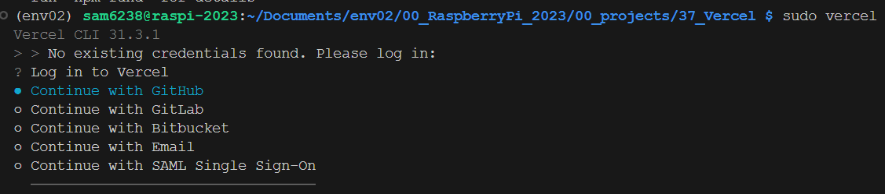

9. 點擊 GitHub 之後會出現認證網址，要複製到樹莓派的瀏覽器開啟

    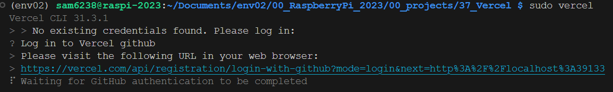

10. 輸入 GitHub 帳號密碼並且完成認證，這裡省略這些提過的說明
    
    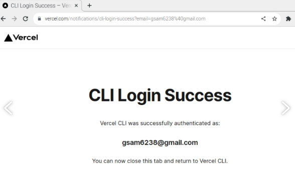

11. 回到 VSCode 會顯示成功，並詢問是否部署這個資料夾：YES
    
    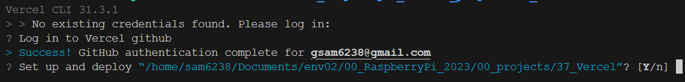

12. 哪個 scope，只有一個，實質上沒得選
    
    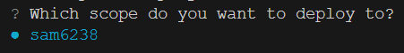

13. 不連結現有專案
    
    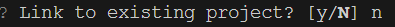

14. 名稱使用預設 -> ENTER
    
    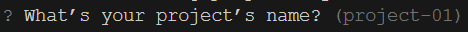

15. 檔案在哪裡，ENTER 預設根目錄
    
    

16. 開始部署

    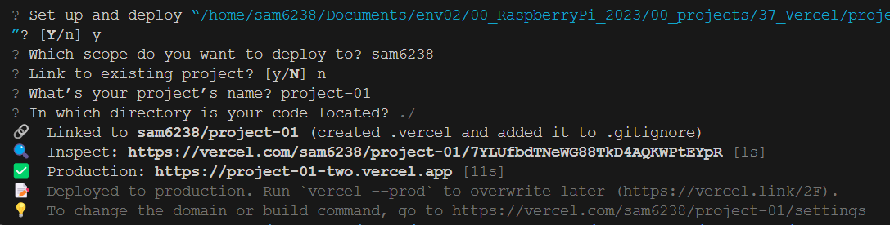

17. 完成後將獲得一個連結，可使用該連結來訪問 Flask 應用
    
    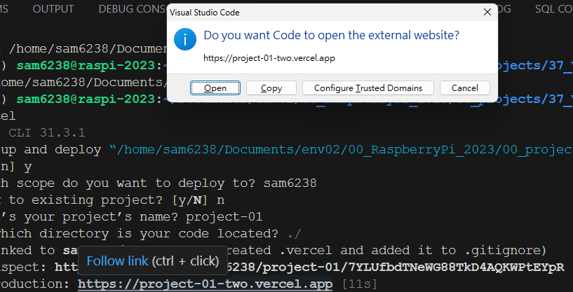

18. 點擊開啟連結
    
    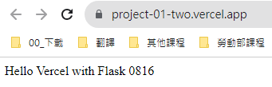

19. 至此先確認已經完成部署，進入 Vercel 控制台可以看到這個部署完成的專案
    
    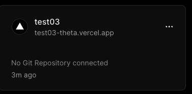

<br>

## 連結 GitHub

1. 在前一個步驟最後可以看出尚未連結

   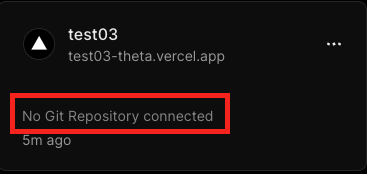

2. 在 VSCode 中選取 `原始檔控制`

    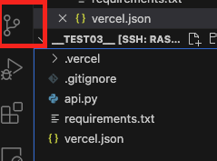

3. 點擊發佈

    

4. 選取 Public

   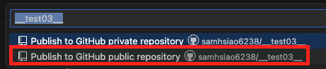

5. 打開看看

   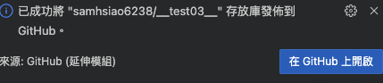

6. 在 Vercel 控制台點擊專案進入

    

7. 右下角連結

   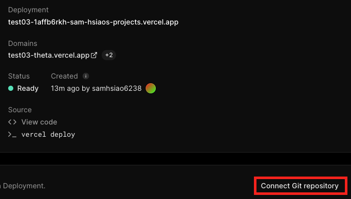

8. 選取 GitHub

   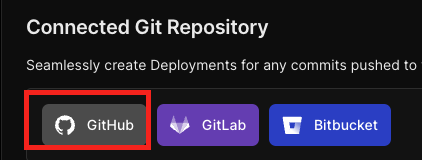

9. 選取自己對應的 Repo 然後連結 `Connect`

    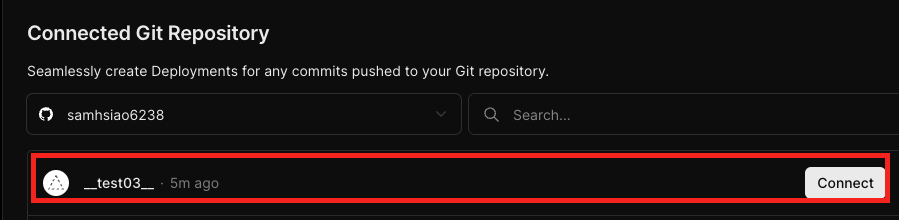

10. 任意改一下內容然後同步

    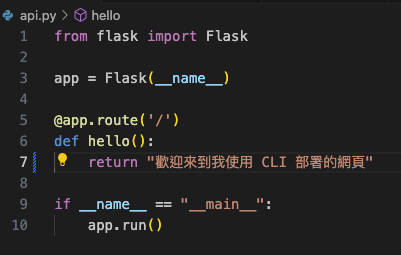

11. 再到 Vercel 控制台看一下專案左側的 Git 是不是跟自己輸入的最新版本一致
    
    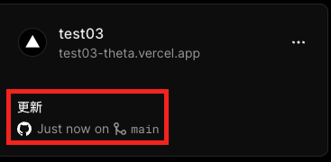

12. 瀏覽顯示為更新內容，至此完成連接

    

</br>

---

_END_