_實作_

# 在 Vercel 部署 LineBot

</br>

## A. 在樹莓派上

1. 進入 Documents，建立專案目錄（這裡假設是 `test06`）

    ```bash
    mkdir <專案資料夾名稱> && cd <專案資料夾名稱>
    ```

2. 在專案資料夾內開啟新的工作區

    ```bash
    code .
    ```

3. 要建立如下的資料結構

   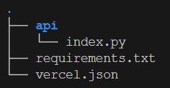

4. 編輯 `index.py`

    ```python
    # 導入 Flask 相關模組
    from flask import Flask, request, abort  
    # 導入 LineBot 相關模組
    from linebot import LineBotApi, WebhookHandler  
    # 導入 LineBot 的例外處理
    from linebot.exceptions import InvalidSignatureError  
    # 導入 LineBot 的模型
    from linebot.models import MessageEvent, TextMessage, TextSendMessage  

    import os  # 導入 os 模組
    # 從環境變數中獲取 LineBot 的設置
    line_bot_api = LineBotApi(os.getenv("LINE_CHANNEL_ACCESS_TOKEN"))
    line_handler = WebhookHandler(os.getenv("LINE_CHANNEL_SECRET"))
    # 創建 Flask 應用
    app = Flask(__name__)  
    # 定義根路由
    @app.route('/')  
    def home():  
        # 返回簡單的文字訊息
        return '=== 這是預設的首頁 ==='  
    # 定義 webhook 路由
    @app.route("/webhook", methods=['POST'])  
    def callback(): 
        # 獲取 X-Line-Signature 標頭值
        signature = request.headers['X-Line-Signature']  
        # 獲取請求主體
        body = request.get_data(as_text=True)  
        # 記錄請求主體
        app.logger.info("Request body: " + body)  
        try:
            # 處理 webhook 主體
            line_handler.handle(body, signature)  
        # 捕捉無效簽名的錯誤
        except InvalidSignatureError: 
            # 返回 400 錯誤 
            abort(400)  
        # 返回正確的響應
        return 'OK'  
    # 處理 Line 的訊息事件
    @line_handler.add(MessageEvent, message=TextMessage)
    def handle_message(event):
        
        if event.message.type != "text":
            line_bot_api.reply_message(
                event.reply_token,
                TextSendMessage(text="我目前僅可以讀取文字訊息"))
            return
        if event.message.text == "說話":
            
            line_bot_api.reply_message(
                event.reply_token,
                TextSendMessage(text="我可以說話囉，歡迎來跟我互動 ^_^ "))
            return
        else:
            line_bot_api.reply_message(
                event.reply_token,
                TextSendMessage(text="我目前還未擁有對應的功能"))
            return

    if __name__ == "__main__":
        # 運行 Flask 應用
        app.run()  
    ```

5. 編輯套件管理檔案 `requirements.txt` ，套件有版本相容問題，所以要加上版本號

    ```txt
    Flask==2.2.2
    line-bot-sdk
    Werkzeug==2.3.7
    ```

6. 建立 Vercel 設定檔案 `vercel.json`

    ```json
    {
        "builds": [
        {
            "src": "api/index.py",
            "use": "@vercel/python"
        }
        ],
        "routes": [
        {
            "src": "/(.*)",
            "dest": "api/index.py"
        }
        ]
    }
    ```

7. 完成後可透過 Vercel CLI 進行部署

    ```bash
    sudo vercel
    ```

8. 在設定的步驟
	1. 同意設定且部署目前所在的資料夾（Y）
	2. 選擇專案的擁有者，唯一選擇，所以等於沒選（ENTER）
	3. 是否連結現有專案（N）
	4. 專案名稱，使用預設即可（ENTER）
	5. 在哪個目錄（ENTER）

    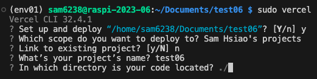

9. 開始部署

    

10. 完成時會顯示連結，可以不用急著複製，等一下在專案控制台去複製

    

</br>

## B. 前往 Line Developers

1. 開啟 [Line Developers](https://developers.line.biz/zh-hant/)

    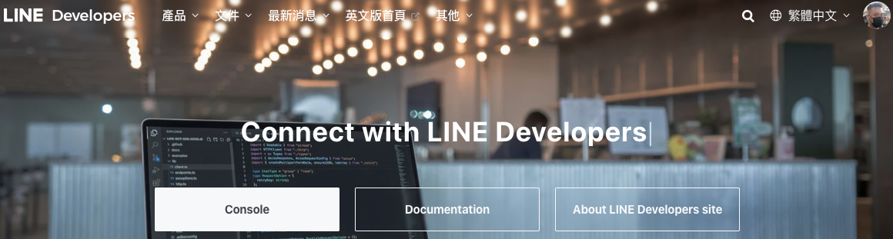

</br>

_省略一部分的說明，這裡的操作很簡單，有必要再補充_

</br>

2. 建立新的 channel

    

3. 選擇 Messaging API

    

4. 這部分選取地區，其他預設

    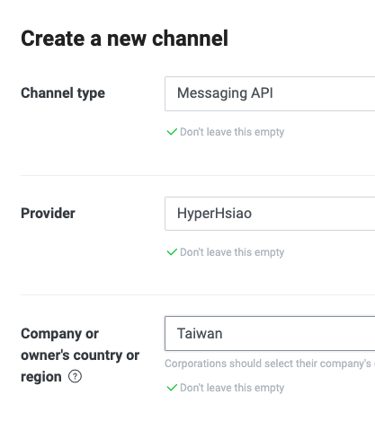    

5. 給個圖片漂亮一點

    

6. 隨意設定一下

    

7. 滑動到最下面，勾選之後建立

    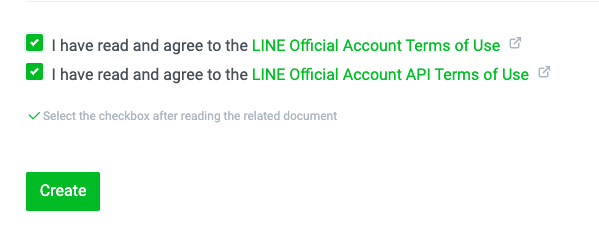

8. OK

    

9. Agree

    

10. 在這個頁面先複製 `Channel secret` 準備起來

    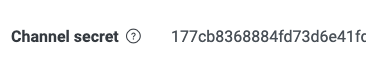

11. 切換到

    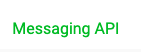

12. Issue

    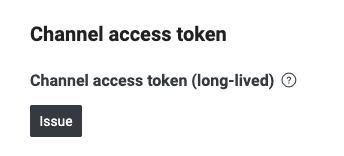

13. 複製

    

14. 接下來很重要一件事是設定 `Webhook`

    

</br>

## C. 前往 Vercel 主控台

1. 到 Vercel 主控台，點擊剛剛上傳的專案，這裡示範是 `test06`

   

2. 先複製 Domain
   - 這個時候網頁是錯誤的，不用理會

    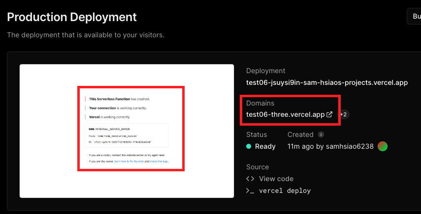   

</br>

## D. 前往 Line Developers

1. 回到 Line Developers，編輯 Webhook

   

2. 貼上網址，加上「/webhook」，然後 Update

    

3. 特別說明這裡的 `webhook` 尾綴是定義在 `index.py` 中的路由

   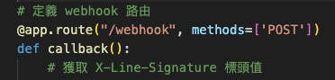

4. 開啟 `Use webhook`

   

5. 這時還沒完成設定，點擊驗證會是錯的

    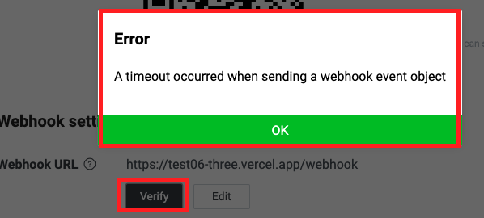

6. 繼續進行設定，點擊 Edit

    

7. 選擇接受邀請

    
   
8. 總的來說是這樣

    

</br>

_🔺 以上完成第一階段的 Line Developers 設定_

</br>

## E. 進入 Vercel

1. 接著進入 Vercel 的設定

   

2. 點擊左側環境變數
   
   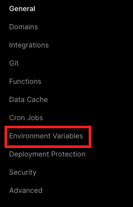

3. 複製程式碼中的兩個環境變數名稱作為 Key
   
   

4. 先貼上 Key，再貼上 Line Develop 所提供對應的 `Token` 與 `Secret` 的值
   
   

5. 務必記得儲存
   
   

</br>

## F. 進入 VSCode

1. 將專案發佈到新的儲存庫中

   

2. 選公開

   

## G. 再回到 Vercel 中

1. 點擊連結到專案

   

2. 選取 GitHub

   

3. 連結
   
   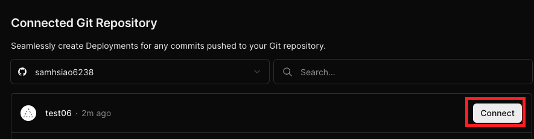

4. 這裡可以查看 `Source code` 確認是否為更新的內容

   

</br>

## H. 驗證結果

1. Vercel 的部署有時會有延遲狀況，可以透過去修改一下 `index.py` 來同步並觀察一下部署狀況

   

2. 直到畫面正常顯示就表示部署完成

   

3. 也可以透過驗證 Webhook 確認是否完成部署

   

</br>

---

_END:這裡僅是確認部署，至於腳本內容並無太多功能_