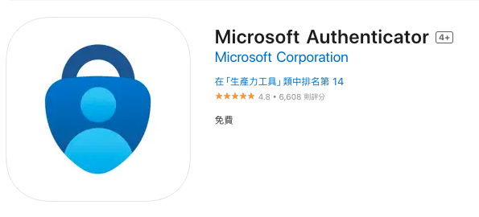
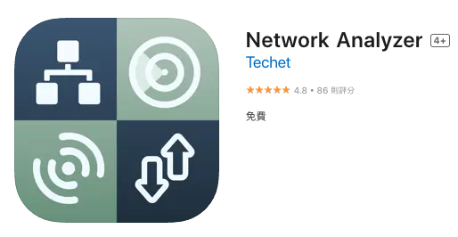
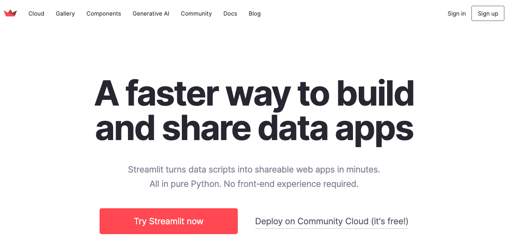

# 今日課程簡介 2/9 10/22

 

## A. Git 檔案管理

1. 請先安裝 [GitHub Desktop](https://desktop.github.com/)
   
   

 

2. 建議下載 APP 用於雙重認證
   
   

 

2. 建議下載 APP 用於雙重認證
   
   

 

3. 建立下載 APP 用於檢測熱點設備
   
   

 

## B. Git 各種錯誤排除

 

## C. 服務服務整合 GitHub 

- Codespace

- [Streamlit](https://streamlit.io/)

- [Vercel](https://vercel.com/)

 

1. 請先註冊 [Streamlit](https://streamlit.io/)
   
   

 

2. 請先註冊 [Vercel](https://vercel.com/)
   
   

 

---

_END_