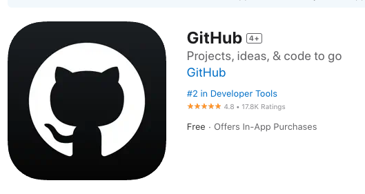

# 今日課程簡介 2/9 10/22

 

## A. Git 檔案管理

1. 請先安裝 [GitHub Desktop](https://desktop.github.com/)
   
   

 

2. 建議下載 APP 用於雙重認證
   
   

 

3. 建議下載 APP 用於雙重認證
   
   

 

4. 建立下載 APP 用於檢測熱點設備
   
   

 

## B. Git 各種錯誤排除

 

## C. 服務服務整合 GitHub 

- Codespace

- [Streamlit](https://streamlit.io/)

- [Vercel](https://vercel.com/)

 

1. 請先註冊 [Streamlit](https://streamlit.io/)
   
   

 

2. 請先註冊 [Vercel](https://vercel.com/)
   
   

 

## C. 前情回顧

1. 燒錄 SD 卡，務必正確選擇作業系統 Bullseye。
2. 使用命令提示字元、終端機進行 SSH 連線。
3. 建立多帳號使用環境。
4. 設定免密碼登入。
5. `排除連線問題` 1：編輯 `.ssh` 資料夾內的 `known_hosts` 所紀錄的公鑰。
6. `排除連線問題` 2：解決 DNS 解析問題，編輯 `etc/hosts` 手動解析 Hostname。
7. `排除無畫面問題`：連線後編輯 `boot/config.txt`，連線後進行解析度設定。
8. 卡片燒錄失敗問題：重新燒錄。
9. 使用 VSCode 連線樹莓派。
10. 安裝虛擬機，在虛擬機安裝樹莓派系統，虛擬機中安裝 VSCode，電腦連線虛擬機中的樹莓派。

 

---

_END_