*上課實作*

# Apache 站台實作

<br>

## A. 安裝與檢查

1. 更新套件索引＆升級套件。

   ```bash
   sudo apt update && sudo apt upgrade -y
   ```

<br>

2. 安裝 `apache2`。

   ```bash
   sudo apt install apache2 -y
   ```

   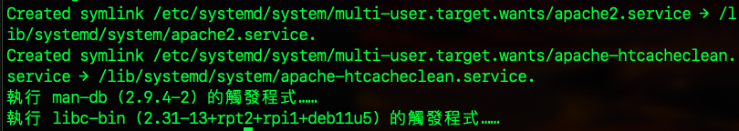

<br>

3. 透過指令查詢 `apache2` 安裝狀態。

   - 使用 `dpkg -l` 命令列出與 `apache2` 相關的套件列表

   ```bash
   dpkg -l | grep apache2
   ```

   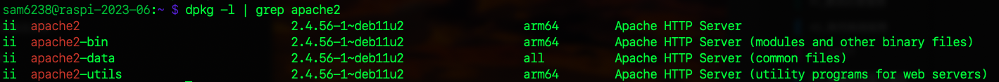

<br>

4. 查詢 `apache2` 安裝的版本。

   ```bash
   apache2 -v
   ```

   

<br>

5. 查詢 `apache2` 服務是否啟動。

   ```bash
   sudo systemctl status apache2
   ```

   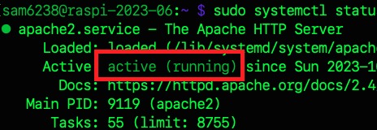

<br>

6. _若未啟動_，立即啟動服務。

   ```bash
   sudo systemctl start apache2
   ```

<br>

7. 設定為開機啟動。

   ```bash
   sudo systemctl enable apache2
   ```

   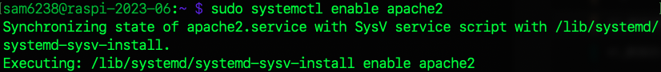

<br>

## B. 設定文件說明

_`Apache` 的配置文件有全局與個別配置文件。_

<br>

1. 全局配置文件路徑。

   ```bash
   /etc/apache2/apache2.conf
   ```

<br>

2. 個別配置文件路徑：用於定義 `單個網站` 或 `應用程式` 的設定，可以在此配置每個網站的文件根目錄、特定的伺服器名稱、伺服器別名、錯誤頁面等。

   ```bash
   /etc/apache2/sites-available/000-default.conf
   ```

<br>

## C. 授權編輯設定文件

_因為使用終端機編輯器查看這類文件很吃力，以下設定權限來授權 。_

<br>

1. 要使用 VSCode 直接編輯設定文件，必須先進行 `授權`。

    _全局_
   ```bash
   sudo chown $USER  /etc/apache2/apache2.conf
   ```
    _個別_    
   ```bash
   sudo chown $USER /etc/apache2/sites-available/000-default.conf
   ```

<br>

2. 補充說明，前項 `文件授權`，因為 VSCode 無法執行像 `sudo nano` 這樣的授權行為，所以必須修改檔案權限或是擁有者來賦予編輯的權限，在只有單人的開發環境中，使用授權或是變更擁有者的效果並無差異。

<br>

3. 在 `多人共用` 的環境中，因為 `/etc` 文件屬於全域的設定檔案，將檔案 `擁有者` 改為特定人實屬不便，最直接的處置方式就是使用終端機以 `sudo nano` 進行編輯，另外可透過建立權限群組，如 ` apacheadmin`，然後透過將使用者加入群組來配置權限。

   _建立群組並加入文件_

   ```bash
   sudo chgrp apacheadmin /etc/apache2/apache2.conf /etc/apache2/sites-available/000-default.conf
   ```

   _修改群組權限_

   ```bash
   sudo chmod 660 /etc/apache2/apache2.conf /etc/apache2/sites-available/000-default.conf
   ```

   _將當前 user 或指定 user加入群組_
   
   ```bash
   sudo adduser $USER apacheadmin
   ```

<br>

4. 另外一種相對暴力的處理方式就是授權 `666` 甚至 `777` ，將 `讀、寫、執行` 都全部開放，實務上是不會這樣做的，但這裡可以簡單處理。
   
   ```bash
   sudo chmod 666 /etc/apache2/apache2.conf /etc/apache2/sites-available/000-default.conf
   ```

<br>

## D. 修改設定檔案

1. 首先，在設定文件中將會指定 `超文本所在路徑`，所以可將這個指定目錄先進行建立，這個範例是將目錄建立在 `/home/sam6238/Documents` 。

   ```bash
   sudo mkdir /home/sam6238/Documents/my_web
   ```

<br>

2. 修改 `全局` 配置，特別注意 `縮排` 要手動調整跟其他文本一樣，到這裡同學應該發現檔案內容很多，使用 `nano` 編輯不太友善，這也就是為何前面要授權讓我們可以在此使用 VSCode 編輯的原因，假如已經設定好權限，可以使用 VSCode 編輯。

   ```bash
   sudo nano /etc/apache2/apache2.conf
   ```

<br>

3. 滑動到程式碼中以下區塊進行添加內容 `# 添加這個`，其餘部分可以不用變動。

   ```html
   <Directory />
       Options FollowSymLinks
       AllowOverride None
       Require all granted
   </Directory>
   <Directory /usr/share>
       AllowOverride None
       Require all granted
   </Directory>
   <Directory /var/www/>
       Options Indexes FollowSymLinks
       AllowOverride None
       Require all granted
   </Directory>
   # 添加這個
   <Directory <超文本所在目錄>>
       Options Indexes FollowSymLinks
       AllowOverride None
       Require all granted
   </Directory>      
   ```

<br>

4. 超文本所在目錄就是前面自己建立的那個路徑，比如說 `/home/sam6238/Documents/my_web` 。

   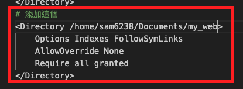

<br>

5. 修改 `個別` 網站配置

   ```bash
   sudo nano /etc/apache2/sites-available/000-default.conf
   ```

<br>

6. 添加內容 `# 添加這個`，並且些修改 `超文本所在目錄` ，其餘部分可以不用變動，也可以把已經註解的內容都刪除，這樣會看得比較清楚。

   ```html
   <VirtualHost *:80>
       ServerAdmin webmaster@localhost
       DocumentRoot <超文本所在目錄>

       # 添加這段
       <Directory <超文本所在目錄>>
           Options Indexes FollowSymLinks
           AllowOverride All
           Require all granted
       </Directory>

       ErrorLog ${APACHE_LOG_DIR}/error.log
       CustomLog ${APACHE_LOG_DIR}/access.log combined
   </VirtualHost>
   ```

<br>

## E. 是否使用預設的設定檔案

_因為我們將使用預設值，所以這裡不用做任何變動，理解即可。_

<br>

1. 禁用（關閉）預設的設定檔 `000-default.conf`

   - `a2dissite` 是 `Apache 2 Disable Site` 的縮寫

   ```bash
   sudo a2dissite 000-default.conf
   ```

<br>

2. 啟用指定的設定檔

   ```bash
   sudo a2ensite <自訂設定檔案>
   ```
3. 啟用預設檔案

   - 也就是使用預設檔案

   ```bash
   sudo a2ensite 000-default.conf
   ```

<br>

## F. 授權訪問文件

1. 讓 `Apache` 用戶有權限訪問服務相關目錄。

   ```bash
   sudo chmod -R 755 <Apache 超文本所在目錄>
   ```

   如

   ```bash
   sudo chmod -R 755 /home/sam6238/Documents/my_web
   ```

<br>

2. 確保 Apache 用戶（通常是 www-data）是相關目錄和文件的擁有者

   ```bash
   sudo chown -R www-data:www-data <Apache 超文本所在目錄>
   ```

   如

   ```bash
   sudo chown -R www-data:www-data  /home/sam6238/Documents/my_web
   ```

<br>

3. 因為 `DocumentRoot` 設置為 `<Apache 超文本所在目錄>`，那麼 `Apache` 需要對所在目錄的上層資料夾也具有執行權限方可進行訪問。

   ```bash
   sudo chmod +x /home
   sudo chmod +x /home/<使用者名稱>
   ```
   
   _如_
   ```bash
   sudo chmod +x /home
   sudo chmod +x /home/sam6238
   ```


4. 後續會添加超文本，所以可先授權自己擁有添加文件的權限，沒授權的話將無法新增 `index.html`。

   ```bash
   sudo chown -R <使用者名稱>:<使用者同名群組名稱> <Apache 超文本所在目錄>
   ```

   如

   ```bash
   sudo chown -R sam6238:sam6238 /home/sam6238/Documents/my_web
   ```
   或

   ```bash
   sudo chown -R $USER:$USER /home/sam6238/Documents/my_web
   ```

<br>

## G. 建議任意文本來測試

1. 進入超文本目錄，建立一個 `index.html` 檔案。

   ```bash
   sudo touch index.html
   ```

   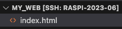

<br>

2. 開啟 `index.html` 使用 VSCode 透過快速鍵 `!` 建立文本。

   

<br>

3. 任意修改

   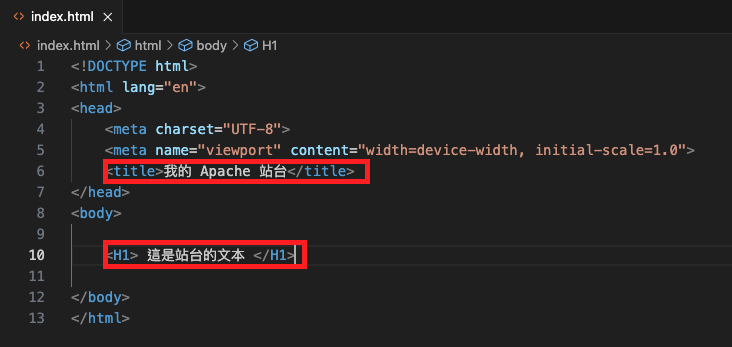

<br>

4. 完成要重新啟動。

   ```bash
   sudo systemctl reload apache2
   ```

<br>

5. 在樹莓派上瀏覽 `http://localhost` 或在區網內訪問樹莓派網址。

   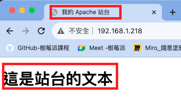

<br>

## H. 其他問題排除

1. 假使看到的是這個內容，表示文本路徑設置錯誤，所以訪問到預設內容。
   
   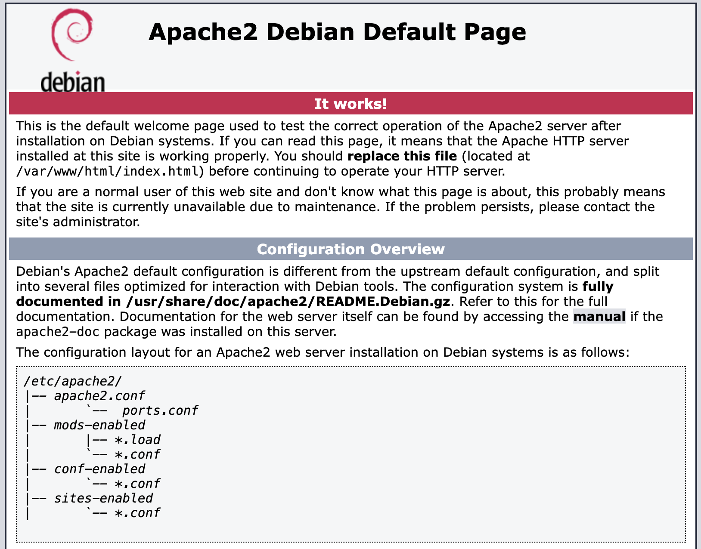

<br>

2. 在進行任何更改之前，先確保 Apache 配置文件沒有 `語法錯誤`。
   
   ```bash
   sudo apache2ctl configtest
   ```
   _正確的話會看到 `Syntax OK`_

   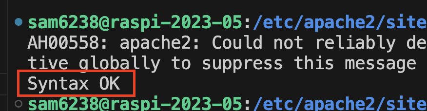

   _錯誤的話會看到 `Action 'configtest' failed`_

   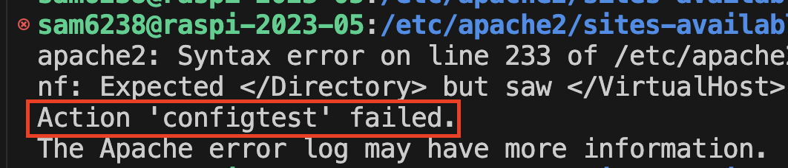

<br>

3. 查看日誌可以看到詳細的錯誤與問題。
   
   ```bash
   sudo tail -f /var/log/apache2/error.log
   ```

<br>

4. 確認站台是否啟動 `active`
   
   ```bash
   sudo systemctl status apache2
   ```

   _沒有啟動會顯示 `failed`_
   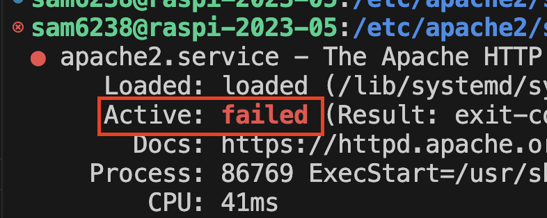

<br>

___

_END：以上建立自己的 Apache 站台_
